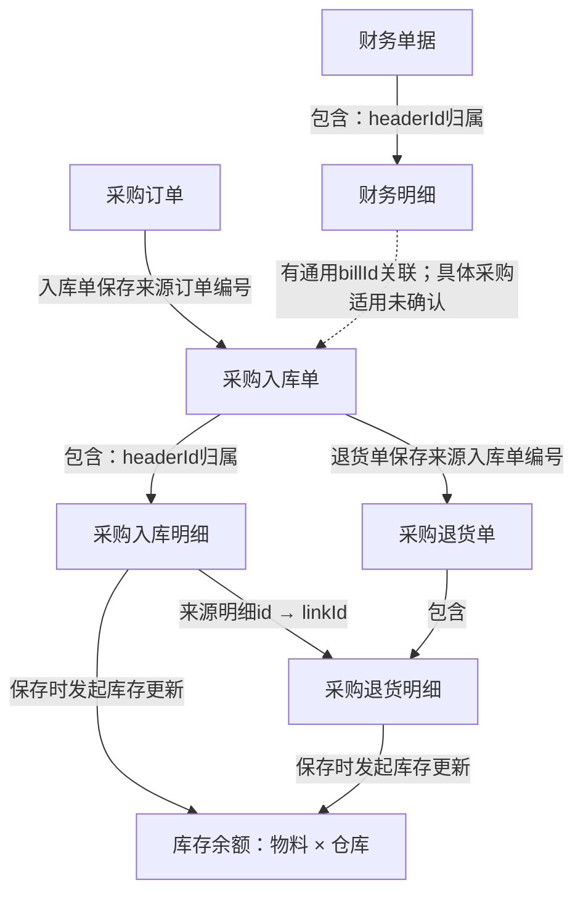

# 自主选材业务对象关系图薄实验验收

## 结论

本轮已完成 Java 导航、模型自主选择主题及原文、一次提取、一次同原文审阅、引用检查和实验结果保存。模型自行选择“进销存单据如何连接物料、仓库库存、供应商往来与财务结算”。没有把用户参考图、预期采购链、旧本体结果或人工业务答案放进请求，也没有人工补选原文后替换模型选择。

**有限可行性成立，完整目标没有全部通过。** 实际结果有可核对的采购订单到入库、入库到退货、主表与明细、明细与物料及仓库、财务主表与明细等对象联系；已生成方框及带机制标签的箭头。仍没有识别出完整的请购链、采购入库与财务明细的具体适用联系。输入约354 KiB，不能宣称小上下文要求已通过；维度和指标的模型分类仍有问题。本轮也没有独立第二个真实系统的泛化验收。

这是一次抛弃式验证，不是新的正式 CLI 或全仓本体发布。实际模型结果未被宿主 Agent 改写成“正确答案”。

## 输入和边界

使用准确 R4：`analysis-run:1bcd11687fd7ab082d6b7a51c5218758bb0d60af0677e8d34f717d702e4b6744`。

来源身份：`entry-evidence-index:a25a843822a607bc55ee25db56dfa736361d1ee9858d200ccab45c6fff41a909`。

从正式存储读取真实 receipt，经已有 `EntryEvidenceReader` 校验后打开 `OntologyEvidenceCorpus`。资料库有339个后端入口。本轮不重新扫描源码、运行 JDT/Maven/客户构建，不运行 Activity、业务过程或全仓本体，不使用 DDL。模型为已有订阅 Provider 的 `gpt-5.6-luna/high`，四次串行请求，无自动重试和回退。

旧 MD 解读逻辑及既有 R0/R4 没有被本轮修改；工作区已有 staged 实验代码保持原状。本轮新增程序与运行文件均在忽略的 `.workspace/ontology-overview-poc-20261005/`；本验收记录与总体设计的导航链接是文档修改。

## Java 组织及模型识别链路

| 阶段 | 实际输入 | 实际处理和输出 | 下一消费者 |
| --- | --- | --- | --- |
| 导航，零模型 | R4入口、技术线索、页面上下文 | Java按准确技术身份列出入口与共同项；全部766组共同项保留，模型展示95组，明确展示分母。当前显示TABLE 31、STATEMENT 32、METHOD 32；没有可展示的COLUMN组，不宣称列级交接已经实现 | SELECT |
| SELECT | 339入口与95组具体共同项 | 模型自主选择主题和12个入口；共同表/方法只是选材线索，不批准业务关系 | Java单元目录 |
| READ | 所选入口655条可选单元目录 | 模型选择39个准确U/E用途；Java沿已有PAGE_CONTEXT展开完整前端单元，最终52个单元，不用多轮阅读移入/移出状态机 | 冻结阅读包 |
| EXTRACT | 完整已选正文、入口/页面用途、调用限制、通用任务 | 模型返回对象、关系、操作、维度和指标候选及未知；程序不把表名自动裁决成业务对象 | REVIEW |
| REVIEW | 同一冻结材料和实际首稿 | 模型返回完整修正稿；程序检查全部来源及对象端点引用，无第三次自动修稿 | 局部实验组装 |
| 组装，零模型 | 结构合法的完整审阅结果 | Java稳定分配显示对象号，保存实验JSON和Mermaid图；不按中文猜对象身份，不生成新增关系 | 查看及事实核验 |

所有339入口在导航中保留；95个共同项是明确有界的候选视图，不是全仓业务覆盖承诺。目录主动不重复列默认调用明细、源码位置记录和整份XML资源，选择的是可读完整单元；不因此宣称所有动态XML分支或所有辅助方法都已提交。

模型自行选出的12个入口短号为：E114、E116、E128、E202、E217、E299、E225、E22、E326、E75、E332、E330。其原始理由、目录、选单、请求、响应均保留。短号只在本资料库作用域内有效。

## 实际关系图节选

以下是实际审阅结果的主要联系节选，不是预设输入。库存箭头限于已读保存流程发起更新，不据此承诺内部余额计算、审核过滤或增减数量已全部核验。虚线保留了具体采购变体适用关系未确认。



完整程序生成图有20个对象、32条关系候选（审阅标为28 CONFIRMED、4 UNRESOLVED）、9个操作候选、10个维度候选和10个指标候选。**这些是模型记录数量，不是人工认证的本体规模或业务完整度。** 特别是维度候选大多是身份/属性，不合格的分类不能当作10个正式分析维度；指标也未执行或通过完整口径验收。

## 核验的具体依据和问题归属

| 联系或定义 | 本次实际提交的来源 | 核验结论及归属 |
| --- | --- | --- |
| 采购订单 → 采购入库 | S45选择“其它/采购订单”，S22把所选record.number赋为linkNumber，S47回填linkNumber且info.linkId=info.id，S39声明入库/采购，S14保存linkId，S26接收主表 | 核心关系成立。审阅关系的evidenceRefs没有把S22/S39全部列齐；二者正文已入模，是模型引用遗漏，不是Java没交材料 |
| 入库 → 采购退货及来源明细 | S34筛选入库/采购，S22生成来源编号，S35回填linkNumber并令linkId=id，S33声明出库/采购退货，S14保存关联标识 | 核心关系成立。审阅关系引用遗漏S22/S33，正文已入模；不等于退货全流程和全部数量规则已验收 |
| 明细 → 库存 | S14批量保存后逐明细调用updateCurrentStock，S21传入materialId/depotId，S42提供按basic_number汇总的PARTIAL SQL | 可以确认保存流程发起库存更新。updateCurrentStockFun正文未被选入，且其导航仍是NAVIGATION_CONFLICT；不能进一步宣称准确增减、审核条件或实际余额重算完整证明。属于本次选材/导航范围缺口，不是紧凑投影删掉已有选中正文 |
| 财务主表 → 明细 → 通用业务单据 | S8以headerId归属主单，按billNumber取得DepotHead.id保存billId，并在billId非空、单据存在且债务非零时请求欠款更新 | 通用关联的建立端已可见。模型保留采购入库/退货适用未知合理；但它没有建立通用业务单据对象并输出对应确定边，属于对象/关系输出遗漏。欠款辅助计算正文未选，不能承诺金额规则全齐 |
| 供应商预付款 | S26/S19在预付款且organId存在时检查金额并调用更新；S16收预付款也调用更新；S9写financialAllPrice-billAllPrice | 条件与差额公式有依据。两个查询的具体筛选未选，S9注释称零售出库，不可自行改写成“必然是采购入库结算金额” |
| 采购金额 | S39保存totalPrice=-ΣallPrice；S33退货为+ΣallPrice；S35/S47有税率及含税分支 | 本次审阅纠正了首稿符号，不据此认证所有指标 |
| 移动平均成本 | S6完整正文有basicNumber!=0且allPrice!=0的外层门槛，以及divide(...,4,HALF_UP) | 模型指标遗漏该门槛和精度。正文已入模，属于模型规则遗漏；真实排序依据的查询正文未读，仅有源码注释，不算排序证明 |
| 请购 → 采购订单 | S14完整保存实现已含采购订单分支、linkApply及请购关联状态更新调用；本轮没有选请购/采购订单页面完整上下文 | **不能说输入完全没有请购线索。** 已读后端分支没有被模型转成请购对象/关系，是模型遗漏；页面建立端未读又是本次选材范围缺口。两者分开，不把它解释成系统没有请购链 |

本表是宿主独立事实核查，不写回模型原稿或实验JSON；下游必须保留原始结果和这份核验，不把“结构合法”作为业务准确性证明。

## 材料成本与机械核验

所有数值均为实际保存JSON的UTF-8字节或请求成本计数，不冒称token，也没有对全部模型窗口做估算。

| 请求或材料 | 实测字节 |
| --- | ---: |
| SELECT完整请求成本 | 60,758 |
| READ完整请求成本 | 83,154 |
| 原formalV4模型投影 | 467,527 |
| 本轮紧凑阅读材料 | 362,897 |
| EXTRACT完整请求成本 | 366,221 |
| REVIEW完整请求成本，含实际首稿 | 381,178 |

成本函数包括输入、Schema、实际Prompt和256字节封套预留；它不是Provider最终token统计或严格计费体积。当前Provider没有在这些结果中提供可用于窗口验证的token计数。

Java已删除方法中与完整正文重复的控制流/签名等便利字段，并将调用改为紧凑行；原文、参数、用途、SQL分析状态与调用限制保留。本轮相对原投影减少约22.4%，但约354 KiB材料仍偏大，**小上下文要求未验收通过**。

剩余成本不是504条重复调用：504个调用行和调用位置均不同，其中484 NAVIGATION_CONFLICT、15 LOCATED、5 CANDIDATES。调用行约120.9KB，目标/观察字典约35.3KB；52个单元约202.3KB，Java/Vue/SQL文本字符串合计96,680字节，另有XML结构树、SQL AST和页面上下文。不能以“全是无用重复”为由全部删掉冲突。后续应按原文保留、已选连接和逐位置限制组织更小任务；本轮没有为追求小数值截断正文、自动摘要或临时升级模型。

实际请求核验器`ResultAudit`已零模型通过：

- 52个单元逐项映射；完整选中Java/Vue正文、XML结构子树及SQL文本/结构/状态/限制未改变；不是证明未选内容已经完整。
- EXTRACT和REVIEW收到相同的units、entryContexts、callEvidence和calls；REVIEW首稿等于实际EXTRACT响应。
- 504个调用与私有原始记录逐项核对所属方法、位置、状态和实参；无中途丢弃或跨任务串位。
- 最终对象名称及关系/操作/分析端点闭合，来源全部指向已读S；非语义真假检查。
- 保存来源索引，包含S、U、入口用途、原始身份、内容摘要、相对路径/范围或语句身份、完整私有正文位置。

在零模型预检中，悬空对象端点被拒绝；全实验四次请求均正常结束，源码材料没有写回R4。未运行无关整仓测试或重型构建，只用JDK17 javac编译薄驱动及结果核验器。

## 实际产物和复现

实验目录相对本工作树为`.workspace/ontology-overview-poc-20261005/`。运行输出位于其`output/`，本机路径仅用于查找，不进入模型事实。

| 文件 | 实际职责 |
| --- | --- |
| `OverviewProbe.java`、`config.json` | 四阶段薄实验驱动、明确来源与模型配置；不注册生产命令 |
| `navigation.json`、`all-common-items.json` | 模型所见导航与完整共同项分母 |
| `01-select-*`、`selected-catalogue.json`、`02-read-*` | 实际主题、范围、单元目录、选择理由 |
| `frozen-private-packet.json`、`model-material.json` | 原始完整选中单元及本次模型阅读投影 |
| `03-extract-*`、`04-review-*` | 两次实际完整请求和未经宿主修改的响应 |
| `overview.json`、`overview.mmd` | 实验识别结构和程序直接生成的全部对象关系图，待人审 |
| `overview-sources.json`、`mechanical-checks.json` | 可逆来源索引和零模型结果核验 |
| `manifest.json` | 模型身份、四次请求起止、实际成本与执行终态；完成调用不等于本验收全通过 |

当前已结束批次不能直接再运行。不要向相同输出目录派发不同输入；驱动的已有响应读取分支尚不是经过任务指纹匹配的生产复用功能，本轮没有使用它复用响应。正式实现必须使用已有正式任务匹配能力。

零模型结果核验可在本工作树用既有JDK17与`target/repository-run-classpath.txt`执行：

```bash
task_probe_cp="$(< target/repository-run-classpath.txt)"
/usr/local/Cellar/openjdk@17/17.0.19/libexec/openjdk.jdk/Contents/Home/bin/java \
  -cp ".workspace/ontology-overview-poc-20261005/classes:target/classes:$task_probe_cp" \
  org.sourceanalysis.app.adapter.cli.ResultAudit \
  .workspace/ontology-overview-poc-20261005/output
```

这是本机验收命令，不是共享Skill已经具备的一项新功能。正式操作继续由既有O0–O3拥有；本轮不把实验入口冒充跨宿主交付。

## 下一阶段的边界

已经证明：准确共同项而非entryId相邻顺序可以供模型自主选择跨入口主题；Java能够实际取回所选材料并保留用途/限制；Luna/high可以据此形成可读对象关系骨架；程序可以保存结果并反查，不依靠宿主人工填写业务链。

尚未证明：自动找齐全部对象关系、小上下文及弱模型稳定效果、全部分析维度/指标正确、独立另一个系统的语义质量。不能宣称这些已通过，也不能把它们都归为“模型能力”而忽略材料成本和未读建立端。

下一次正式设计应复用这条准确共同项与完整单元路径，并限制同题阅读负担，分开对象骨架、关系补查及分析定义。该调整需同步正式命令和Skill，不能把本轮忽略目录的程序作为隐含生产依赖。不为填满示意图临时增加业务专用匹配规则，不继续无限调用来修好所有模型输出。
