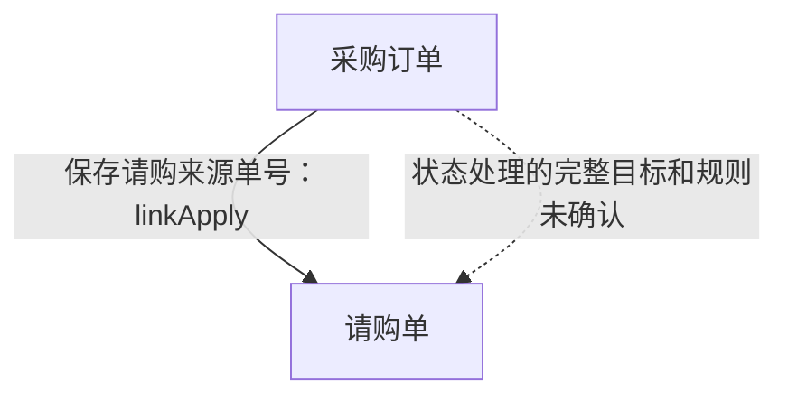

# 紧凑材料与遗漏联系补查实验

## 结论

本次完成用户指定的两项薄实验，不修改生产代码、不接入正式CLI。

1. **同一材料可以进一步无损压缩。** 上一轮362,897字节的模型材料编码为276,159字节，从354.4KiB降到269.7KiB，减少约23.9%。解码后与原JSON逐字段相等；52个完整单元、504个调用位置、入口/页面用途及限制未丢失。不是把源码摘要化，也不是证明任意小窗口能容纳它。
2. **已遗漏的请购联系在本例补出。** 模型从Java产生的通用分支导航自行选中`linkApply`，Java使用既有R4字面搜索找到页面建立端，按模型选单读回完整原文。一次提取及同证据审阅后，原始结果有“采购订单通过linkApply引用请购单”的确定关系。状态联动仍为UNRESOLVED，没有包装成完整数量/状态流程。

模型还自行选中第二个调查：调拨明细如何连接两个仓库。结果支持两个不同仓库标识在同一明细中的联系，未确认调入/调出方向或库存增减。

**可逆压缩和本例补关系成立；小上下文目标仍未通过。** 两题提取封套分别167,935和143,085字节，仍明显偏大。框架规则没有写入采购、请购、调拨等业务词；这不是第二个真实系统的泛化证明，也不是全仓本体、指标或维度验收。

## 输入与边界

- 沿用R4：`analysis-run:1bcd11687fd7ab082d6b7a51c5218758bb0d60af0677e8d34f717d702e4b6744`。
- 来源身份：`entry-evidence-index:a25a843822a607bc55ee25db56dfa736361d1ee9858d200ccab45c6fff41a909`。
- 同时读取上一轮自主选材的冻结材料及模型候选总览。它们只用于增量查漏，不当作正确答案；因此不称为从零独立无提示发现。
- 没有提供用户参考图、采购链答案、人工指定文件清单或修好的模型JSON。
- 没有使用R0补读、DDL、旧Activity、业务过程或旧MD事实；不运行JDT/Maven/客户代码，不重取证。
- 产品模型为既有订阅Provider的`gpt-5.6-luna/high`。共7次串行请求，无自动重试、模型/账户回退。全部观察为ENDED。
- 没有改写既有R4、旧模型响应或原实验目录的产物。现有staged实现及旧MD路径未修改。

## 实际处理与消费者

| 阶段 | 输入 | 程序或模型的实际动作 | 输出及下一消费者 |
| --- | --- | --- | --- |
| 无损编码，零模型 | 上一轮完整模型投影 | Java对位置、实参数组、重复冲突原因和SQL/XML树使用固定列编码，再解码核对整个JSON | `compact-baseline.json`及`compression-checks.json`；不从压缩结果生成新业务事实 |
| 分支导航，零模型 | 上一轮已读Java单元的保存`controls` | 从219项控制观察中列出96个含JavaBean getter/setter名称的IF条件；机械派生字面搜索词，保留对应方法和入口 | `branch-navigation.json`；供模型选择补查问题 |
| 选择遗漏联系 | 分支导航及前次候选对象/关系 | 模型自主选B49/B50的linkApply联系、B9/B73的两仓库联系；没有Java业务分类器 | `01-find-missing-links-response.json`；供R4检索 |
| 检索，零模型 | 模型所选分支中的实际/派生标识词 | 调用既有`OntologyEvidenceCorpus.searchLiteral`，按准确U身份整理命中目录，显示真实入口用途；片段仅为导航 | 每题`search-catalogue.json`；供完整原文选单 |
| 阅读决策 | 命中目录及调查问题 | 模型选完整U/E单元；Java附入所选分支对应的完整种子方法 | 题1七单元，题2五单元；供冻结及投影 |
| 提取与审阅 | 同一冻结原文、用途、逐位置调用限制 | 模型给对象和联系；REVIEW接收同证据与真实草稿，逐项处置所请求B。操作、维度、指标允许为空 | 每题未经宿主修改的`result.json`及关系图；供查看和事实核验 |
| 机械复核，零模型 | 保存请求、响应、私有包和投影 | 核对完整正文、调用所属/位置/实参、可逆投影、同包审阅及所有来源/对象端点 | `mechanical-checks.json`及每题`sources.json`；不是中文业务真假裁决 |

219项控制观察和96项显示分支是导航分母，不是219个业务规则或96条关系。只验证本次调查所需机制；未显示/未选材料不被写成已读。

## 请购联系的实际结果与来源

原始审阅结果的确定关系是：

```json
{
  "from": "采购订单",
  "to": "请购单",
  "label": "通过linkApply引用请购单",
  "certainty": "CONFIRMED",
  "mechanism": "前端在所选单据subType为“请购单”时将其编号写入linkApply；采购订单分支读取该字段，持久化映射将其写入jsh_depot_head.link_apply。",
  "evidenceRefs": ["S1", "S4", "S6"]
}
```

这是题1作用域的S，不可与上一轮或题2的同名S直接拼接。

| 来源 | 实际内容 | 支持什么、不支持什么 |
| --- | --- | --- |
| S6，`PurchaseOrderModal.vue`424–478完整回调 | `findBillDetailByNumber({'number':linkNumber})`；`res.data.subType === '请购单'`时设置`linkApply:linkNumber`，否则设置`linkNumber` | 支持页面建立来源请购单编号；不证明数据库唯一约束或所有页面/变体 |
| S1，`DepotItemService.saveDetials`380–738完整方法 | 采购订单分支读取`getLinkApply()`，调用状态查询及更新；旧值变化也有处理分支 | 支持保存流程使用该编号；辅助调用仍保留导航冲突，不算完整状态算法证明 |
| S4，`DepotHeadMapper.insertSelective`完整XML语句 | `link_apply`与`#{linkApply,jdbcType=VARCHAR}`对应，完整动态条件保留 | 支持字段的静态持久化映射；不执行SQL |
| S2，`DepotHeadService.batchDeleteBillByIds`416–555完整方法 | linkApply查询关联记录，并以`andNumberEqualTo(linkApply)`构造目标条件；注释明确请购转采购订单场景 | 支持编号用途的交叉核对；不把工具候选或注释独立作为完整因果证明 |

因果方向与引用方向不同。下图表达订单保存请购来源编号，不表示已经实际执行采购或一一对应：



**这次新增联系不等于完整采购生命周期。** 原始审阅明确保留：后端是否拒绝非请购类型、linkApply其他变体用途、辅助状态实现及数据库身份约束等未知。

## 第二题与模型保留的未知

题2选择的是调拨分支。完整保存方法读取`depotId`，调拨条件下读取`anotherDepotId`，校验二者不相等，XML有`depot_id`/`another_depot_id`；完整`updateCurrentStock`向未展开的辅助函数分别传入两个仓库ID。

最终结果有6个对象和9条关系候选，其中7条标CONFIRMED、2条标UNRESOLVED；这是模型数量，不是正式本体规模。模型审阅将首稿把`headerId+materialId+materialExtendId`当明细身份的表述收窄为关联字段，并将库存增减因果降为未知。来源/目标方向、`depotIdF`与保存字段的对应及库存辅助函数实现未确认。

当前“仓库→仓库”是一种关系类型的自连接，描述两个不同仓库实例可能相连；不是同一个仓库向自己调拨。可读图若要展示来源/目标角色，应等有实际角色依据，不能自行填方向。

## 实际体积与范围

| 材料或请求 | 原材料/封套字节 | 编码后字节 | 说明 |
| --- | ---: | ---: | --- |
| 同一上一轮材料 | 362,897 | 276,159 | 逐字段可逆，约减少23.9% |
| 题1完整已选投影 | 245,613 | 164,302 | 后者含实际调查/读取决定；七单元、569条按入口用途保存的调用 |
| 题2完整已选投影 | 200,962 | 139,452 | 后者含实际调查/读取决定；五单元、540条调用 |

不同任务的材料范围不同，不能把354.4KiB→160.5KiB写成“同一份材料无损缩到160.5KiB”。同范围压缩与更小任务分别比较。

| 模型请求 | 实际完整封套字节 |
| --- | ---: |
| 选择两处遗漏联系 | 38,679 |
| 题1选择建立/使用端 | 7,826 |
| 题1提取 | 167,935 |
| 题1审阅，含实际草稿 | 169,609 |
| 题2选择建立/使用端 | 29,130 |
| 题2提取 | 143,085 |
| 题2审阅，含实际草稿 | 146,777 |

封套成本沿用输入JSON、Schema、Prompt及256字节预留，不是模型实际token/计费统计。没有据此证明任何指定小窗口。

仍有明确成本问题：题1完整调用行中355条不同、214条在多个入口用法下完全重复；题2为317条不同、223条完全重复。它们来自共享完整方法的多个真实E用途。不得静默删除用途；今后的调用去重需同时保留入口用途及可逆顺序。本轮只测量，没有再扩大实验去实现或发送一种新去重格式。

新增前端材料是两个完整页面回调单元，保留准确U/E及私有路径/范围；实际投影没有新增PAGE_CONTEXT。薄驱动的页面上下文自动关联分支未通过物理身份匹配验证，不能把本例结果写成共享组件、多页面实例或模板事件链已验收，也不能直接将该分支用于生产。该限制不改变同一上一轮材料的逐字段无损结论。

## 保存与核验

实验代码与配置位于忽略目录`.workspace/ontology-overview-poc-20261005/`：`CompactLinkProbe.java`、`CompactLinkAudit.java`、`compact-link-config.json`。新产物在`compact-link-output/`；前次`output/`不改写。所有模型响应原样保存，不由宿主修关系名称或来源编号。

- `compact-baseline.json`/`compression-checks.json`：同材料无损编码及检查。
- `branch-navigation.json`：实际模型所见分支。
- `01-find-missing-links-request.json`/`response.json`：实际选择。
- 每题`search-catalogue.json`、`02-read-ends-*`：实际R4检索和模型选单。
- 每题`private-packet.json`、`plain-material.json`、`material.json`：私有完整证据及模型投影。
- 每题`03-extract-*`、`04-review-*`、`result.json`：原稿、同包审阅及最终实验结果。
- 每题`sources.json`/`overview.mmd`：来源反查和从原始结果渲染的图。
- `manifest.json`/`mechanical-checks.json`：实际调用、体积及机械核验。

JDK17直接编译两个薄Java程序成功；零模型核验正常退出，确认两题7/5单元、569/540调用位置，原文与实参/限制保留、EXTRACT/REVIEW相同证据、实际草稿未改、所有引用闭合。`git diff --check`通过。未运行生产测试套件、质量全构建或无关测试；这是实验，不是正式实现交付。

只读复核命令在当前工作树使用现有依赖：

```bash
task_probe_cp="$(< target/repository-run-classpath.txt)"
/usr/local/Cellar/openjdk@17/17.0.19/libexec/openjdk.jdk/Contents/Home/bin/java \
  -cp ".workspace/ontology-overview-poc-20261005/classes:target/classes:$task_probe_cp" \
  org.sourceanalysis.app.adapter.cli.CompactLinkAudit \
  .workspace/ontology-overview-poc-20261005/compact-link-output \
  .workspace/ontology-overview-poc-20261005/compact-link-config.json
```

已结束批次不得重新派发；未来变更输入要用新独立目录和准确任务匹配。程序机械检查不是业务语义判真器；本例能补出关系，不表示任意模型都会补出，或所有条件都已核验。

## 是否值得进入正式设计

已有依据支持保留两项方向：**无损去机械重复，以及源码分支导航→模型选联系→Java检索两端→聚焦提取/审阅。** 不需要为此重写Java解释器或把采购链写成框架规则。

正式实施前仍应收口调用共享用途去重、前端实例上下文的正确匹配以及实际请求容量；不能沿用本实验未验证分支。数量/金额深规则、指标与维度、全仓自动覆盖和其他模型/系统质量均未在本轮验证。
