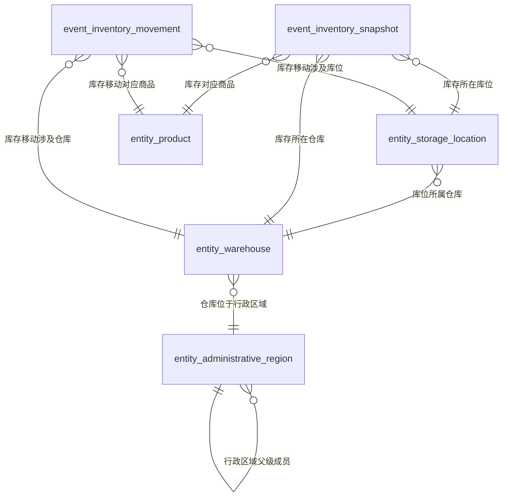

# 数码产品库存与移动语义模型审核报告

## 模型摘要

- 模型类型：`snowflake`
- 模型说明：面向数码产品仓储分析的语义模型，以商品、仓库、库位和行政区域为共享实体，以库存快照和库存移动为事件；库位到仓库、仓库到行政区域及行政区域内部父子关系形成有证据的雪花导航结构。
- 建模结果：4 张实体表、2 张业务事件表、47 个字段、9 条关系、6 个指标。
- 校验状态：通过，0 个错误、0 个警告。

## 实体表

### 商品 (`entity_product`)

以商品编码唯一识别的商品主数据，承载名称、品类、系列、规格和当前有效标准成本。

| 字段 | 名称 | 角色 | 逻辑类型 | 语义类型 | 单位 | 格式 | 比例原值 | 来源 | 审核 | 查询能力 | 证据 | 推断或设计理由 | 待解决项 |
|---|---|---|---|---|---|---|---|---|---|---|---|---|---|
| `field_product_key` | 商品代理键 | surrogate_key | id | ID |  |  |  | technical_generated | ACTIVE |  |  | 为保证实体表具有唯一技术标识而生成，不代表文档中的业务字段。 |  |
| `field_product_code` | 商品编码 | business_key | string | CODE |  |  |  | document_explicit | ACTIVE | 筛选 展示 排序 | `E004`, `E006` |  |  |
| `field_product_name` | 商品名称 | attribute | string | TEXT |  |  |  | document_explicit | ACTIVE | 筛选 展示 排序 | `E004`, `E006` |  |  |
| `field_product_category` | 商品品类 | attribute | category | ENUM |  |  |  | document_explicit | ACTIVE | 筛选 分组 展示 排序 | `E004`, `E006` |  |  |
| `field_product_series` | 商品系列 | attribute | category | ENUM |  |  |  | document_explicit | ACTIVE | 筛选 分组 展示 排序 | `E004`, `E006` |  |  |
| `field_product_specification` | 商品规格 | attribute | string | TEXT |  |  |  | document_explicit | ACTIVE | 筛选 展示 | `E004`, `E006` |  |  |
| `field_product_standard_cost` | 标准成本 | attribute | decimal | AMOUNT | 元/件 |  |  | document_explicit | ACTIVE | 筛选 展示 排序 | `E004`, `E006`, `E014`, `E016` |  |  |

### 仓库 (`entity_warehouse`)

以仓库编码识别的仓库主数据，承载名称、业务区域、类型和标准行政区县归属。

| 字段 | 名称 | 角色 | 逻辑类型 | 语义类型 | 单位 | 格式 | 比例原值 | 来源 | 审核 | 查询能力 | 证据 | 推断或设计理由 | 待解决项 |
|---|---|---|---|---|---|---|---|---|---|---|---|---|---|
| `field_warehouse_key` | 仓库代理键 | surrogate_key | id | ID |  |  |  | technical_generated | ACTIVE |  |  | 为保证实体表具有唯一技术标识而生成，不代表文档中的业务字段。 |  |
| `field_warehouse_code` | 仓库编码 | business_key | string | CODE |  |  |  | document_explicit | ACTIVE | 筛选 展示 排序 | `E004`, `E006` |  |  |
| `field_warehouse_name` | 仓库名称 | attribute | string | TEXT |  |  |  | document_explicit | ACTIVE | 筛选 分组 展示 排序 | `E004`, `E006` |  |  |
| `field_warehouse_region` | 仓库区域 | attribute | category | ENUM |  |  |  | document_explicit | ACTIVE | 筛选 分组 展示 排序 | `E004`, `E006` |  |  |
| `field_warehouse_type` | 仓库类型 | attribute | category | ENUM |  |  |  | document_explicit | ACTIVE | 筛选 分组 展示 排序 | `E004`, `E010` |  |  |
| `field_warehouse_district_code` | 区县编码 | foreign_key | string | FOREIGN_KEY |  |  |  | document_explicit | ACTIVE | 筛选 | `E006`, `E013` |  |  |

### 库位 (`entity_storage_location`)

以WMS全局唯一库位编码识别的库位主数据，承载名称、类型和所属仓库。

| 字段 | 名称 | 角色 | 逻辑类型 | 语义类型 | 单位 | 格式 | 比例原值 | 来源 | 审核 | 查询能力 | 证据 | 推断或设计理由 | 待解决项 |
|---|---|---|---|---|---|---|---|---|---|---|---|---|---|
| `field_location_key` | 库位代理键 | surrogate_key | id | ID |  |  |  | technical_generated | ACTIVE |  |  | 为保证实体表具有唯一技术标识而生成，不代表文档中的业务字段。 |  |
| `field_location_code` | 库位编码 | business_key | string | CODE |  |  |  | document_explicit | ACTIVE | 筛选 展示 排序 | `E004`, `E006` |  |  |
| `field_location_name` | 库位名称 | attribute | string | TEXT |  |  |  | document_explicit | ACTIVE | 筛选 分组 展示 排序 | `E004`, `E006` |  |  |
| `field_location_type` | 库位类型 | attribute | category | ENUM |  |  |  | document_explicit | ACTIVE | 筛选 分组 展示 排序 | `E004`, `E010` |  |  |
| `field_location_warehouse_code` | 所属仓库编码 | foreign_key | string | FOREIGN_KEY |  |  |  | document_explicit | ACTIVE | 筛选 | `E004`, `E006`, `E013` |  |  |

### 行政区域 (`entity_administrative_region`)

跨仓库复用的标准行政地域主数据，通过级别、父级编码和成员层级字段承载大区、省、市、区县成员树。

| 字段 | 名称 | 角色 | 逻辑类型 | 语义类型 | 单位 | 格式 | 比例原值 | 来源 | 审核 | 查询能力 | 证据 | 推断或设计理由 | 待解决项 |
|---|---|---|---|---|---|---|---|---|---|---|---|---|---|
| `field_region_key` | 行政区域代理键 | surrogate_key | id | ID |  |  |  | technical_generated | ACTIVE |  |  | 为保证实体表具有唯一技术标识而生成，不代表文档中的业务字段。 |  |
| `field_region_code` | 行政区域编码 | business_key | string | CODE |  |  |  | document_explicit | ACTIVE | 筛选 展示 排序 | `E004`, `E006` |  |  |
| `field_region_name` | 行政区域名称 | attribute | string | TEXT |  |  |  | document_explicit | ACTIVE | 筛选 分组 展示 排序 | `E004`, `E006` |  |  |
| `field_region_level` | 区域级别 | attribute | category | ENUM |  |  |  | document_explicit | ACTIVE | 筛选 分组 展示 排序 | `E004`, `E006`, `E008` |  |  |
| `field_region_parent_code` | 上级区域编码 | foreign_key | string | FOREIGN_KEY |  |  |  | document_explicit | ACTIVE | 筛选 | `E004`, `E006`, `E008` |  |  |
| `field_region_member_hierarchy` | 行政区域成员 | attribute | string | HIERARCHY |  |  |  | document_explicit | ACTIVE | 筛选 分组 展示 | `E004`, `E006`, `E008` |  |  |

## 业务事件表

### 库存快照 (`event_inventory_snapshot`)

- 定义：按快照时点记录仓库、库位、商品和批次库存状态的小时级快照事件。
- 粒度：每个快照时点、仓库、库位、商品、批次一行
- 无度量事件：否

| 字段 | 名称 | 角色 | 逻辑类型 | 语义类型 | 单位 | 格式 | 比例原值 | 来源 | 审核 | 查询能力 | 证据 | 推断或设计理由 | 待解决项 |
|---|---|---|---|---|---|---|---|---|---|---|---|---|---|
| `field_inventory_snapshot_key` | 库存快照代理键 | surrogate_key | id | ID |  |  |  | technical_generated | ACTIVE |  |  | 文档未提供单一快照事件编号，因此为每个最细粒度快照行生成唯一技术标识。 |  |
| `field_inventory_snapshot_time` | 快照时间 | event_time | timestamp | DATETIME |  |  |  | document_explicit | ACTIVE | 筛选 展示 排序 | `E002`, `E005`, `E011`, `E014` |  |  |
| `field_inventory_product_code` | 商品编码 | foreign_key | string | FOREIGN_KEY |  |  |  | document_explicit | ACTIVE | 筛选 | `E005`, `E013` |  |  |
| `field_inventory_warehouse_code` | 仓库编码 | foreign_key | string | FOREIGN_KEY |  |  |  | document_explicit | ACTIVE | 筛选 | `E005`, `E013` |  |  |
| `field_inventory_location_code` | 库位编码 | foreign_key | string | FOREIGN_KEY |  |  |  | document_explicit | ACTIVE | 筛选 | `E005`, `E013` |  |  |
| `field_inventory_batch_number` | 批次号 | attribute | string | CODE |  |  |  | document_explicit | ACTIVE | 筛选 分组 展示 排序 | `E005`, `E007`, `E011` |  |  |
| `field_inventory_on_hand_quantity` | 在库数量 | measure | integer | NUMBER | 件 |  |  | document_explicit | ACTIVE | 筛选 展示 排序 | `E007`, `E014` |  |  |
| `field_inventory_locked_quantity` | 锁定数量 | measure | integer | NUMBER | 件 |  |  | document_explicit | ACTIVE | 筛选 展示 排序 | `E007`, `E014` |  |  |
| `field_inventory_safety_quantity` | 安全库存数量 | measure | integer | NUMBER | 件 |  |  | document_explicit | ACTIVE | 筛选 展示 排序 | `E007`, `E015` |  |  |
| `field_inventory_receipt_date` | 入库日期 | attribute | date | DATE |  |  |  | document_explicit | ACTIVE | 筛选 展示 排序 | `E007`, `E014` |  |  |
| `field_inventory_available_quantity` | 可用库存数量 | measure | integer | NUMBER | 件 |  |  | document_inferred | ACTIVE | 筛选 展示 排序 | `E011`, `E014` | 文档明确给出可用库存数量字段名称及逐行计算公式，因此保留为语义派生度量；这不表示源数据库存在同名物理列。 |  |
| `field_inventory_amount` | 库存金额 | measure | currency | AMOUNT | 元 |  |  | document_inferred | ACTIVE | 筛选 展示 排序 | `E006`, `E011`, `E014`, `E016` | 文档明确给出库存金额字段名称及计算公式，因此保留为语义派生度量；这不表示源数据库存在同名物理列。 |  |
| `field_inventory_age_days` | 库龄天数 | measure | integer | NUMBER | 天 |  |  | document_inferred | ACTIVE | 筛选 展示 排序 | `E007`, `E012`, `E014` | 为使文档明确的按批次库龄指标关联到库存快照事件，将其表达为行级语义派生度量；这不表示源数据库存在同名物理列。 |  |

### 库存移动 (`event_inventory_movement`)

- 定义：统一承载已完成商品入库和商品出库明细的库存移动事件族，以移动方向区分入库与出库。
- 粒度：每张库存移动单的每个商品明细一行，以移动方向区分商品入库与商品出库
- 无度量事件：否

| 字段 | 名称 | 角色 | 逻辑类型 | 语义类型 | 单位 | 格式 | 比例原值 | 来源 | 审核 | 查询能力 | 证据 | 推断或设计理由 | 待解决项 |
|---|---|---|---|---|---|---|---|---|---|---|---|---|---|
| `field_movement_key` | 库存移动代理键 | surrogate_key | id | ID |  |  |  | technical_generated | ACTIVE |  |  | 入库单号或出库单号不能单独唯一标识商品明细，因此为统一事件族生成行级技术标识。 |  |
| `field_movement_document_number` | 业务单号 | attribute | string | CODE |  |  |  | document_explicit | ACTIVE | 筛选 展示 排序 | `E007`, `E011` |  |  |
| `field_movement_time` | 移动时间 | event_time | timestamp | DATETIME |  |  |  | document_inferred | ACTIVE | 筛选 展示 排序 | `E003`, `E005`, `E011`, `E015` | 两类候选均以完成时间作为发生时间且时间语义兼容，合并为统一移动时间。 |  |
| `field_movement_direction` | 移动方向 | attribute | category | ENUM |  |  |  | document_explicit | ACTIVE | 筛选 分组 展示 排序 | `E005`, `E009`, `E011` |  |  |
| `field_movement_type` | 移动类型 | attribute | category | ENUM |  |  |  | document_inferred | ACTIVE | 筛选 分组 展示 排序 | `E007`, `E011` | 入库类型和出库类型均描述库存动作的业务类别，在统一事件族中由移动方向限定其具体取值域。 |  |
| `field_movement_status` | 移动状态 | attribute | status | ENUM |  |  |  | document_explicit | ACTIVE | 筛选 分组 展示 | `E005`, `E011`, `E014` |  |  |
| `field_movement_product_code` | 商品编码 | foreign_key | string | FOREIGN_KEY |  |  |  | document_explicit | ACTIVE | 筛选 | `E005`, `E013` |  |  |
| `field_movement_warehouse_code` | 仓库编码 | foreign_key | string | FOREIGN_KEY |  |  |  | document_explicit | ACTIVE | 筛选 | `E005`, `E013` |  |  |
| `field_movement_location_code` | 库位编码 | foreign_key | string | FOREIGN_KEY |  |  |  | document_explicit | ACTIVE | 筛选 | `E005` |  |  |
| `field_movement_quantity` | 移动数量 | measure | integer | NUMBER | 件 |  |  | document_inferred | ACTIVE | 筛选 展示 排序 | `E007`, `E011`, `E014` | 入库数量和出库数量单位一致、粒度兼容且均表示单据商品明细的移动数量，因此合并为统一度量。 |  |

## 关系

| 关系编号 | 类型 | 起点 | 终点 | 基数 | 依据 |
|---|---|---|---|---|---|
| `rel_location_to_warehouse` | entity_hierarchy | `entity_storage_location.field_location_warehouse_code` | `entity_warehouse.field_warehouse_code` | many_to_one |  |
| `rel_warehouse_to_region` | entity_hierarchy | `entity_warehouse.field_warehouse_district_code` | `entity_administrative_region.field_region_code` | many_to_one |  |
| `rel_region_to_parent_region` | entity_hierarchy | `entity_administrative_region.field_region_parent_code` | `entity_administrative_region.field_region_code` | many_to_one |  |
| `rel_inventory_snapshot_to_product` | event_to_entity | `event_inventory_snapshot.field_inventory_product_code` | `entity_product.field_product_code` | many_to_one |  |
| `rel_inventory_snapshot_to_warehouse` | event_to_entity | `event_inventory_snapshot.field_inventory_warehouse_code` | `entity_warehouse.field_warehouse_code` | many_to_one |  |
| `rel_inventory_snapshot_to_location` | event_to_entity | `event_inventory_snapshot.field_inventory_location_code` | `entity_storage_location.field_location_code` | many_to_one |  |
| `rel_inventory_movement_to_product` | event_to_entity | `event_inventory_movement.field_movement_product_code` | `entity_product.field_product_code` | many_to_one |  |
| `rel_inventory_movement_to_warehouse` | event_to_entity | `event_inventory_movement.field_movement_warehouse_code` | `entity_warehouse.field_warehouse_code` | many_to_one |  |
| `rel_inventory_movement_to_location` | event_to_entity | `event_inventory_movement.field_movement_location_code` | `entity_storage_location.field_location_code` | many_to_one |  |

## 指标

| 指标 | 定义 | 事件 | 聚合 | 度量字段 | 分子 | 分母 | 公式 | 半可加时间 | 证据 |
|---|---|---|---|---|---|---|---|---|---|
| 在库数量 (`metric_on_hand_quantity`) | 在所选时间范围内先确定最新库存快照，再对该快照的在库数量求和；不得跨快照时间直接累加。 | `event_inventory_snapshot` | semi_additive | `field_inventory_on_hand_quantity` |  |  | SUM(field_inventory_on_hand_quantity) | `field_inventory_snapshot_time` | `E003`, `E007`, `E012`, `E014` |
| 可用库存数量 (`metric_available_inventory_quantity`) | 在所选时间范围内先确定最新库存快照，逐行以在库数量减锁定数量后求和；冻结库位排除规则尚待确认，不得跨快照时间直接累加。 | `event_inventory_snapshot` | semi_additive | `field_inventory_on_hand_quantity`, `field_inventory_locked_quantity`, `field_inventory_available_quantity` |  |  | SUM(field_inventory_on_hand_quantity - field_inventory_locked_quantity) | `field_inventory_snapshot_time` | `E003`, `E007`, `E011`, `E012`, `E014`, `E016` |
| 库存金额 (`metric_inventory_amount`) | 在最新库存快照中逐行以在库数量乘商品当前有效标准成本后求和；标准成本不回溯历史且有效值取值机制待确认，不得跨快照时间直接累加。 | `event_inventory_snapshot` | semi_additive | `field_inventory_on_hand_quantity`, `field_inventory_amount` |  |  | SUM(field_inventory_on_hand_quantity * field_product_standard_cost) | `field_inventory_snapshot_time` | `E003`, `E006`, `E012`, `E014`, `E016` |
| 入库数量 (`metric_inbound_quantity`) | 对已完成且移动方向为商品入库的库存移动明细数量求和。 | `event_inventory_movement` | sum | `field_movement_quantity` |  |  | SUM(field_movement_quantity) FILTER BY field_movement_direction = 商品入库 |  | `E003`, `E005`, `E007`, `E012`, `E014` |
| 出库数量 (`metric_outbound_quantity`) | 对已完成且移动方向为商品出库的库存移动明细数量求和。 | `event_inventory_movement` | sum | `field_movement_quantity` |  |  | SUM(field_movement_quantity) FILTER BY field_movement_direction = 商品出库 |  | `E003`, `E005`, `E007`, `E012`, `E014` |
| 库龄天数 (`metric_inventory_age_days`) | 按库存批次以统计日期减入库日期计算，不同批次之间不得相加；入库日期缺失的记录不参与，统计日期的具体取值口径仍待确认。 | `event_inventory_snapshot` | none | `field_inventory_age_days` |  |  | field_inventory_age_days = 统计日期 - field_inventory_receipt_date |  | `E003`, `E007`, `E012`, `E014` |

## 候选去向

| 候选 | 处理 | 目标表 | 目标字段 | 原因 |
|---|---|---|---|---|
| `ENT001` | independent_table | `entity_product` |  | 商品具有稳定业务键和独立主数据属性，并被多个事件复用，独立建模为核心实体表。 |
| `ENT002` | independent_table | `entity_warehouse` |  | 仓库具有稳定业务键、独立属性和行政区域归属，并被库位及多个事件复用，独立建模为核心实体表。 |
| `ENT003` | independent_table | `entity_storage_location` |  | 库位编码全局唯一，库位具有名称、类型及仓库归属，满足独立维护和复用条件，独立建模为核心实体表。 |
| `ENT004` | independent_table | `entity_administrative_region` |  | 行政区域是跨仓库复用的标准地域主数据，具有独立业务键、级别、父级引用和成员层级，独立建模为核心实体表。 |
| `EVT001` | independent_table | `event_inventory_snapshot` |  | 库存快照具有独立的时点状态粒度，不能与准实时库存移动流水合并，独立建模为快照事件表。 |
| `EVT002` | independent_table | `event_inventory_movement` |  | 商品入库作为库存移动事件族的来源锚点建表；其明细粒度、商品与仓库及库位参与关系、数量语义和完成生命周期均可由统一移动字段表达。 |
| `EVT003` | merged_into_table | `event_inventory_movement` | `field_movement_document_number`, `field_movement_time`, `field_movement_direction`, `field_movement_type`, `field_movement_status`, `field_movement_product_code`, `field_movement_warehouse_code`, `field_movement_location_code`, `field_movement_quantity` | 商品出库与商品入库属于同一库存移动业务过程；二者均为单据商品明细粒度，参与商品、仓库和库位，数量含义兼容，均在完成时发生，仅移动方向、单号名称、完成时间名称和类型名称不同，因此合并并以移动方向和移动类型区分。 |

## 待确认事项

- `unresolved_frozen_location_exclusion` **冻结库位排除口径**：冻结库位的具体清单、识别字段、状态值和生效范围。；影响：在冻结库位清单及其有效范围确定前，可用库存数量无法完整执行文档要求的排除规则。。
- `unresolved_standard_cost_effective_value` **标准成本有效值口径**：商品主数据当前有效标准成本的确定时点、取值机制及缺失值处理方式。；影响：库存金额在历史统计日期上的取值可能随当前标准成本变化，影响结果复现和期间比较。。
- `unresolved_low_stock_rule` **低于安全库存判断规则**：安全库存比较所用库存指标，以及仓库、库位、商品和批次的比较与汇总粒度。；影响：无法确定低库存判断应采用在库数量还是可用库存数量，以及应在哪一汇总粒度比较。。
- `unresolved_inventory_change_metric` **库存变化指标口径**：库存变化的计算公式和期间口径，例如期末减期初或入库数量减出库数量。；影响：无法形成按日、周、月分析库存变化的确定指标。。
- `unresolved_completed_document_filter` **完成单据过滤规则**：移动状态字段中表示已完成的实际状态值、编码映射和过滤规则。；影响：入库数量和出库数量指标要求仅统计已完成单据，但当前无法转换为可执行状态过滤条件。。
- `unresolved_inventory_age_statistical_date` **库龄统计日期口径**：库龄公式中统计日期的取值来源、日期边界和时区口径。；影响：库龄天数虽可按批次计算，但在不同查询日期或时区下可能产生不一致结果。。

## 模型关系图

## 证据目录

| 证据 | 章节 | 行号 | 原文 |
|---|---|---|---|
| `E001` | 文档标题 | 1-1 | # 数码产品销售仓储语义设计 |
| `E002` | 1. 文档说明 | 5-8 | - 资料版本：v1 - 建模范围：共享主数据、库存快照、入库和出库 - 数据更新：库存每小时快照，出入库流水准实时更新 - 使用部门：仓储、销售、供应链管理 |
| `E003` | 2. 业务目标 | 10-14 | ## 2. 业务目标  1. 查询任意商品在各仓库的可用库存、在库数量和库存金额。 2. 按日、周、月分析商品入库量、出库量及库存变化。 3. 识别低于安全库存和库龄超过 90 天的商品。 |
| `E004` | 3. 业务对象 | 18-23 | \| 对象 \| 业务键 \| 主要属性 \| 说明 \| \| --- \| --- \| --- \| --- \| \| 商品 \| 商品编码 \| 商品名称、品类、系列、规格、标准成本 \| 品类和系列作为商品属性，不单独建表 \| \| 仓库 \| 仓库编码 \| 仓库名称、仓库区域、仓库类型 \| 一个仓库属于一个区域 \| \| 库位 \| 库位编码 \| 库位名称、库位类型、所属仓库编码 \| 库位编码由 WMS 统一分配并在全部仓库中唯一 \| \| 行政区域 \| 行政区域编码 \| 行政区域名称、区域级别、上级区域编码、行政区域成员 \| 跨仓库复用的标准地域主数据；成员层级为大区、省、市、区县 \| |
| `E005` | 4. 业务活动 | 27-31 | \| 业务活动 \| 业务粒度 \| 发生时间 \| 参与对象 \| 说明 \| \| --- \| --- \| --- \| --- \| --- \| \| 库存快照 \| 每个快照时点、仓库、库位、商品、批次一行 \| 快照时间 \| 商品、仓库、库位 \| 保存实时库存状态 \| \| 商品入库 \| 每张入库单的商品明细一行 \| 入库完成时间 \| 商品、仓库、库位 \| 只统计已完成入库明细 \| \| 商品出库 \| 每张出库单的商品明细一行 \| 出库完成时间 \| 商品、仓库、库位 \| 只统计已完成出库明细 \| |
| `E006` | 5. 字段与维度（主对象字段） | 35-54 | \| 所属对象或活动 \| 字段 \| 类型 \| 单位 \| 角色与分析方式 \| \| --- \| --- \| --- \| --- \| --- \| \| 商品 \| 商品编码 \| 字符串 \| 无 \| 业务键，可按商品筛选 \| \| 商品 \| 商品名称 \| 字符串 \| 无 \| 名称属性，可搜索 \| \| 商品 \| 品类 \| 字符串 \| 无 \| 分析维度，可分组 \| \| 商品 \| 系列 \| 字符串 \| 无 \| 分析维度，可分组 \| \| 商品 \| 规格 \| 字符串 \| 无 \| 描述属性 \| \| 商品 \| 标准成本 \| 小数 \| 元/件 \| 金额计算字段 \| \| 仓库 \| 仓库编码 \| 字符串 \| 无 \| 业务键 \| \| 仓库 \| 仓库名称 \| 字符串 \| 无 \| 分析维度 \| \| 仓库 \| 仓库区域 \| 字符串 \| 无 \| 分析维度，华北、华东、华南 \| \| 仓库 \| 区县编码 \| 字符串 \| 无 \| 外键，关联行政区域.行政区域编码 \| \| 库位 \| 库位编码 \| 字符串 \| 无 \| 业务键，在全部仓库中唯一 \| \| 库位 \| 所属仓库编码 \| 字符串 \| 无 \| 外键，关联仓库.仓库编码 \| \| 库位 \| 库位名称 \| 字符串 \| 无 \| 分析维度 \| \| 行政区域 \| 行政区域编码 \| 字符串 \| 无 \| 业务键 \| \| 行政区域 \| 行政区域名称 \| 字符串 \| 无 \| 名称属性，可搜索和分组 \| \| 行政区域 \| 区域级别 \| 字符串 \| 无 \| 分析维度，取值为大区、省、市、区县 \| \| 行政区域 \| 上级区域编码 \| 字符串 \| 无 \| 同一行政区域维度内的成员父级引用 \| \| 行政区域 \| 行政区域成员 \| 字符串 \| 无 \| 成员层级字段，按大区→省→市→区县下钻 \| |
| `E007` | 5. 字段与维度（活动字段） | 55-65 | \| 库存快照 \| 批次号 \| 字符串 \| 无 \| 退化维度 \| \| 库存快照 \| 在库数量 \| 整数 \| 件 \| 可加度量 \| \| 库存快照 \| 锁定数量 \| 整数 \| 件 \| 可加度量 \| \| 库存快照 \| 安全库存数量 \| 整数 \| 件 \| 阈值字段 \| \| 库存快照 \| 入库日期 \| 日期 \| 无 \| 计算库龄 \| \| 商品入库 \| 入库单号 \| 字符串 \| 无 \| 退化维度 \| \| 商品入库 \| 入库数量 \| 整数 \| 件 \| 可加度量 \| \| 商品入库 \| 入库类型 \| 字符串 \| 无 \| 分析维度 \| \| 商品出库 \| 出库单号 \| 字符串 \| 无 \| 退化维度 \| \| 商品出库 \| 出库数量 \| 整数 \| 件 \| 可加度量 \| \| 商品出库 \| 出库类型 \| 字符串 \| 无 \| 分析维度 \| |
| `E008` | 5.1 行政区域成员层级 | 67-75 | ### 5.1 行政区域成员层级  该层级是同一“行政区域”维度内部的成员树，不是“库位属于仓库”这类跨实体关系。层级顺序固定为“大区 → 省 → 市 → 区县”。缺少区县的路径可以在城市结束。  \| 大区 \| 省 \| 市 \| 区县 \| 成员编码路径 \| \| --- \| --- \| --- \| --- \| --- \| \| 华东 \| 江苏 \| 南京 \| 玄武区 \| EAST / JS / NJ / XW \| \| 华东 \| 浙江 \| 杭州 \| 无 \| EAST / ZJ / HZ \| \| 华南 \| 广东 \| 深圳 \| 南山区 \| SOUTH / GD / SZ / NS \| |
| `E009` | 5.2 业务同义词（实体与事件） | 77-88 | ### 5.2 业务同义词  下表中的词是业务人员实际使用的表达，可以作为同义词；标准名称、技术编码、代理键、外键不得反向当作同义词。  \| 目标类型 \| 标准目标 \| 明确同义词 \| \| --- \| --- \| --- \| \| 实体 \| 商品 \| 产品、SKU主数据 \| \| 实体 \| 仓库 \| 仓、库房 \| \| 实体 \| 库位 \| 储位、货位 \| \| 实体 \| 行政区域 \| 地区、地域 \| \| 事件 \| 库存快照 \| 库存时点、现存快照 \| \| 事件 \| 库存移动（商品入库与商品出库事件族） \| 出入库流水、库存流水 \| |
| `E010` | 5.2 业务同义词（主对象字段） | 89-105 | \| 字段 \| 商品.商品编码 \| 商品号、SKU编码 \| \| 字段 \| 商品.商品名称 \| 产品名称、SKU名称 \| \| 字段 \| 商品.品类 \| 产品品类、类目 \| \| 字段 \| 商品.系列 \| 产品系列、产品线 \| \| 字段 \| 商品.规格 \| 型号规格、规格型号 \| \| 字段 \| 商品.标准成本 \| 单位成本、标准单位成本 \| \| 字段 \| 仓库.仓库编码 \| 仓库号、仓编码 \| \| 字段 \| 仓库.仓库名称 \| 仓名称、库房名称 \| \| 字段 \| 仓库.仓库区域 \| 仓库大区、仓库地区 \| \| 字段 \| 仓库.仓库类型 \| 仓类别、仓储类型 \| \| 字段 \| 库位.库位编码 \| 货位编码、储位号 \| \| 字段 \| 库位.库位名称 \| 货位名称、储位名称 \| \| 字段 \| 库位.库位类型 \| 储位类型、货位类型 \| \| 字段 \| 行政区域.行政区域编码 \| 地区编码、行政区划码 \| \| 字段 \| 行政区域.行政区域名称 \| 地区名称、行政区名称 \| \| 字段 \| 行政区域.区域级别 \| 地区层级、行政级别 \| \| 字段 \| 行政区域.行政区域成员 \| 地域节点、地区成员 \| |
| `E011` | 5.2 业务同义词（活动字段） | 106-119 | \| 字段 \| 库存快照.批次号 \| 库存批号、批号 \| \| 字段 \| 库存快照.在库数量 \| 现存量、库存量 \| \| 字段 \| 库存快照.锁定数量 \| 占用量、锁定库存 \| \| 字段 \| 库存快照.安全库存数量 \| 安全库存、库存下限 \| \| 字段 \| 库存快照.入库日期 \| 到库日期、收货日期 \| \| 字段 \| 库存快照.快照时间 \| 库存时点、采集时间 \| \| 字段 \| 库存快照.可用库存数量 \| 可售库存量、可用量 \| \| 字段 \| 库存快照.库存金额 \| 库存价值、存货金额 \| \| 字段 \| 库存移动.业务单号 \| 出入库单号、库存单号 \| \| 字段 \| 库存移动.移动数量 \| 出入库数量、变动数量 \| \| 字段 \| 库存移动.移动类型 \| 出入库类型、库存动作 \| \| 字段 \| 库存移动.移动时间 \| 出入库时间、库存变动时间 \| \| 字段 \| 库存移动.移动状态 \| 出入库状态、流水状态 \| \| 字段 \| 库存移动.移动方向 \| 出入库方向、库存方向 \| |
| `E012` | 5.2 业务同义词（指标、维度与规则） | 120-131 | \| 指标 \| 在库数量 \| 现存库存、库存件数 \| \| 指标 \| 可用库存数量 \| 可售库存、可用量 \| \| 指标 \| 库存金额 \| 库存价值、存货金额 \| \| 指标 \| 入库数量 \| 收货量、入仓量 \| \| 指标 \| 出库数量 \| 发出量、出仓量 \| \| 指标 \| 库龄天数 \| 库存天龄、存放天数 \| \| 维度 \| 商品品类 \| 产品类目、品类维度 \| \| 维度 \| 商品系列 \| 产品线、系列维度 \| \| 维度 \| 仓库区域 \| 仓库地区、仓库大区 \| \| 维度 \| 行政区域 \| 地域维度、地区维度 \| \| 规则候选 \| 最新库存快照规则 \| 最新时点库存、时点库存口径 \| \| 规则候选 \| 完成单据过滤规则 \| 有效出入库、已完成单据口径 \| |
| `E013` | 6. 对象关系 | 133-145 | ## 6. 对象关系  \| 中文名称 \| 起点 \| 终点 \| 基数 \| 关联字段 \| 依据 \| \| --- \| --- \| --- \| --- \| --- \| --- \| \| 库位所属仓库 \| 库位 \| 仓库 \| 多对一 \| 库位.所属仓库编码 = 仓库.仓库编码 \| 库位必须归属一个仓库 \| \| 仓库位于区县 \| 仓库 \| 行政区域 \| 多对一 \| 仓库.区县编码 = 行政区域.行政区域编码 \| 每个仓库按标准区县归属行政区域成员树 \| \| 库存对应商品 \| 库存快照 \| 商品 \| 多对一 \| 库存快照.商品编码 = 商品.商品编码 \| 每条库存记录只对应一个商品 \| \| 库存所在仓库 \| 库存快照 \| 仓库 \| 多对一 \| 库存快照.仓库编码 = 仓库.仓库编码 \| 每条库存记录只对应一个仓库 \| \| 库存所在库位 \| 库存快照 \| 库位 \| 多对一 \| 库位编码 \| WMS 库位编码全局唯一 \| \| 入库对应商品 \| 商品入库 \| 商品 \| 多对一 \| 商品编码 \| 入库明细对应一个商品 \| \| 入库进入仓库 \| 商品入库 \| 仓库 \| 多对一 \| 仓库编码 \| 入库明细进入一个仓库 \| \| 出库对应商品 \| 商品出库 \| 商品 \| 多对一 \| 商品编码 \| 出库明细对应一个商品 \| \| 出库离开仓库 \| 商品出库 \| 仓库 \| 多对一 \| 仓库编码 \| 出库明细离开一个仓库 \| |
| `E014` | 7. 指标口径 | 147-156 | ## 7. 指标口径  \| 指标 \| 定义与公式 \| 聚合方式 \| 单位 \| 所属活动 \| 排除规则 \| \| --- \| --- \| --- \| --- \| --- \| --- \| \| 在库数量 \| `SUM(在库数量)` \| 求和 \| 件 \| 库存快照 \| 只取所选时间内最新快照 \| \| 可用库存数量 \| `SUM(在库数量 - 锁定数量)` \| 先逐行计算再求和 \| 件 \| 库存快照 \| 不包含冻结库位 \| \| 库存金额 \| `SUM(在库数量 × 标准成本)` \| 先逐行计算再求和 \| 元 \| 库存快照 \| 只取最新快照 \| \| 入库数量 \| `SUM(入库数量)` \| 求和 \| 件 \| 商品入库 \| 仅已完成单据 \| \| 出库数量 \| `SUM(出库数量)` \| 求和 \| 件 \| 商品出库 \| 仅已完成单据 \| \| 库龄天数 \| `统计日期 - 入库日期` \| 按库存批次计算，不跨批次相加 \| 天 \| 库存快照 \| 无入库日期的记录不参与 \| |
| `E015` | 8. 示例问题 | 158-163 | ## 8. 示例问题  1. 华南仓的 BT-X100 当前可用库存是多少？ 2. 最近 30 天各品类的入库量和出库量是多少？ 3. 哪些商品低于安全库存数量？ 4. 各仓库库龄超过 90 天的库存金额是多少？ |
| `E016` | 9. 待确认事项 | 165-168 | ## 9. 待确认事项  1. 冻结库位清单由仓库主数据提供。 2. 标准成本以商品主数据当前有效值计算，不回溯历史成本。 |

## 语义增强

增强产物校验通过。

- 维度：4 个
- 待结构化规则候选：2 个
- 成员层级：1 个
- 同义词组：50 个

### 成员层级

- **行政区域成员层级**：大区 → 省 → 市 → 区县；成员 10 个
