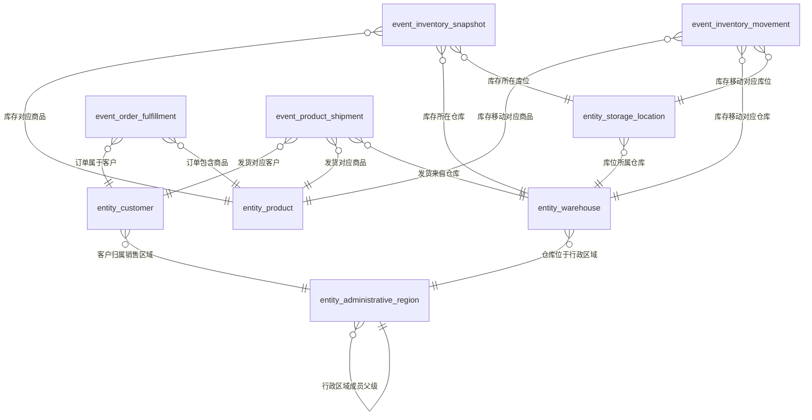

# 数码产品销售仓储语义模型审核报告

## 模型摘要

- 模型类型：`snowflake`
- 模型说明：面向数码产品库存、库存移动、销售订单履约和发货时效分析的语义模型；行政区域、仓库和库位构成有证据支持的实体层级，库存快照与流水事实共享商品、仓库等实体。
- 建模结果：5 张实体表、4 张业务事件表、78 个字段、15 条关系、10 个指标。
- 校验状态：通过，0 个错误、0 个警告。

## 实体表

### 商品 (`entity_product`)

由商品编码标识并被库存、库存移动、订单履约和发货过程复用的商品主数据。

| 字段 | 名称 | 角色 | 逻辑类型 | 语义类型 | 单位 | 格式 | 比例原值 | 来源 | 审核 | 查询能力 | 证据 | 推断或设计理由 | 待解决项 |
|---|---|---|---|---|---|---|---|---|---|---|---|---|---|
| `field_product_key` | 商品代理键 | surrogate_key | id | ID |  |  |  | technical_generated | ACTIVE |  |  | 为保证实体连接稳定性而生成的唯一技术键。 |  |
| `field_product_code` | 商品编码 | business_key | string | CODE |  |  |  | document_explicit | ACTIVE | 筛选 分组 展示 排序 | `E004`, `E006` |  |  |
| `field_product_name` | 商品名称 | attribute | string | TEXT |  |  |  | document_explicit | ACTIVE | 筛选 展示 排序 | `E004`, `E006` |  |  |
| `field_product_category` | 品类 | attribute | category | ENUM |  |  |  | document_explicit | ACTIVE | 筛选 分组 展示 排序 | `E004`, `E006` |  |  |
| `field_product_series` | 系列 | attribute | category | ENUM |  |  |  | document_explicit | ACTIVE | 筛选 分组 展示 排序 | `E004`, `E006` |  |  |
| `field_product_specification` | 规格 | attribute | string | TEXT |  |  |  | document_explicit | ACTIVE | 筛选 展示 | `E004`, `E006` |  |  |
| `field_product_standard_cost` | 标准成本 | attribute | decimal | AMOUNT | 元/件 |  |  | document_explicit | ACTIVE | 筛选 展示 排序 | `E004`, `E006`, `E028` |  |  |

### 仓库 (`entity_warehouse`)

由仓库编码标识并被库存、库存移动及发货过程复用的仓库主数据。

| 字段 | 名称 | 角色 | 逻辑类型 | 语义类型 | 单位 | 格式 | 比例原值 | 来源 | 审核 | 查询能力 | 证据 | 推断或设计理由 | 待解决项 |
|---|---|---|---|---|---|---|---|---|---|---|---|---|---|
| `field_warehouse_key` | 仓库代理键 | surrogate_key | id | ID |  |  |  | technical_generated | ACTIVE |  |  | 为保证实体连接稳定性而生成的唯一技术键。 |  |
| `field_warehouse_code` | 仓库编码 | business_key | string | CODE |  |  |  | document_explicit | ACTIVE | 筛选 分组 展示 排序 | `E004`, `E007` |  |  |
| `field_warehouse_name` | 仓库名称 | attribute | string | TEXT |  |  |  | document_explicit | ACTIVE | 筛选 分组 展示 排序 | `E004`, `E007` |  |  |
| `field_warehouse_region` | 仓库区域 | attribute | category | ENUM |  |  |  | document_explicit | ACTIVE | 筛选 分组 展示 排序 | `E004`, `E007` |  |  |
| `field_warehouse_type` | 仓库类型 | attribute | category | ENUM |  |  |  | document_explicit | ACTIVE | 筛选 分组 展示 排序 | `E004`, `E014` |  |  |
| `field_warehouse_district_code` | 区县编码 | foreign_key | string | FOREIGN_KEY |  |  |  | document_explicit | ACTIVE | 筛选 | `E007`, `E012`, `E018` |  |  |

### 库位 (`entity_storage_location`)

由WMS全局唯一库位编码标识、归属于仓库并被库存及库存移动过程复用的库位主数据。

| 字段 | 名称 | 角色 | 逻辑类型 | 语义类型 | 单位 | 格式 | 比例原值 | 来源 | 审核 | 查询能力 | 证据 | 推断或设计理由 | 待解决项 |
|---|---|---|---|---|---|---|---|---|---|---|---|---|---|
| `field_storage_location_key` | 库位代理键 | surrogate_key | id | ID |  |  |  | technical_generated | ACTIVE |  |  | 为保证实体连接稳定性而生成的唯一技术键。 |  |
| `field_storage_location_code` | 库位编码 | business_key | string | CODE |  |  |  | document_explicit | ACTIVE | 筛选 分组 展示 排序 | `E004`, `E007` |  |  |
| `field_storage_location_name` | 库位名称 | attribute | string | TEXT |  |  |  | document_explicit | ACTIVE | 筛选 分组 展示 排序 | `E004`, `E007` |  |  |
| `field_storage_location_type` | 库位类型 | attribute | category | ENUM |  |  |  | document_explicit | ACTIVE | 筛选 分组 展示 排序 | `E004`, `E014` |  |  |
| `field_storage_location_warehouse_code` | 所属仓库编码 | foreign_key | string | FOREIGN_KEY |  |  |  | document_explicit | ACTIVE | 筛选 | `E004`, `E007`, `E018` |  |  |

### 客户 (`entity_customer`)

由客户编码标识、跨订单共享并参与订单履约和发货过程的客户主数据。

| 字段 | 名称 | 角色 | 逻辑类型 | 语义类型 | 单位 | 格式 | 比例原值 | 来源 | 审核 | 查询能力 | 证据 | 推断或设计理由 | 待解决项 |
|---|---|---|---|---|---|---|---|---|---|---|---|---|---|
| `field_customer_key` | 客户代理键 | surrogate_key | id | ID |  |  |  | technical_generated | ACTIVE |  |  | 为保证实体连接稳定性而生成的唯一技术键。 |  |
| `field_customer_code` | 客户编码 | business_key | string | CODE |  |  |  | document_explicit | ACTIVE | 筛选 分组 展示 排序 | `E004`, `E008` |  |  |
| `field_customer_name` | 客户名称 | attribute | string | TEXT |  |  |  | document_explicit | ACTIVE | 筛选 分组 展示 排序 | `E004`, `E008` |  |  |
| `field_customer_level` | 客户等级 | attribute | category | ENUM |  |  |  | document_explicit | ACTIVE | 筛选 分组 展示 排序 | `E004`, `E008` |  |  |
| `field_customer_sales_region` | 销售区域 | attribute | category | ENUM |  |  |  | document_explicit | ACTIVE | 筛选 分组 展示 排序 | `E004`, `E008` |  |  |
| `field_customer_sales_region_code` | 销售区域编码 | foreign_key | string | FOREIGN_KEY |  |  |  | document_explicit | ACTIVE | 筛选 | `E008`, `E012`, `E018` |  |  |

### 行政区域 (`entity_administrative_region`)

跨仓库和客户复用的标准行政区域主数据，内部承载大区、省、市、区县成员树。

| 字段 | 名称 | 角色 | 逻辑类型 | 语义类型 | 单位 | 格式 | 比例原值 | 来源 | 审核 | 查询能力 | 证据 | 推断或设计理由 | 待解决项 |
|---|---|---|---|---|---|---|---|---|---|---|---|---|---|
| `field_administrative_region_key` | 行政区域代理键 | surrogate_key | id | ID |  |  |  | technical_generated | ACTIVE |  |  | 为保证层级成员连接稳定性而生成的唯一技术键。 |  |
| `field_administrative_region_code` | 行政区域编码 | business_key | string | CODE |  |  |  | document_explicit | ACTIVE | 筛选 分组 展示 排序 | `E004`, `E008` |  |  |
| `field_administrative_region_name` | 行政区域名称 | attribute | string | TEXT |  |  |  | document_explicit | ACTIVE | 筛选 分组 展示 排序 | `E004`, `E008` |  |  |
| `field_administrative_region_level` | 区域级别 | attribute | category | ENUM |  |  |  | document_explicit | ACTIVE | 筛选 分组 展示 排序 | `E008`, `E012` |  |  |
| `field_administrative_region_parent_code` | 上级区域编码 | foreign_key | string | FOREIGN_KEY |  |  |  | document_explicit | ACTIVE | 筛选 | `E004`, `E008`, `E012` |  |  |
| `field_administrative_region_member` | 行政区域成员 | attribute | string | HIERARCHY |  |  |  | document_explicit | ACTIVE | 筛选 分组 展示 | `E008`, `E012` |  |  |
| `field_administrative_region_code_path` | 成员编码路径 | attribute | string | HIERARCHY |  |  |  | document_explicit | ACTIVE | 筛选 展示 | `E012`, `E014` |  |  |

## 业务事件表

### 库存快照 (`event_inventory_snapshot`)

- 定义：在指定快照时间观察仓库、库位、商品及批次库存状态的库存快照事实。
- 粒度：每个快照时点、仓库、库位、商品、批次一行。
- 无度量事件：否

| 字段 | 名称 | 角色 | 逻辑类型 | 语义类型 | 单位 | 格式 | 比例原值 | 来源 | 审核 | 查询能力 | 证据 | 推断或设计理由 | 待解决项 |
|---|---|---|---|---|---|---|---|---|---|---|---|---|---|
| `field_inventory_snapshot_key` | 库存快照事件键 | surrogate_key | id | ID |  |  |  | technical_generated | ACTIVE |  |  | 文档未提供单一快照行标识，生成唯一技术事件键以稳定标识该粒度记录。 |  |
| `field_inventory_snapshot_time` | 快照时间 | event_time | timestamp | DATETIME |  |  |  | document_explicit | ACTIVE | 筛选 展示 排序 | `E005`, `E015`, `E020` |  |  |
| `field_inventory_snapshot_product_code` | 商品编码 | foreign_key | string | FOREIGN_KEY |  |  |  | document_explicit | ACTIVE | 筛选 | `E019` |  |  |
| `field_inventory_snapshot_warehouse_code` | 仓库编码 | foreign_key | string | FOREIGN_KEY |  |  |  | document_explicit | ACTIVE | 筛选 | `E019` |  |  |
| `field_inventory_snapshot_storage_location_code` | 库位编码 | foreign_key | string | FOREIGN_KEY |  |  |  | document_explicit | ACTIVE | 筛选 | `E019` |  |  |
| `field_inventory_snapshot_batch_number` | 批次号 | attribute | string | CODE |  |  |  | document_explicit | ACTIVE | 筛选 分组 展示 排序 | `E005`, `E009` |  |  |
| `field_inventory_snapshot_on_hand_quantity` | 在库数量 | measure | integer | NUMBER | 件 |  |  | document_explicit | ACTIVE | 筛选 展示 排序 | `E009`, `E020` |  |  |
| `field_inventory_snapshot_locked_quantity` | 锁定数量 | measure | integer | NUMBER | 件 |  |  | document_explicit | ACTIVE | 筛选 展示 排序 | `E009` |  |  |
| `field_inventory_snapshot_safety_stock_quantity` | 安全库存数量 | measure | integer | NUMBER | 件 |  |  | document_explicit | ACTIVE | 筛选 展示 排序 | `E003`, `E009` |  |  |
| `field_inventory_snapshot_receipt_date` | 入库日期 | attribute | date | DATE |  |  |  | document_explicit | ACTIVE | 筛选 展示 排序 | `E009`, `E020` |  |  |
| `field_inventory_snapshot_inventory_amount` | 库存金额 | measure | decimal | AMOUNT | 元 |  |  | document_explicit | ACTIVE | 筛选 展示 排序 | `E009`, `E020` |  |  |
| `field_inventory_snapshot_inventory_age_days` | 库龄天数 | measure | integer | NUMBER | 天 |  |  | document_inferred | ACTIVE | 筛选 展示 排序 | `E020` | 指标口径明确给出“统计日期减入库日期”的逐批次结果，因此将该结果建模为库存快照上的派生度量。 |  |

### 库存移动 (`event_inventory_movement`)

- 定义：统一承载已完成商品入库与商品出库明细，以移动方向和移动类型区分业务动作。
- 粒度：每张库存移动业务单的一条商品明细一行；入库和出库以移动方向区分。
- 无度量事件：否

| 字段 | 名称 | 角色 | 逻辑类型 | 语义类型 | 单位 | 格式 | 比例原值 | 来源 | 审核 | 查询能力 | 证据 | 推断或设计理由 | 待解决项 |
|---|---|---|---|---|---|---|---|---|---|---|---|---|---|
| `field_inventory_movement_key` | 库存移动事件键 | surrogate_key | id | ID |  |  |  | technical_generated | ACTIVE |  |  | 文档未提供统一且单列唯一的库存移动明细标识，生成技术事件键。 |  |
| `field_inventory_movement_time` | 移动时间 | event_time | timestamp | DATETIME |  |  |  | document_explicit | ACTIVE | 筛选 展示 排序 | `E005`, `E015` |  |  |
| `field_inventory_movement_product_code` | 商品编码 | foreign_key | string | FOREIGN_KEY |  |  |  | document_explicit | ACTIVE | 筛选 | `E019` |  |  |
| `field_inventory_movement_warehouse_code` | 仓库编码 | foreign_key | string | FOREIGN_KEY |  |  |  | document_explicit | ACTIVE | 筛选 | `E019` |  |  |
| `field_inventory_movement_storage_location_code` | 库位编码 | foreign_key | string | FOREIGN_KEY |  |  |  | document_inferred | ACTIVE | 筛选 | `E005` | 业务活动明确将库位列为入库和出库参与对象，且库位编码全局唯一，因此推断统一事件族通过库位编码关联库位实体。 |  |
| `field_inventory_movement_business_document_number` | 业务单号 | attribute | string | CODE |  |  |  | document_explicit | ACTIVE | 筛选 展示 排序 | `E010`, `E015` |  |  |
| `field_inventory_movement_quantity` | 移动数量 | measure | integer | NUMBER | 件 |  |  | document_explicit | ACTIVE | 筛选 展示 排序 | `E010`, `E015`, `E020` |  |  |
| `field_inventory_movement_type` | 移动类型 | attribute | category | ENUM |  |  |  | document_explicit | ACTIVE | 筛选 分组 展示 排序 | `E010`, `E015` |  |  |
| `field_inventory_movement_direction` | 移动方向 | attribute | category | ENUM |  |  |  | document_explicit | ACTIVE | 筛选 分组 展示 排序 | `E013`, `E015` |  |  |
| `field_inventory_movement_status` | 移动状态 | attribute | status | ENUM |  |  |  | document_explicit | ACTIVE | 筛选 分组 展示 排序 | `E005`, `E015` |  |  |

### 销售订单履约 (`event_order_fulfillment`)

- 定义：在订单创建时间形成的销售订单商品履约行，承载订购、取消、欠货、承诺日期和状态。
- 粒度：每张销售订单的每个商品明细一行，由销售订单号与订单行号共同标识。
- 无度量事件：否

| 字段 | 名称 | 角色 | 逻辑类型 | 语义类型 | 单位 | 格式 | 比例原值 | 来源 | 审核 | 查询能力 | 证据 | 推断或设计理由 | 待解决项 |
|---|---|---|---|---|---|---|---|---|---|---|---|---|---|
| `field_order_fulfillment_key` | 订单履约事件键 | surrogate_key | id | ID |  |  |  | technical_generated | ACTIVE |  |  | 为销售订单号与订单行号组成的业务粒度生成稳定的唯一技术事件键。 |  |
| `field_order_fulfillment_created_at` | 订单创建时间 | event_time | timestamp | DATETIME |  |  |  | document_explicit | ACTIVE | 筛选 展示 排序 | `E005`, `E016` |  |  |
| `field_order_fulfillment_customer_code` | 客户编码 | foreign_key | string | FOREIGN_KEY |  |  |  | document_explicit | ACTIVE | 筛选 | `E019` |  |  |
| `field_order_fulfillment_product_code` | 商品编码 | foreign_key | string | FOREIGN_KEY |  |  |  | document_explicit | ACTIVE | 筛选 | `E019` |  |  |
| `field_order_fulfillment_sales_order_number` | 销售订单号 | business_key | string | CODE |  |  |  | document_explicit | ACTIVE | 筛选 展示 排序 | `E011`, `E016`, `E019` |  |  |
| `field_order_fulfillment_order_line_number` | 订单行号 | business_key | integer | NUMBER |  |  |  | document_explicit | ACTIVE | 筛选 展示 排序 | `E011`, `E016`, `E019` |  |  |
| `field_order_fulfillment_ordered_quantity` | 订购数量 | measure | integer | NUMBER | 件 |  |  | document_explicit | ACTIVE | 筛选 展示 排序 | `E011`, `E020` |  |  |
| `field_order_fulfillment_cancelled_quantity` | 取消数量 | measure | integer | NUMBER | 件 |  |  | document_explicit | ACTIVE | 筛选 展示 排序 | `E011`, `E020` |  |  |
| `field_order_fulfillment_promised_ship_date` | 承诺发货日期 | attribute | date | DATE |  |  |  | document_explicit | ACTIVE | 筛选 展示 排序 | `E011`, `E020` |  |  |
| `field_order_fulfillment_status` | 订单状态 | attribute | status | ENUM |  |  |  | document_explicit | ACTIVE | 筛选 分组 展示 排序 | `E011`, `E017` |  |  |
| `field_order_fulfillment_backorder_quantity` | 欠货数量 | measure | integer | NUMBER | 件 |  |  | document_explicit | ACTIVE | 筛选 展示 排序 | `E011`, `E020` |  |  |

### 商品发货 (`event_product_shipment`)

- 定义：在实际发货时间发生的一条发货单订单商品明细，同一订单行拆分发货时每次发货分别成行。
- 粒度：每张发货单的一条订单商品明细一行；同一订单行拆分多次发货时，每次发货分别成行。
- 无度量事件：否

| 字段 | 名称 | 角色 | 逻辑类型 | 语义类型 | 单位 | 格式 | 比例原值 | 来源 | 审核 | 查询能力 | 证据 | 推断或设计理由 | 待解决项 |
|---|---|---|---|---|---|---|---|---|---|---|---|---|---|
| `field_product_shipment_key` | 商品发货事件键 | surrogate_key | id | ID |  |  |  | technical_generated | ACTIVE |  |  | 发货单号不能单独标识发货单内的商品明细，生成唯一技术事件键。 |  |
| `field_product_shipment_time` | 实际发货时间 | event_time | timestamp | DATETIME |  |  |  | document_explicit | ACTIVE | 筛选 展示 排序 | `E005`, `E011` |  |  |
| `field_product_shipment_customer_code` | 客户编码 | foreign_key | string | FOREIGN_KEY |  |  |  | document_inferred | ACTIVE | 筛选 | `E005` | 业务活动明确将客户列为商品发货参与对象，因此推断发货明细通过客户编码关联客户主数据。 |  |
| `field_product_shipment_product_code` | 商品编码 | foreign_key | string | FOREIGN_KEY |  |  |  | document_explicit | ACTIVE | 筛选 | `E019` |  |  |
| `field_product_shipment_warehouse_code` | 仓库编码 | foreign_key | string | FOREIGN_KEY |  |  |  | document_explicit | ACTIVE | 筛选 | `E019`, `E028` |  |  |
| `field_product_shipment_number` | 发货单号 | attribute | string | CODE |  |  |  | document_explicit | ACTIVE | 筛选 展示 排序 | `E011`, `E016` |  |  |
| `field_product_shipment_sales_order_number` | 销售订单号 | attribute | string | CODE |  |  |  | document_explicit | ACTIVE | 筛选 展示 排序 | `E016`, `E019` |  |  |
| `field_product_shipment_order_line_number` | 订单行号 | attribute | integer | NUMBER |  |  |  | document_explicit | ACTIVE | 筛选 展示 排序 | `E016`, `E019` |  |  |
| `field_product_shipment_quantity` | 发货数量 | measure | integer | NUMBER | 件 |  |  | document_explicit | ACTIVE | 筛选 展示 排序 | `E011`, `E020` |  |  |
| `field_product_shipment_carrier` | 承运商 | attribute | string | TEXT |  |  |  | document_explicit | ACTIVE | 筛选 分组 展示 排序 | `E011`, `E017` |  |  |
| `field_product_shipment_tracking_number` | 运单号 | attribute | string | CODE |  |  |  | document_explicit | ACTIVE | 筛选 展示 排序 | `E011` |  |  |
| `field_product_shipment_on_time_flag` | 按时发货标记 | measure | integer | NUMBER | 次 |  |  | document_explicit | ACTIVE | 筛选 展示 排序 | `E011`, `E020` |  |  |
| `field_product_shipment_status` | 发货状态 | attribute | status | ENUM |  |  |  | document_explicit | ACTIVE | 筛选 分组 展示 排序 | `E016`, `E020` |  |  |
| `field_product_shipment_valid_order_line_count` | 有效发货订单行计数 | measure | integer | NUMBER |  |  |  | document_inferred | ACTIVE |  | `E020` | 指标口径明确以COUNT(有效发货订单行)作为分母，因此将每条有效记录的计数贡献建模为分母度量，以支持已给出的比率公式。 |  |

## 关系

| 关系编号 | 类型 | 起点 | 终点 | 基数 | 依据 |
|---|---|---|---|---|---|
| `rel_storage_location_to_warehouse` | entity_hierarchy | `entity_storage_location.field_storage_location_warehouse_code` | `entity_warehouse.field_warehouse_code` | many_to_one |  |
| `rel_warehouse_to_administrative_region` | entity_hierarchy | `entity_warehouse.field_warehouse_district_code` | `entity_administrative_region.field_administrative_region_code` | many_to_one |  |
| `rel_customer_to_administrative_region` | entity_hierarchy | `entity_customer.field_customer_sales_region_code` | `entity_administrative_region.field_administrative_region_code` | many_to_one |  |
| `rel_administrative_region_to_parent` | entity_hierarchy | `entity_administrative_region.field_administrative_region_parent_code` | `entity_administrative_region.field_administrative_region_code` | many_to_one |  |
| `rel_inventory_snapshot_to_product` | event_to_entity | `event_inventory_snapshot.field_inventory_snapshot_product_code` | `entity_product.field_product_code` | many_to_one |  |
| `rel_inventory_snapshot_to_warehouse` | event_to_entity | `event_inventory_snapshot.field_inventory_snapshot_warehouse_code` | `entity_warehouse.field_warehouse_code` | many_to_one |  |
| `rel_inventory_snapshot_to_storage_location` | event_to_entity | `event_inventory_snapshot.field_inventory_snapshot_storage_location_code` | `entity_storage_location.field_storage_location_code` | many_to_one |  |
| `rel_inventory_movement_to_product` | event_to_entity | `event_inventory_movement.field_inventory_movement_product_code` | `entity_product.field_product_code` | many_to_one |  |
| `rel_inventory_movement_to_warehouse` | event_to_entity | `event_inventory_movement.field_inventory_movement_warehouse_code` | `entity_warehouse.field_warehouse_code` | many_to_one |  |
| `rel_inventory_movement_to_storage_location` | event_to_entity | `event_inventory_movement.field_inventory_movement_storage_location_code` | `entity_storage_location.field_storage_location_code` | many_to_one | 业务活动同时将库位列为商品入库和商品出库的参与对象，且库位编码全局唯一，因此统一库存移动事件可关联库位实体。 |
| `rel_order_fulfillment_to_customer` | event_to_entity | `event_order_fulfillment.field_order_fulfillment_customer_code` | `entity_customer.field_customer_code` | many_to_one |  |
| `rel_order_fulfillment_to_product` | event_to_entity | `event_order_fulfillment.field_order_fulfillment_product_code` | `entity_product.field_product_code` | many_to_one |  |
| `rel_product_shipment_to_customer` | event_to_entity | `event_product_shipment.field_product_shipment_customer_code` | `entity_customer.field_customer_code` | many_to_one | 业务活动明确将客户列为商品发货参与对象，因此发货明细关联客户实体。 |
| `rel_product_shipment_to_product` | event_to_entity | `event_product_shipment.field_product_shipment_product_code` | `entity_product.field_product_code` | many_to_one |  |
| `rel_product_shipment_to_warehouse` | event_to_entity | `event_product_shipment.field_product_shipment_warehouse_code` | `entity_warehouse.field_warehouse_code` | many_to_one |  |

## 指标

| 指标 | 定义 | 事件 | 聚合 | 度量字段 | 分子 | 分母 | 公式 | 半可加时间 | 证据 |
|---|---|---|---|---|---|---|---|---|---|
| 在库数量 (`metric_on_hand_quantity`) | 所选时间范围内先按快照时间选择最新库存快照，再跨商品、仓库、库位和批次汇总在库数量；不得跨快照时间普通求和。 | `event_inventory_snapshot` | semi_additive | `field_inventory_snapshot_on_hand_quantity` |  |  | SUM(field_inventory_snapshot_on_hand_quantity)，仅取所选时间内最新快照 | `field_inventory_snapshot_time` | `E009`, `E020` |
| 可用库存数量 (`metric_available_inventory_quantity`) | 最新库存快照中逐行以在库数量减锁定数量后汇总，并排除冻结库位；冻结库位匹配规则确认前不能可靠执行排除。 | `event_inventory_snapshot` | semi_additive | `field_inventory_snapshot_on_hand_quantity`, `field_inventory_snapshot_locked_quantity` |  |  | SUM(field_inventory_snapshot_on_hand_quantity - field_inventory_snapshot_locked_quantity)，仅取最新快照并排除冻结库位 | `field_inventory_snapshot_time` | `E003`, `E020`, `E028` |
| 库存金额 (`metric_inventory_amount`) | 最新库存快照中的库存金额合计；逐行金额等于在库数量乘商品当前有效标准成本，不得跨快照时间普通求和。 | `event_inventory_snapshot` | semi_additive | `field_inventory_snapshot_inventory_amount` |  |  | SUM(field_inventory_snapshot_inventory_amount)，其中逐行库存金额=在库数量×商品标准成本 | `field_inventory_snapshot_time` | `E009`, `E020`, `E028` |
| 入库数量 (`metric_inbound_quantity`) | 库存移动事件中移动方向为入库且单据已完成的移动数量合计。 | `event_inventory_movement` | sum | `field_inventory_movement_quantity` |  |  | SUM(field_inventory_movement_quantity)，筛选移动方向为入库且移动状态为已完成 |  | `E005`, `E010`, `E020` |
| 出库数量 (`metric_outbound_quantity`) | 库存移动事件中移动方向为出库且单据已完成的移动数量合计。 | `event_inventory_movement` | sum | `field_inventory_movement_quantity` |  |  | SUM(field_inventory_movement_quantity)，筛选移动方向为出库且移动状态为已完成 |  | `E005`, `E010`, `E020` |
| 库龄天数 (`metric_inventory_age_days`) | 统计日期与库存批次入库日期之差，按库存批次计算且不得跨批次相加；无入库日期的记录不参与。 | `event_inventory_snapshot` | none | `field_inventory_snapshot_inventory_age_days` |  |  | 统计日期 - field_inventory_snapshot_receipt_date |  | `E009`, `E020` |
| 有效订购数量 (`metric_effective_ordered_quantity`) | 逐订单行以订购数量减取消数量后汇总，并排除已整单取消的订单。 | `event_order_fulfillment` | sum | `field_order_fulfillment_ordered_quantity`, `field_order_fulfillment_cancelled_quantity` |  |  | SUM(field_order_fulfillment_ordered_quantity - field_order_fulfillment_cancelled_quantity) |  | `E020` |
| 已发货数量 (`metric_shipped_quantity`) | 排除已作废发货单后的商品发货数量合计。 | `event_product_shipment` | sum | `field_product_shipment_quantity` |  |  | SUM(field_product_shipment_quantity)，排除发货状态为作废的记录 |  | `E011`, `E020` |
| 欠货数量 (`metric_backorder_quantity`) | 订单行预计算欠货数量的合计；该数量等于有效订购数量减累计已发货数量且最小为零，已取消数量不计入欠货。 | `event_order_fulfillment` | sum | `field_order_fulfillment_backorder_quantity` |  |  | SUM(field_order_fulfillment_backorder_quantity) |  | `E011`, `E020` |
| 发货及时率 (`metric_on_time_shipping_rate`) | 有效发货订单行中按时发货所占百分比；承诺日期为空或发货单作废时不参与。拆分发货按明细计数还是按订单行去重仍待确认，因此当前结果需审核后使用。 | `event_product_shipment` | weighted_avg | `field_product_shipment_on_time_flag`, `field_product_shipment_valid_order_line_count` | `field_product_shipment_on_time_flag` | `field_product_shipment_valid_order_line_count` | SUM(field_product_shipment_on_time_flag) / SUM(field_product_shipment_valid_order_line_count) × 100% |  | `E020`, `E028` |

## 候选去向

| 候选 | 处理 | 目标表 | 目标字段 | 原因 |
|---|---|---|---|---|
| `ENT001` | independent_table | `entity_product` |  | 商品具有稳定商品编码、独立主数据属性并被多个业务事件复用，作为核心实体独立建表。 |
| `ENT002` | independent_table | `entity_warehouse` |  | 仓库具有稳定仓库编码、独立属性及跨库存、移动和发货过程复用依据，作为核心实体独立建表。 |
| `ENT003` | independent_table | `entity_storage_location` |  | 库位编码全局唯一，库位独立维护并归属于仓库，作为核心实体独立建表。 |
| `ENT004` | independent_table | `entity_customer` |  | 客户具有稳定客户编码和跨订单共享的主数据属性，作为核心实体独立建表。 |
| `ENT005` | independent_table | `entity_administrative_region` |  | 行政区域具有独立业务键、跨仓库和客户复用依据、区域级别及父级引用等实质属性，并明确承载成员树，作为层级实体独立建表。 |
| `EVT001` | independent_table | `event_inventory_snapshot` |  | 库存快照具有独立的时点观察粒度和半可加库存度量，与流水事件的时间语义不兼容，独立建表。 |
| `EVT002` | independent_table | `event_inventory_movement` |  | 商品入库作为库存移动事件族的来源候选建表；入库与出库主体、参与实体、明细粒度和数量语义兼容，可由移动方向、类型、时间和状态统一表达。 |
| `EVT003` | merged_into_table | `event_inventory_movement` | `field_inventory_movement_time`, `field_inventory_movement_product_code`, `field_inventory_movement_warehouse_code`, `field_inventory_movement_storage_location_code`, `field_inventory_movement_business_document_number`, `field_inventory_movement_quantity`, `field_inventory_movement_type`, `field_inventory_movement_direction`, `field_inventory_movement_status` | 商品出库与商品入库属于同一库存移动生命周期，主体、商品明细粒度、参与实体和数量含义兼容；方向相反及完成时间名称不同可由统一移动方向和移动时间字段表达，因此合并。 |
| `EVT004` | independent_table | `event_order_fulfillment` |  | 销售订单履约以订单商品行为粒度，承载订购、取消、欠货、承诺日期和订单状态，生命周期及粒度与多次发货流水不同，独立建表。 |
| `EVT005` | independent_table | `event_product_shipment` |  | 商品发货以每次发货单订单商品明细为粒度，同一订单行可拆分多次发货，粒度与订单履约行不兼容，独立建表。 |

## 待确认事项

- `unresolved_frozen_storage_location_rule` **冻结库位排除规则**：需要确认冻结库位清单的具体标识、有效期、更新方式，以及如何与库位主数据匹配。；影响：在冻结库位清单及其与库位主数据的关联规则确认前，无法可靠执行可用库存数量的排除规则。。
- `unresolved_inventory_cost_temporality` **库存金额的标准成本时态口径**：需要确认使用商品主数据当前有效标准成本且不回溯历史成本是否为最终口径，以及统计历史快照时采用查询时当前值还是快照当时的当前值。；影响：若当前标准成本规则尚未确认，历史时点库存金额可能随商品当前成本变化，无法表达历史成本口径。。
- `unresolved_split_shipment_timeliness_count` **拆分发货及时率计数口径**：需要确认有效发货订单行计数对拆分发货是按发货明细计数还是按订单行去重，同一订单行部分按时、部分逾期时如何判定，以及分母计数度量的业务单位。；影响：同一订单行拆分为多次、跨多个仓库发货时，分母计数、分母度量单位及按时标记归属不明确，可能影响各仓库发货及时率。。
- `unresolved_inventory_change_formula` **库存变化指标公式**：需要明确库存变化是期末库存减期初库存、入库量减出库量，还是其他定义，并明确时间边界与快照选择规则。；影响：无法形成可执行且可跨日、周、月聚合的库存变化指标，因此本次不输出该最终指标。。

## 模型关系图

## 证据目录

| 证据 | 章节 | 行号 | 原文 |
|---|---|---|---|
| `E001` | 文档标题 | 1-1 | # 数码产品销售仓储语义设计 |
| `E002` | 1. 文档说明 | 5-9 | - 资料版本：v2 - 建模范围：共享主数据、库存与出入库、销售订单履约、发货时效 - 数据更新：库存每小时快照，出入库、订单和发货明细准实时更新 - 使用部门：仓储、销售、客服、供应链管理 - 版本变化：在 v1 完整内容上增加客户、销售订单和发货活动 |
| `E003` | 2. 业务目标 | 13-17 | 1. 查询任意商品在各仓库的可用库存、在库数量和库存金额。 2. 按日、周、月分析商品入库量、出库量及库存变化。 3. 识别低于安全库存和库龄超过 90 天的商品。 4. 查询客户订单的订购、已发货、欠货数量和履约状态。 5. 评估订单是否按承诺日期发货，并分析各仓库发货及时率。 |
| `E004` | 3. 业务对象 | 21-27 | \| 对象 \| 业务键 \| 主要属性 \| 说明 \| \| --- \| --- \| --- \| --- \| \| 商品 \| 商品编码 \| 商品名称、品类、系列、规格、标准成本 \| 品类和系列作为商品属性，不单独建表 \| \| 仓库 \| 仓库编码 \| 仓库名称、仓库区域、仓库类型 \| 一个仓库属于一个区域 \| \| 库位 \| 库位编码 \| 库位名称、库位类型、所属仓库编码 \| 库位编码由 WMS 统一分配并在全部仓库中唯一 \| \| 客户 \| 客户编码 \| 客户名称、客户等级、销售区域 \| 跨订单共享的客户主数据 \| \| 行政区域 \| 行政区域编码 \| 行政区域名称、区域级别、上级区域编码、行政区域成员 \| 跨仓库和客户复用的标准地域主数据；成员层级为大区、省、市、区县 \| |
| `E005` | 4. 业务活动 | 31-37 | \| 业务活动 \| 业务粒度 \| 发生时间 \| 参与对象 \| 说明 \| \| --- \| --- \| --- \| --- \| --- \| \| 库存快照 \| 每个快照时点、仓库、库位、商品、批次一行 \| 快照时间 \| 商品、仓库、库位 \| 保存实时库存状态 \| \| 商品入库 \| 每张入库单的商品明细一行 \| 入库完成时间 \| 商品、仓库、库位 \| 只统计已完成入库明细 \| \| 商品出库 \| 每张出库单的商品明细一行 \| 出库完成时间 \| 商品、仓库、库位 \| 只统计已完成出库明细 \| \| 销售订单履约 \| 每张销售订单的商品明细一行 \| 订单创建时间 \| 客户、商品 \| 保存订购数量、承诺发货日期和取消数量 \| \| 商品发货 \| 每张发货单的订单商品明细一行 \| 实际发货时间 \| 客户、商品、仓库 \| 一张订单明细可拆分多次发货 \| |
| `E006` | 5. 字段与维度—商品 | 43-48 | \| 商品 \| 商品编码 \| 字符串 \| 无 \| 业务键，可按商品筛选 \| \| 商品 \| 商品名称 \| 字符串 \| 无 \| 名称属性，可搜索 \| \| 商品 \| 品类 \| 字符串 \| 无 \| 分析维度，可分组 \| \| 商品 \| 系列 \| 字符串 \| 无 \| 分析维度，可分组 \| \| 商品 \| 规格 \| 字符串 \| 无 \| 描述属性 \| \| 商品 \| 标准成本 \| 小数 \| 元/件 \| 金额计算字段 \| |
| `E007` | 5. 字段与维度—仓库与库位 | 49-55 | \| 仓库 \| 仓库编码 \| 字符串 \| 无 \| 业务键 \| \| 仓库 \| 仓库名称 \| 字符串 \| 无 \| 分析维度 \| \| 仓库 \| 仓库区域 \| 字符串 \| 无 \| 分析维度，华北、华东、华南 \| \| 仓库 \| 区县编码 \| 字符串 \| 无 \| 外键，关联行政区域.行政区域编码 \| \| 库位 \| 库位编码 \| 字符串 \| 无 \| 业务键，在全部仓库中唯一 \| \| 库位 \| 所属仓库编码 \| 字符串 \| 无 \| 外键，关联仓库.仓库编码 \| \| 库位 \| 库位名称 \| 字符串 \| 无 \| 分析维度 \| |
| `E008` | 5. 字段与维度—客户与行政区域 | 56-65 | \| 客户 \| 客户编码 \| 字符串 \| 无 \| 业务键 \| \| 客户 \| 客户名称 \| 字符串 \| 无 \| 分析维度 \| \| 客户 \| 客户等级 \| 字符串 \| 无 \| 分析维度 \| \| 客户 \| 销售区域 \| 字符串 \| 无 \| 分析维度 \| \| 客户 \| 销售区域编码 \| 字符串 \| 无 \| 外键，关联行政区域.行政区域编码，可关联到大区、省、市或区县成员 \| \| 行政区域 \| 行政区域编码 \| 字符串 \| 无 \| 业务键 \| \| 行政区域 \| 行政区域名称 \| 字符串 \| 无 \| 名称属性，可搜索和分组 \| \| 行政区域 \| 区域级别 \| 字符串 \| 无 \| 分析维度，取值为大区、省、市、区县 \| \| 行政区域 \| 上级区域编码 \| 字符串 \| 无 \| 同一行政区域维度内的成员父级引用 \| \| 行政区域 \| 行政区域成员 \| 字符串 \| 无 \| 成员层级字段，按大区→省→市→区县下钻 \| |
| `E009` | 5. 字段与维度—库存快照 | 66-71 | \| 库存快照 \| 批次号 \| 字符串 \| 无 \| 退化维度 \| \| 库存快照 \| 在库数量 \| 整数 \| 件 \| 可加度量 \| \| 库存快照 \| 锁定数量 \| 整数 \| 件 \| 可加度量 \| \| 库存快照 \| 安全库存数量 \| 整数 \| 件 \| 阈值字段 \| \| 库存快照 \| 入库日期 \| 日期 \| 无 \| 计算库龄 \| \| 库存快照 \| 库存金额 \| 小数 \| 元 \| 派生度量，逐行等于在库数量 × 商品标准成本 \| |
| `E010` | 5. 字段与维度—出入库 | 72-77 | \| 商品入库 \| 入库单号 \| 字符串 \| 无 \| 退化维度 \| \| 商品入库 \| 入库数量 \| 整数 \| 件 \| 可加度量 \| \| 商品入库 \| 入库类型 \| 字符串 \| 无 \| 分析维度 \| \| 商品出库 \| 出库单号 \| 字符串 \| 无 \| 退化维度 \| \| 商品出库 \| 出库数量 \| 整数 \| 件 \| 可加度量 \| \| 商品出库 \| 出库类型 \| 字符串 \| 无 \| 分析维度 \| |
| `E011` | 5. 字段与维度—订单履约与发货 | 78-90 | \| 销售订单履约 \| 销售订单号 \| 字符串 \| 无 \| 退化维度 \| \| 销售订单履约 \| 订单行号 \| 整数 \| 无 \| 与订单号组成业务键 \| \| 销售订单履约 \| 订购数量 \| 整数 \| 件 \| 可加度量 \| \| 销售订单履约 \| 取消数量 \| 整数 \| 件 \| 可加度量 \| \| 销售订单履约 \| 承诺发货日期 \| 日期 \| 无 \| 履约基准时间 \| \| 销售订单履约 \| 订单状态 \| 字符串 \| 无 \| 分析维度 \| \| 销售订单履约 \| 欠货数量 \| 整数 \| 件 \| 派生度量，逐订单行等于有效订购数量减累计已发货数量，最小为 0 \| \| 商品发货 \| 发货单号 \| 字符串 \| 无 \| 退化维度 \| \| 商品发货 \| 发货数量 \| 整数 \| 件 \| 可加度量 \| \| 商品发货 \| 实际发货时间 \| 日期时间 \| 无 \| 事件时间 \| \| 商品发货 \| 承运商 \| 字符串 \| 无 \| 分析维度 \| \| 商品发货 \| 运单号 \| 字符串 \| 无 \| 退化维度 \| \| 商品发货 \| 按时发货标记 \| 整数 \| 次 \| 派生度量，实际发货日期不晚于承诺日期记 1，否则记 0 \| |
| `E012` | 5.1 行政区域成员层级 | 92-100 | ### 5.1 行政区域成员层级  该层级是同一“行政区域”维度内部的成员树，不是跨实体关系。层级顺序固定为“大区 → 省 → 市 → 区县”；仓库关联区县，客户销售区域可以关联任一级成员。  \| 大区 \| 省 \| 市 \| 区县 \| 成员编码路径 \| \| --- \| --- \| --- \| --- \| --- \| \| 华东 \| 江苏 \| 南京 \| 玄武区 \| EAST / JS / NJ / XW \| \| 华东 \| 浙江 \| 杭州 \| 无 \| EAST / ZJ / HZ \| \| 华南 \| 广东 \| 深圳 \| 南山区 \| SOUTH / GD / SZ / NS \| |
| `E013` | 5.2 业务同义词—实体与事件 | 102-116 | ### 5.2 业务同义词  下表中的词是业务人员实际使用的表达，可以作为同义词；标准名称、技术编码、代理键、外键不得反向当作同义词。  \| 目标类型 \| 标准目标 \| 明确同义词 \| \| --- \| --- \| --- \| \| 实体 \| 商品 \| 产品、SKU主数据 \| \| 实体 \| 仓库 \| 仓、库房 \| \| 实体 \| 库位 \| 储位、货位 \| \| 实体 \| 客户 \| 客户主数据、买方 \| \| 实体 \| 行政区域 \| 地区、地域 \| \| 事件 \| 库存快照 \| 库存时点、现存快照 \| \| 事件 \| 库存移动（商品入库与商品出库事件族） \| 出入库流水、库存流水 \| \| 事件 \| 销售订单履约 \| 订单行履约、订单履行 \| \| 事件 \| 商品发货 \| 发运、出货 \| |
| `E014` | 5.2 业务同义词—主对象字段 | 117-138 | \| 字段 \| 商品.商品编码 \| 商品号、SKU编码 \| \| 字段 \| 商品.商品名称 \| 产品名称、SKU名称 \| \| 字段 \| 商品.品类 \| 产品品类、类目 \| \| 字段 \| 商品.系列 \| 产品系列、产品线 \| \| 字段 \| 商品.规格 \| 型号规格、规格型号 \| \| 字段 \| 商品.标准成本 \| 单位成本、标准单位成本 \| \| 字段 \| 仓库.仓库编码 \| 仓库号、仓编码 \| \| 字段 \| 仓库.仓库名称 \| 仓名称、库房名称 \| \| 字段 \| 仓库.仓库区域 \| 仓库大区、仓库地区 \| \| 字段 \| 仓库.仓库类型 \| 仓类别、仓储类型 \| \| 字段 \| 库位.库位编码 \| 货位编码、储位号 \| \| 字段 \| 库位.库位名称 \| 货位名称、储位名称 \| \| 字段 \| 库位.库位类型 \| 储位类型、货位类型 \| \| 字段 \| 客户.客户编码 \| 客户号、买方编码 \| \| 字段 \| 客户.客户名称 \| 买方名称、客户全称 \| \| 字段 \| 客户.客户等级 \| 客户分层、客户级别 \| \| 字段 \| 客户.销售区域 \| 客户区域、销售大区 \| \| 字段 \| 行政区域.行政区域编码 \| 地区编码、行政区划码 \| \| 字段 \| 行政区域.行政区域名称 \| 地区名称、行政区名称 \| \| 字段 \| 行政区域.区域级别 \| 地区层级、行政级别 \| \| 字段 \| 行政区域.行政区域成员 \| 地域节点、地区成员 \| \| 字段 \| 行政区域.成员编码路径 \| 行政区划路径、区域编码链 \| |
| `E015` | 5.2 业务同义词—库存字段 | 139-153 | \| 字段 \| 库存快照.批次号 \| 库存批号、批号 \| \| 字段 \| 库存快照.在库数量 \| 现存量、库存量 \| \| 字段 \| 库存快照.锁定数量 \| 占用量、锁定库存 \| \| 字段 \| 库存快照.安全库存数量 \| 安全库存、库存下限 \| \| 字段 \| 库存快照.入库日期 \| 到库日期、收货日期 \| \| 字段 \| 库存快照.快照时间 \| 库存时点、采集时间 \| \| 字段 \| 库存快照.可用库存数量 \| 可售库存量、可用量 \| \| 字段 \| 库存快照.库存金额 \| 库存价值、存货金额 \| \| 字段 \| 库存快照.库龄天数 \| 批次库龄、在库天数 \| \| 字段 \| 库存移动.业务单号 \| 出入库单号、库存单号 \| \| 字段 \| 库存移动.移动数量 \| 出入库数量、变动数量 \| \| 字段 \| 库存移动.移动类型 \| 出入库类型、库存动作 \| \| 字段 \| 库存移动.移动时间 \| 出入库时间、库存变动时间 \| \| 字段 \| 库存移动.移动状态 \| 出入库状态、流水状态 \| \| 字段 \| 库存移动.移动方向 \| 出入库方向、库存方向 \| |
| `E016` | 5.2 业务同义词—订单与发货字段 | 154-170 | \| 字段 \| 销售订单履约.销售订单号 \| 订单号、销售单号 \| \| 字段 \| 销售订单履约.订单行号 \| 行项目号、订单明细号 \| \| 字段 \| 销售订单履约.订购数量 \| 下单数量、订单数量 \| \| 字段 \| 销售订单履约.取消数量 \| 退订数量、取消量 \| \| 字段 \| 销售订单履约.承诺发货日期 \| 应发日期、承诺出货日 \| \| 字段 \| 销售订单履约.订单状态 \| 履约状态、订单进度 \| \| 字段 \| 销售订单履约.欠货数量 \| 未发数量、缺货量 \| \| 字段 \| 销售订单履约.订单创建时间 \| 下单时间、订单生成时间 \| \| 字段 \| 商品发货.发货单号 \| 发运单号、出货单号 \| \| 字段 \| 商品发货.销售订单号 \| 发货关联订单号、来源订单号 \| \| 字段 \| 商品发货.订单行号 \| 发货关联行号、来源订单行 \| \| 字段 \| 商品发货.发货数量 \| 出货数量、发运量 \| \| 字段 \| 商品发货.实际发货时间 \| 出货时间、发运时间 \| \| 字段 \| 商品发货.承运商 \| 物流商、承运公司 \| \| 字段 \| 商品发货.运单号 \| 物流单号、快递单号 \| \| 字段 \| 商品发货.按时发货标记 \| 准时发货标记、按期出货标记 \| \| 字段 \| 商品发货.发货状态 \| 发运状态、出货进度 \| |
| `E017` | 5.2 业务同义词—指标、维度与规则 | 171-191 | \| 指标 \| 在库数量 \| 现存库存、库存件数 \| \| 指标 \| 可用库存数量 \| 可售库存、可用量 \| \| 指标 \| 库存金额 \| 库存价值、存货金额 \| \| 指标 \| 入库数量 \| 收货量、入仓量 \| \| 指标 \| 出库数量 \| 发出量、出仓量 \| \| 指标 \| 库龄天数 \| 库存天龄、存放天数 \| \| 指标 \| 有效订购数量 \| 净订购量、有效下单量 \| \| 指标 \| 已发货数量 \| 已出货量、累计发运量 \| \| 指标 \| 欠货数量 \| 未发货量、未履约数量 \| \| 指标 \| 发货及时率 \| 准时发货率、按期出货率 \| \| 维度 \| 商品品类 \| 产品类目、品类维度 \| \| 维度 \| 商品系列 \| 产品线、系列维度 \| \| 维度 \| 仓库区域 \| 仓库地区、仓库大区 \| \| 维度 \| 行政区域 \| 地域维度、地区维度 \| \| 维度 \| 客户等级 \| 客户分层、客户级别维度 \| \| 维度 \| 订单状态 \| 履约状态维度、订单进度维度 \| \| 维度 \| 承运商 \| 物流商维度、承运公司维度 \| \| 规则候选 \| 最新库存快照规则 \| 最新时点库存、时点库存口径 \| \| 规则候选 \| 完成单据过滤规则 \| 有效出入库、已完成单据口径 \| \| 规则候选 \| 有效订单过滤规则 \| 有效订单口径、净订单规则 \| \| 规则候选 \| 按时发货判断规则 \| 准时出货规则、按期发运判断 \| |
| `E018` | 6. 对象关系—实体关系 | 195-199 | \| 中文名称 \| 起点 \| 终点 \| 基数 \| 关联字段 \| 依据 \| \| --- \| --- \| --- \| --- \| --- \| --- \| \| 库位所属仓库 \| 库位 \| 仓库 \| 多对一 \| 所属仓库编码 \| 库位必须归属一个仓库 \| \| 仓库位于区县 \| 仓库 \| 行政区域 \| 多对一 \| 区县编码 \| 每个仓库按标准区县归属行政区域成员树 \| \| 客户归属销售区域 \| 客户 \| 行政区域 \| 多对一 \| 销售区域编码 \| 客户销售区域引用行政区域任一级成员 \| |
| `E019` | 6. 对象关系—事件参与关系 | 200-211 | \| 库存对应商品 \| 库存快照 \| 商品 \| 多对一 \| 商品编码 \| 每条库存记录只对应一个商品 \| \| 库存所在仓库 \| 库存快照 \| 仓库 \| 多对一 \| 仓库编码 \| 每条库存记录只对应一个仓库 \| \| 库存所在库位 \| 库存快照 \| 库位 \| 多对一 \| 库位编码 \| WMS 库位编码全局唯一 \| \| 入库对应商品 \| 商品入库 \| 商品 \| 多对一 \| 商品编码 \| 入库明细对应一个商品 \| \| 入库进入仓库 \| 商品入库 \| 仓库 \| 多对一 \| 仓库编码 \| 入库明细进入一个仓库 \| \| 出库对应商品 \| 商品出库 \| 商品 \| 多对一 \| 商品编码 \| 出库明细对应一个商品 \| \| 出库离开仓库 \| 商品出库 \| 仓库 \| 多对一 \| 仓库编码 \| 出库明细离开一个仓库 \| \| 订单属于客户 \| 销售订单履约 \| 客户 \| 多对一 \| 客户编码 \| 每张订单属于一个客户 \| \| 订单包含商品 \| 销售订单履约 \| 商品 \| 多对一 \| 商品编码 \| 每行订单对应一个商品 \| \| 发货履行订单 \| 商品发货 \| 销售订单履约 \| 多对一 \| 销售订单号、订单行号 \| 一行订单允许多次发货 \| \| 发货来自仓库 \| 商品发货 \| 仓库 \| 多对一 \| 仓库编码 \| 每次发货来自一个仓库 \| \| 发货对应商品 \| 商品发货 \| 商品 \| 多对一 \| 商品编码 \| 每次发货对应一个商品 \| |
| `E020` | 7. 指标口径 | 215-226 | \| 指标 \| 定义与公式 \| 聚合方式 \| 单位 \| 所属活动 \| 排除规则 \| \| --- \| --- \| --- \| --- \| --- \| --- \| \| 在库数量 \| `SUM(在库数量)` \| 求和 \| 件 \| 库存快照 \| 只取所选时间内最新快照 \| \| 可用库存数量 \| `SUM(在库数量 - 锁定数量)` \| 先逐行计算再求和 \| 件 \| 库存快照 \| 不包含冻结库位 \| \| 库存金额 \| `SUM(库存金额)`，其中库存金额逐行等于在库数量 × 商品标准成本 \| 求和 \| 元 \| 库存快照 \| 只取最新快照 \| \| 入库数量 \| `SUM(入库数量)` \| 求和 \| 件 \| 商品入库 \| 仅已完成单据 \| \| 出库数量 \| `SUM(出库数量)` \| 求和 \| 件 \| 商品出库 \| 仅已完成单据 \| \| 库龄天数 \| `统计日期 - 入库日期` \| 按库存批次计算，不跨批次相加 \| 天 \| 库存快照 \| 无入库日期的记录不参与 \| \| 有效订购数量 \| `SUM(订购数量 - 取消数量)` \| 先逐行计算再求和 \| 件 \| 销售订单履约 \| 排除已整单取消的订单 \| \| 已发货数量 \| `SUM(发货数量)` \| 求和 \| 件 \| 商品发货 \| 排除已作废发货单 \| \| 欠货数量 \| `SUM(欠货数量)`，欠货数量在订单行上预先按有效订购数量减累计已发货数量计算且最小为 0 \| 求和 \| 件 \| 销售订单履约 \| 已取消数量不计入欠货 \| \| 发货及时率 \| `SUM(按时发货标记) / COUNT(有效发货订单行) × 100%` \| 比率，先求和与计数再相除 \| % \| 商品发货 \| 承诺日期为空或发货单作废时不参与 \| |
| `E021` | 8. 示例问题 | 230-230 | 1. 华南仓的 BT-X100 当前可用库存是多少？ |
| `E022` | 8. 示例问题 | 231-231 | 2. 最近 30 天各品类的入库量和出库量是多少？ |
| `E023` | 8. 示例问题 | 232-232 | 3. 哪些商品低于安全库存数量？ |
| `E024` | 8. 示例问题 | 233-233 | 4. 各仓库库龄超过 90 天的库存金额是多少？ |
| `E025` | 8. 示例问题 | 234-234 | 5. 订单 SO-20260801-001 已发货多少、还欠多少？ |
| `E026` | 8. 示例问题 | 235-235 | 6. 本月各仓库发货及时率是多少？ |
| `E027` | 8. 示例问题 | 236-236 | 7. 哪些客户的欠货数量最高？ |
| `E028` | 9. 待确认事项 | 240-242 | 1. 冻结库位清单由仓库主数据提供。 2. 标准成本以商品主数据当前有效值计算，不回溯历史成本。 3. 跨仓拆分发货按实际发货仓库分别统计及时率。 |

## 语义增强

增强产物校验通过。

- 维度：7 个
- 待结构化规则候选：4 个
- 成员层级：1 个
- 同义词组：83 个

### 成员层级

- **行政区域成员层级**：大区 → 省 → 市 → 区县；成员 10 个
