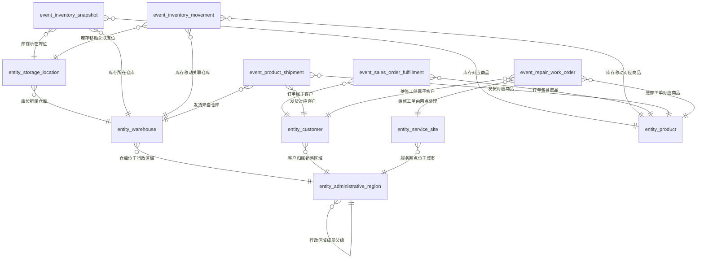

# 数码产品销售仓储与维修语义模型审核报告

## 模型摘要

- 模型类型：`snowflake`
- 模型说明：覆盖商品、仓库、库位、客户、行政区域和服务网点主数据，以及库存快照、库存移动、订单履约、发货和维修工单事件的可审核语义模型。行政区域内部成员树及多个实体到行政区域的层级关系形成真实雪花结构。
- 建模结果：6 张实体表、5 张业务事件表、96 个字段、19 条关系、10 个指标。
- 校验状态：通过，0 个错误、0 个警告。

## 实体表

### 商品 (`entity_product`)

以商品编码标识并被库存、移动、订单、发货和维修活动复用的商品主数据。

| 字段 | 名称 | 角色 | 逻辑类型 | 语义类型 | 单位 | 格式 | 比例原值 | 来源 | 审核 | 查询能力 | 证据 | 推断或设计理由 | 待解决项 |
|---|---|---|---|---|---|---|---|---|---|---|---|---|---|
| `field_product_key` | 商品键 | surrogate_key | id | ID |  |  |  | technical_generated | ACTIVE |  |  | 为商品实体生成稳定的技术关联键，不代表文档中的业务编码。 |  |
| `field_product_code` | 商品编码 | business_key | string | CODE |  |  |  | document_explicit | ACTIVE | 筛选 分组 展示 排序 | `E006` |  |  |
| `field_product_name` | 商品名称 | attribute | string | TEXT |  |  |  | document_explicit | ACTIVE | 筛选 分组 展示 排序 | `E006` |  |  |
| `field_product_category` | 品类 | attribute | category | ENUM |  |  |  | document_explicit | ACTIVE | 筛选 分组 展示 排序 | `E004`, `E006` |  |  |
| `field_product_series` | 系列 | attribute | category | ENUM |  |  |  | document_explicit | ACTIVE | 筛选 分组 展示 排序 | `E004`, `E006` |  |  |
| `field_product_specification` | 规格 | attribute | string | TEXT |  |  |  | document_explicit | ACTIVE | 筛选 展示 | `E004`, `E006` |  |  |
| `field_product_standard_cost` | 标准成本 | attribute | decimal | AMOUNT | 元/件 |  |  | document_explicit | ACTIVE | 筛选 展示 排序 | `E006`, `E022` |  |  |

### 仓库 (`entity_warehouse`)

以仓库编码标识、具有区域和类型属性并归属于行政区域的仓储主数据。

| 字段 | 名称 | 角色 | 逻辑类型 | 语义类型 | 单位 | 格式 | 比例原值 | 来源 | 审核 | 查询能力 | 证据 | 推断或设计理由 | 待解决项 |
|---|---|---|---|---|---|---|---|---|---|---|---|---|---|
| `field_warehouse_key` | 仓库键 | surrogate_key | id | ID |  |  |  | technical_generated | ACTIVE |  |  | 为仓库实体生成稳定的技术关联键，不替代仓库编码。 |  |
| `field_warehouse_code` | 仓库编码 | business_key | string | CODE |  |  |  | document_explicit | ACTIVE | 筛选 分组 展示 排序 | `E006` |  |  |
| `field_warehouse_name` | 仓库名称 | attribute | string | TEXT |  |  |  | document_explicit | ACTIVE | 筛选 分组 展示 排序 | `E006` |  |  |
| `field_warehouse_region` | 仓库区域 | attribute | category | ENUM |  |  |  | document_explicit | ACTIVE | 筛选 分组 展示 排序 | `E006` |  |  |
| `field_warehouse_type` | 仓库类型 | attribute | category | ENUM |  |  |  | document_explicit | ACTIVE | 筛选 分组 展示 排序 | `E004`, `E009` |  |  |
| `field_warehouse_district_region_code` | 区县编码 | foreign_key | string | FOREIGN_KEY |  |  |  | document_explicit | ACTIVE | 筛选 | `E006`, `E011` |  |  |

### 库位 (`entity_storage_location`)

由WMS统一分配全局唯一编码、明确归属仓库的库位主数据。

| 字段 | 名称 | 角色 | 逻辑类型 | 语义类型 | 单位 | 格式 | 比例原值 | 来源 | 审核 | 查询能力 | 证据 | 推断或设计理由 | 待解决项 |
|---|---|---|---|---|---|---|---|---|---|---|---|---|---|
| `field_storage_location_key` | 库位键 | surrogate_key | id | ID |  |  |  | technical_generated | ACTIVE |  |  | 为库位实体生成稳定的技术关联键，不替代全局唯一库位编码。 |  |
| `field_storage_location_code` | 库位编码 | business_key | string | CODE |  |  |  | document_explicit | ACTIVE | 筛选 分组 展示 排序 | `E004`, `E006` |  |  |
| `field_storage_location_warehouse_code` | 所属仓库编码 | foreign_key | string | FOREIGN_KEY |  |  |  | document_explicit | ACTIVE | 筛选 | `E006`, `E011` |  |  |
| `field_storage_location_name` | 库位名称 | attribute | string | TEXT |  |  |  | document_explicit | ACTIVE | 筛选 分组 展示 排序 | `E004`, `E006` |  |  |
| `field_storage_location_type` | 库位类型 | attribute | category | ENUM |  |  |  | document_explicit | ACTIVE | 筛选 分组 展示 排序 | `E004`, `E009` |  |  |

### 客户 (`entity_customer`)

跨订单、发货及维修活动共享并可归属行政区域成员的客户主数据。

| 字段 | 名称 | 角色 | 逻辑类型 | 语义类型 | 单位 | 格式 | 比例原值 | 来源 | 审核 | 查询能力 | 证据 | 推断或设计理由 | 待解决项 |
|---|---|---|---|---|---|---|---|---|---|---|---|---|---|
| `field_customer_key` | 客户键 | surrogate_key | id | ID |  |  |  | technical_generated | ACTIVE |  |  | 为客户实体生成稳定的技术关联键，不替代客户编码。 |  |
| `field_customer_code` | 客户编码 | business_key | string | CODE |  |  |  | document_explicit | ACTIVE | 筛选 分组 展示 排序 | `E006` |  |  |
| `field_customer_name` | 客户名称 | attribute | string | TEXT |  |  |  | document_explicit | ACTIVE | 筛选 分组 展示 排序 | `E006` |  |  |
| `field_customer_level` | 客户等级 | attribute | category | ENUM |  |  |  | document_explicit | ACTIVE | 筛选 分组 展示 排序 | `E006` |  |  |
| `field_customer_sales_region` | 销售区域 | attribute | category | ENUM |  |  |  | document_explicit | ACTIVE | 筛选 分组 展示 排序 | `E004`, `E006` |  |  |
| `field_customer_sales_region_code` | 销售区域编码 | foreign_key | string | FOREIGN_KEY |  |  |  | document_explicit | ACTIVE | 筛选 | `E006`, `E008`, `E011` |  |  |

### 服务网点 (`entity_service_site`)

以服务网点编码标识、承担维修服务并归属行政区域城市成员的服务组织主数据。

| 字段 | 名称 | 角色 | 逻辑类型 | 语义类型 | 单位 | 格式 | 比例原值 | 来源 | 审核 | 查询能力 | 证据 | 推断或设计理由 | 待解决项 |
|---|---|---|---|---|---|---|---|---|---|---|---|---|---|
| `field_service_site_key` | 服务网点键 | surrogate_key | id | ID |  |  |  | technical_generated | ACTIVE |  |  | 为服务网点实体生成稳定的技术关联键，不替代服务网点编码。 |  |
| `field_service_site_code` | 服务网点编码 | business_key | string | CODE |  |  |  | document_explicit | ACTIVE | 筛选 分组 展示 排序 | `E006` |  |  |
| `field_service_site_name` | 服务网点名称 | attribute | string | TEXT |  |  |  | document_explicit | ACTIVE | 筛选 分组 展示 排序 | `E006` |  |  |
| `field_service_site_region` | 服务区域 | attribute | category | ENUM |  |  |  | document_explicit | ACTIVE | 筛选 分组 展示 排序 | `E004`, `E006` |  |  |
| `field_service_site_level` | 网点等级 | attribute | category | ENUM |  |  |  | document_explicit | ACTIVE | 筛选 分组 展示 排序 | `E004`, `E009` |  |  |
| `field_service_site_city_region_code` | 城市编码 | foreign_key | string | FOREIGN_KEY |  |  |  | document_explicit | ACTIVE | 筛选 | `E006`, `E008`, `E011` |  |  |

### 行政区域 (`entity_administrative_region`)

跨仓库、客户和服务网点复用，具有固定成员树及父级引用的标准行政区域主数据。

| 字段 | 名称 | 角色 | 逻辑类型 | 语义类型 | 单位 | 格式 | 比例原值 | 来源 | 审核 | 查询能力 | 证据 | 推断或设计理由 | 待解决项 |
|---|---|---|---|---|---|---|---|---|---|---|---|---|---|
| `field_administrative_region_key` | 行政区域键 | surrogate_key | id | ID |  |  |  | technical_generated | ACTIVE |  |  | 为行政区域实体生成稳定的技术关联键，不替代行政区域编码。 |  |
| `field_administrative_region_code` | 行政区域编码 | business_key | string | CODE |  |  |  | document_explicit | ACTIVE | 筛选 分组 展示 排序 | `E006` |  |  |
| `field_administrative_region_name` | 行政区域名称 | attribute | string | TEXT |  |  |  | document_explicit | ACTIVE | 筛选 分组 展示 排序 | `E006` |  |  |
| `field_administrative_region_level` | 区域级别 | attribute | category | ENUM |  |  |  | document_explicit | ACTIVE | 筛选 分组 展示 排序 | `E006`, `E008` |  |  |
| `field_administrative_region_parent_code` | 上级区域编码 | foreign_key | string | FOREIGN_KEY |  |  |  | document_explicit | ACTIVE | 筛选 | `E006`, `E008` |  |  |
| `field_administrative_region_member` | 行政区域成员 | attribute | string | HIERARCHY |  |  |  | document_explicit | ACTIVE | 筛选 分组 展示 排序 | `E006`, `E008` |  |  |
| `field_administrative_region_member_path` | 成员编码路径 | attribute | string | HIERARCHY |  |  |  | document_explicit | ACTIVE | 筛选 展示 排序 | `E008`, `E009` |  |  |

## 业务事件表

### 库存快照 (`event_inventory_snapshot`)

- 定义：按快照时间、仓库、库位、商品和批次保存库存状态的周期快照事件。
- 粒度：每个快照时点、仓库、库位、商品、批次一行。
- 无度量事件：否

| 字段 | 名称 | 角色 | 逻辑类型 | 语义类型 | 单位 | 格式 | 比例原值 | 来源 | 审核 | 查询能力 | 证据 | 推断或设计理由 | 待解决项 |
|---|---|---|---|---|---|---|---|---|---|---|---|---|---|
| `field_inventory_snapshot_key` | 库存快照键 | surrogate_key | id | ID |  |  |  | technical_generated | ACTIVE |  |  | 为每个库存快照粒度记录生成唯一技术标识。 |  |
| `field_inventory_snapshot_time` | 快照时间 | event_time | timestamp | DATETIME |  |  |  | document_explicit | ACTIVE | 筛选 展示 排序 | `E005`, `E010` |  |  |
| `field_inventory_snapshot_product_code` | 商品编码 | foreign_key | string | FOREIGN_KEY |  |  |  | document_explicit | ACTIVE | 筛选 | `E011` |  |  |
| `field_inventory_snapshot_warehouse_code` | 仓库编码 | foreign_key | string | FOREIGN_KEY |  |  |  | document_explicit | ACTIVE | 筛选 | `E011` |  |  |
| `field_inventory_snapshot_storage_location_code` | 库位编码 | foreign_key | string | FOREIGN_KEY |  |  |  | document_explicit | ACTIVE | 筛选 | `E011` |  |  |
| `field_inventory_snapshot_batch_number` | 批次号 | attribute | string | CODE |  |  |  | document_explicit | ACTIVE | 筛选 展示 排序 | `E007` |  |  |
| `field_inventory_snapshot_on_hand_quantity` | 在库数量 | measure | integer | NUMBER | 件 |  |  | document_explicit | ACTIVE | 筛选 展示 排序 | `E007`, `E012` |  |  |
| `field_inventory_snapshot_locked_quantity` | 锁定数量 | measure | integer | NUMBER | 件 |  |  | document_explicit | ACTIVE | 筛选 展示 排序 | `E007`, `E012` |  |  |
| `field_inventory_snapshot_safety_stock_quantity` | 安全库存数量 | measure | integer | NUMBER | 件 |  |  | document_explicit | ACTIVE | 筛选 展示 排序 | `E007` |  |  |
| `field_inventory_snapshot_inbound_date` | 入库日期 | attribute | date | DATE |  |  |  | document_explicit | ACTIVE | 筛选 展示 排序 | `E007`, `E012` |  |  |
| `field_inventory_snapshot_amount` | 库存金额 | measure | decimal | AMOUNT | 元 |  |  | document_explicit | ACTIVE | 筛选 展示 排序 | `E007`, `E012`, `E022` |  |  |
| `field_inventory_snapshot_age_days` | 库龄天数 | measure | integer | NUMBER | 天 |  |  | document_explicit | ACTIVE | 筛选 展示 排序 | `E010`, `E012` |  |  |

### 库存移动 (`event_inventory_movement`)

- 定义：统一承载已完成商品入库和商品出库明细，以移动方向、类型和状态区分具体库存动作。
- 粒度：每张入库单或出库单的商品明细一行，由业务单号、商品及明细粒度区分，移动方向标识入库或出库。
- 无度量事件：否

| 字段 | 名称 | 角色 | 逻辑类型 | 语义类型 | 单位 | 格式 | 比例原值 | 来源 | 审核 | 查询能力 | 证据 | 推断或设计理由 | 待解决项 |
|---|---|---|---|---|---|---|---|---|---|---|---|---|---|
| `field_inventory_movement_key` | 库存移动键 | surrogate_key | id | ID |  |  |  | technical_generated | ACTIVE |  |  | 为合并后的每条库存移动明细生成唯一技术标识。 |  |
| `field_movement_time` | 移动时间 | event_time | timestamp | DATETIME |  |  |  | document_inferred | ACTIVE | 筛选 展示 排序 | `E005`, `E010` | 商品入库和商品出库分别给出完成时间；合并事件族后统一映射为移动时间。 |  |
| `field_movement_product_code` | 商品编码 | foreign_key | string | FOREIGN_KEY |  |  |  | document_explicit | ACTIVE | 筛选 | `E011` |  |  |
| `field_movement_warehouse_code` | 仓库编码 | foreign_key | string | FOREIGN_KEY |  |  |  | document_explicit | ACTIVE | 筛选 | `E011` |  |  |
| `field_movement_storage_location_code` | 库位编码 | foreign_key | string | FOREIGN_KEY |  |  |  | document_inferred | ACTIVE | 筛选 | `E005` | 业务活动明确商品入库和商品出库均由库位参与，因此统一事件保留指向库位的外键。 |  |
| `field_movement_document_number` | 业务单号 | attribute | string | CODE |  |  |  | document_explicit | ACTIVE | 筛选 展示 排序 | `E007`, `E010` |  |  |
| `field_movement_quantity` | 移动数量 | measure | integer | NUMBER | 件 |  |  | document_explicit | ACTIVE | 筛选 展示 排序 | `E007`, `E010` |  |  |
| `field_movement_type` | 移动类型 | attribute | category | ENUM |  |  |  | document_explicit | ACTIVE | 筛选 分组 展示 排序 | `E007`, `E010` |  |  |
| `field_movement_status` | 移动状态 | attribute | status | ENUM |  |  |  | document_explicit | ACTIVE | 筛选 分组 展示 排序 | `E005`, `E010`, `E012` |  |  |
| `field_movement_direction` | 移动方向 | attribute | category | ENUM |  |  |  | document_explicit | ACTIVE | 筛选 分组 展示 排序 | `E005`, `E010` |  |  |

### 销售订单履约 (`event_sales_order_fulfillment`)

- 定义：在订单创建时形成的销售订单商品行履约记录，承载订购、取消、欠货、承诺日期和订单状态。
- 粒度：每张销售订单的商品明细一行，由销售订单号和订单行号共同标识。
- 无度量事件：否

| 字段 | 名称 | 角色 | 逻辑类型 | 语义类型 | 单位 | 格式 | 比例原值 | 来源 | 审核 | 查询能力 | 证据 | 推断或设计理由 | 待解决项 |
|---|---|---|---|---|---|---|---|---|---|---|---|---|---|
| `field_sales_order_fulfillment_key` | 销售订单履约键 | surrogate_key | id | ID |  |  |  | technical_generated | ACTIVE |  |  | 为每个销售订单商品行生成唯一技术标识。 |  |
| `field_sales_order_created_time` | 订单创建时间 | event_time | timestamp | DATETIME |  |  |  | document_explicit | ACTIVE | 筛选 展示 排序 | `E005`, `E010` |  |  |
| `field_sales_order_customer_code` | 客户编码 | foreign_key | string | FOREIGN_KEY |  |  |  | document_explicit | ACTIVE | 筛选 | `E011` |  |  |
| `field_sales_order_product_code` | 商品编码 | foreign_key | string | FOREIGN_KEY |  |  |  | document_explicit | ACTIVE | 筛选 | `E011` |  |  |
| `field_sales_order_number` | 销售订单号 | business_key | string | CODE |  |  |  | document_explicit | ACTIVE | 筛选 展示 排序 | `E007` |  |  |
| `field_sales_order_line_number` | 订单行号 | business_key | integer | NUMBER |  |  |  | document_explicit | ACTIVE | 筛选 展示 排序 | `E007` |  |  |
| `field_sales_order_ordered_quantity` | 订购数量 | measure | integer | NUMBER | 件 |  |  | document_explicit | ACTIVE | 筛选 展示 排序 | `E007`, `E012` |  |  |
| `field_sales_order_cancelled_quantity` | 取消数量 | measure | integer | NUMBER | 件 |  |  | document_explicit | ACTIVE | 筛选 展示 排序 | `E007`, `E012` |  |  |
| `field_sales_order_promised_ship_date` | 承诺发货日期 | attribute | date | DATE |  |  |  | document_explicit | ACTIVE | 筛选 展示 排序 | `E007` |  |  |
| `field_sales_order_status` | 订单状态 | attribute | status | ENUM |  |  |  | document_explicit | ACTIVE | 筛选 分组 展示 排序 | `E007`, `E010` |  |  |
| `field_sales_order_backlog_quantity` | 欠货数量 | measure | integer | NUMBER | 件 |  |  | document_explicit | ACTIVE | 筛选 展示 排序 | `E007`, `E012` |  |  |

### 商品发货 (`event_product_shipment`)

- 定义：按实际发货时间记录一次发货单对订单商品行的履约明细，同一订单行允许多次发货。
- 粒度：每张发货单的订单商品明细一行；一张订单明细可对应多行发货。
- 无度量事件：否

| 字段 | 名称 | 角色 | 逻辑类型 | 语义类型 | 单位 | 格式 | 比例原值 | 来源 | 审核 | 查询能力 | 证据 | 推断或设计理由 | 待解决项 |
|---|---|---|---|---|---|---|---|---|---|---|---|---|---|
| `field_product_shipment_key` | 商品发货键 | surrogate_key | id | ID |  |  |  | technical_generated | ACTIVE |  |  | 为每次发货明细生成唯一技术标识，以支持同一订单行多次发货。 |  |
| `field_product_shipment_time` | 实际发货时间 | event_time | timestamp | DATETIME |  |  |  | document_explicit | ACTIVE | 筛选 展示 排序 | `E005`, `E007` |  |  |
| `field_product_shipment_warehouse_code` | 仓库编码 | foreign_key | string | FOREIGN_KEY |  |  |  | document_explicit | ACTIVE | 筛选 | `E011` |  |  |
| `field_product_shipment_product_code` | 商品编码 | foreign_key | string | FOREIGN_KEY |  |  |  | document_explicit | ACTIVE | 筛选 | `E011` |  |  |
| `field_product_shipment_customer_code` | 客户编码 | foreign_key | string | FOREIGN_KEY |  |  |  | document_inferred | ACTIVE | 筛选 | `E005` | 业务活动明确客户参与商品发货；为保留直接客户分析路径，将参与关系映射为客户外键。 |  |
| `field_product_shipment_number` | 发货单号 | attribute | string | CODE |  |  |  | document_explicit | ACTIVE | 筛选 展示 排序 | `E007` |  |  |
| `field_product_shipment_sales_order_number` | 销售订单号 | attribute | string | CODE |  |  |  | document_explicit | ACTIVE | 筛选 展示 排序 | `E010`, `E011` |  |  |
| `field_product_shipment_order_line_number` | 订单行号 | attribute | integer | NUMBER |  |  |  | document_explicit | ACTIVE | 筛选 展示 排序 | `E010`, `E011` |  |  |
| `field_product_shipment_quantity` | 发货数量 | measure | integer | NUMBER | 件 |  |  | document_explicit | ACTIVE | 筛选 展示 排序 | `E007`, `E012` |  |  |
| `field_product_shipment_carrier` | 承运商 | attribute | category | ENUM |  |  |  | document_explicit | ACTIVE | 筛选 分组 展示 排序 | `E007`, `E010` |  |  |
| `field_product_shipment_tracking_number` | 运单号 | attribute | string | CODE |  |  |  | document_explicit | ACTIVE | 筛选 展示 排序 | `E007` |  |  |
| `field_product_shipment_on_time_flag` | 按时发货标记 | measure | integer | NUMBER | 次 |  |  | document_explicit | ACTIVE | 筛选 展示 排序 | `E007`, `E012` |  |  |
| `field_product_shipment_valid_line_count` | 有效发货订单行计数 | measure | integer | NUMBER |  |  |  | document_inferred | ACTIVE |  | `E012` | 指标公式明确要求COUNT有效发货订单行，因此将该计数作为比率指标的分母度量暴露。 |  |
| `field_product_shipment_status` | 发货状态 | attribute | status | ENUM |  |  |  | document_explicit | ACTIVE | 筛选 分组 展示 排序 | `E010`, `E012` |  |  |

### 维修工单处理 (`event_repair_work_order`)

- 定义：从创建开始记录首次响应、维修完成和状态的一张维修工单处理过程。
- 粒度：每张维修工单一行。
- 无度量事件：是

| 字段 | 名称 | 角色 | 逻辑类型 | 语义类型 | 单位 | 格式 | 比例原值 | 来源 | 审核 | 查询能力 | 证据 | 推断或设计理由 | 待解决项 |
|---|---|---|---|---|---|---|---|---|---|---|---|---|---|
| `field_repair_work_order_key` | 维修工单键 | surrogate_key | id | ID |  |  |  | technical_generated | ACTIVE |  |  | 为每张维修工单生成稳定的技术事件标识，不替代维修单号。 |  |
| `field_repair_work_order_number` | 维修单号 | business_key | string | CODE |  |  |  | document_explicit | ACTIVE | 筛选 展示 排序 | `E007` |  |  |
| `field_repair_work_order_created_time` | 工单创建时间 | event_time | timestamp | DATETIME |  |  |  | document_explicit | ACTIVE | 筛选 展示 排序 | `E005`, `E007` |  |  |
| `field_repair_work_order_first_response_time` | 首次响应时间 | attribute | timestamp | DATETIME |  |  |  | document_explicit | ACTIVE | 筛选 展示 排序 | `E007` |  |  |
| `field_repair_work_order_completed_time` | 维修完成时间 | attribute | timestamp | DATETIME |  |  |  | document_explicit | ACTIVE | 筛选 展示 排序 | `E007` |  |  |
| `field_repair_work_order_customer_code` | 客户编码 | foreign_key | string | FOREIGN_KEY |  |  |  | document_explicit | ACTIVE | 筛选 | `E011` |  |  |
| `field_repair_work_order_product_code` | 商品编码 | foreign_key | string | FOREIGN_KEY |  |  |  | document_explicit | ACTIVE | 筛选 | `E011` |  |  |
| `field_repair_work_order_service_site_code` | 服务网点编码 | foreign_key | string | FOREIGN_KEY |  |  |  | document_explicit | ACTIVE | 筛选 | `E011` |  |  |
| `field_repair_work_order_status` | 维修状态 | attribute | status | ENUM |  |  |  | document_explicit | ACTIVE | 筛选 分组 展示 排序 | `E007`, `E010` |  |  |
| `field_repair_work_order_fault_type` | 故障类型 | attribute | category | ENUM |  |  |  | document_explicit | ACTIVE | 筛选 分组 展示 排序 | `E007`, `E010` |  |  |
| `field_repair_work_order_response_target` | 响应目标 | attribute | decimal | NUMBER |  |  |  | document_explicit | ACTIVE |  | `E007`, `E012` |  |  |
| `field_repair_work_order_completion_target` | 完成目标 | attribute | decimal | NUMBER |  |  |  | document_explicit | ACTIVE |  | `E007`, `E012` |  |  |

## 关系

| 关系编号 | 类型 | 起点 | 终点 | 基数 | 依据 |
|---|---|---|---|---|---|
| `rel_storage_location_to_warehouse` | entity_hierarchy | `entity_storage_location.field_storage_location_warehouse_code` | `entity_warehouse.field_warehouse_code` | many_to_one |  |
| `rel_warehouse_to_administrative_region` | entity_hierarchy | `entity_warehouse.field_warehouse_district_region_code` | `entity_administrative_region.field_administrative_region_code` | many_to_one |  |
| `rel_customer_to_administrative_region` | entity_hierarchy | `entity_customer.field_customer_sales_region_code` | `entity_administrative_region.field_administrative_region_code` | many_to_one |  |
| `rel_service_site_to_administrative_region` | entity_hierarchy | `entity_service_site.field_service_site_city_region_code` | `entity_administrative_region.field_administrative_region_code` | many_to_one |  |
| `rel_administrative_region_to_parent` | entity_hierarchy | `entity_administrative_region.field_administrative_region_parent_code` | `entity_administrative_region.field_administrative_region_code` | many_to_one |  |
| `rel_inventory_snapshot_to_product` | event_to_entity | `event_inventory_snapshot.field_inventory_snapshot_product_code` | `entity_product.field_product_code` | many_to_one |  |
| `rel_inventory_snapshot_to_warehouse` | event_to_entity | `event_inventory_snapshot.field_inventory_snapshot_warehouse_code` | `entity_warehouse.field_warehouse_code` | many_to_one |  |
| `rel_inventory_snapshot_to_storage_location` | event_to_entity | `event_inventory_snapshot.field_inventory_snapshot_storage_location_code` | `entity_storage_location.field_storage_location_code` | many_to_one |  |
| `rel_inventory_movement_to_product` | event_to_entity | `event_inventory_movement.field_movement_product_code` | `entity_product.field_product_code` | many_to_one |  |
| `rel_inventory_movement_to_warehouse` | event_to_entity | `event_inventory_movement.field_movement_warehouse_code` | `entity_warehouse.field_warehouse_code` | many_to_one |  |
| `rel_inventory_movement_to_storage_location` | event_to_entity | `event_inventory_movement.field_movement_storage_location_code` | `entity_storage_location.field_storage_location_code` | many_to_one | 商品入库和商品出库活动均明确由库位参与，因此统一库存移动事件关联库位实体。 |
| `rel_sales_order_fulfillment_to_customer` | event_to_entity | `event_sales_order_fulfillment.field_sales_order_customer_code` | `entity_customer.field_customer_code` | many_to_one |  |
| `rel_sales_order_fulfillment_to_product` | event_to_entity | `event_sales_order_fulfillment.field_sales_order_product_code` | `entity_product.field_product_code` | many_to_one |  |
| `rel_product_shipment_to_warehouse` | event_to_entity | `event_product_shipment.field_product_shipment_warehouse_code` | `entity_warehouse.field_warehouse_code` | many_to_one |  |
| `rel_product_shipment_to_product` | event_to_entity | `event_product_shipment.field_product_shipment_product_code` | `entity_product.field_product_code` | many_to_one |  |
| `rel_product_shipment_to_customer` | event_to_entity | `event_product_shipment.field_product_shipment_customer_code` | `entity_customer.field_customer_code` | many_to_one | 业务活动明确客户参与商品发货，因此保留发货事件到客户实体的直接分析关系。 |
| `rel_repair_work_order_to_customer` | event_to_entity | `event_repair_work_order.field_repair_work_order_customer_code` | `entity_customer.field_customer_code` | many_to_one |  |
| `rel_repair_work_order_to_product` | event_to_entity | `event_repair_work_order.field_repair_work_order_product_code` | `entity_product.field_product_code` | many_to_one |  |
| `rel_repair_work_order_to_service_site` | event_to_entity | `event_repair_work_order.field_repair_work_order_service_site_code` | `entity_service_site.field_service_site_code` | many_to_one |  |

## 指标

| 指标 | 定义 | 事件 | 聚合 | 度量字段 | 分子 | 分母 | 公式 | 半可加时间 | 证据 |
|---|---|---|---|---|---|---|---|---|---|
| 在库数量 (`metric_on_hand_quantity`) | 所选时间范围内最新库存快照的在库数量合计；可沿实体维度求和，但不得跨快照时点直接累加。 | `event_inventory_snapshot` | semi_additive | `field_inventory_snapshot_on_hand_quantity` |  |  | SUM(在库数量) | `field_inventory_snapshot_time` | `E003`, `E012` |
| 可用库存数量 (`metric_available_inventory_quantity`) | 在最新适用库存快照上逐行以在库数量减锁定数量，排除冻结库位后求和；冻结库位清单尚待提供。 | `event_inventory_snapshot` | semi_additive | `field_inventory_snapshot_on_hand_quantity`, `field_inventory_snapshot_locked_quantity` |  |  | SUM(在库数量 - 锁定数量) | `field_inventory_snapshot_time` | `E003`, `E012`, `E022` |
| 库存金额 (`metric_inventory_amount`) | 最新库存快照的库存价值合计；逐行库存金额等于在库数量乘商品当前有效标准成本，不跨快照时点累加。 | `event_inventory_snapshot` | semi_additive | `field_inventory_snapshot_amount` |  |  | SUM(库存金额)，其中逐行库存金额 = 在库数量 × 商品标准成本 | `field_inventory_snapshot_time` | `E007`, `E012`, `E022` |
| 入库数量 (`metric_inbound_quantity`) | 库存移动事件中移动方向为入库且状态为已完成的移动数量合计。 | `event_inventory_movement` | sum | `field_movement_quantity` |  |  | SUM(移动数量)，仅统计入库方向且已完成的单据 |  | `E005`, `E007`, `E012` |
| 出库数量 (`metric_outbound_quantity`) | 库存移动事件中移动方向为出库且状态为已完成的移动数量合计。 | `event_inventory_movement` | sum | `field_movement_quantity` |  |  | SUM(移动数量)，仅统计出库方向且已完成的单据 |  | `E005`, `E007`, `E012` |
| 库龄天数 (`metric_inventory_age_days`) | 库存批次从入库日期至统计日期的天数，按批次计算且不能跨批次相加。 | `event_inventory_snapshot` | none | `field_inventory_snapshot_age_days` |  |  | 统计日期 - 入库日期 |  | `E007`, `E012` |
| 有效订购数量 (`metric_effective_ordered_quantity`) | 销售订单行订购数量扣除取消数量后的合计，并排除已整单取消的订单。 | `event_sales_order_fulfillment` | sum | `field_sales_order_ordered_quantity`, `field_sales_order_cancelled_quantity` |  |  | SUM(订购数量 - 取消数量) |  | `E007`, `E012` |
| 已发货数量 (`metric_shipped_quantity`) | 未作废商品发货明细的发货数量合计。 | `event_product_shipment` | sum | `field_product_shipment_quantity` |  |  | SUM(发货数量) |  | `E007`, `E012` |
| 欠货数量 (`metric_backlog_quantity`) | 订单行有效订购数量减累计已发货数量后的非负余额合计，已取消数量不计入欠货。 | `event_sales_order_fulfillment` | sum | `field_sales_order_backlog_quantity` |  |  | SUM(欠货数量) |  | `E007`, `E012` |
| 发货及时率 (`metric_on_time_shipment_rate`) | 有效发货订单行中按时发货行所占百分比；跨分组汇总时按有效发货订单行计数重新计算，承诺日期为空或发货单作废时不参与。 | `event_product_shipment` | weighted_avg | `field_product_shipment_on_time_flag`, `field_product_shipment_valid_line_count` | `field_product_shipment_on_time_flag` | `field_product_shipment_valid_line_count` | SUM(按时发货标记) / COUNT(有效发货订单行) × 100% |  | `E007`, `E012`, `E022` |

## 候选去向

| 候选 | 处理 | 目标表 | 目标字段 | 原因 |
|---|---|---|---|---|
| `ENT001` | independent_table | `entity_product` |  | 商品具有稳定业务键、完整主数据属性，并被多类业务事件复用，作为核心实体独立建表。 |
| `ENT002` | independent_table | `entity_warehouse` |  | 仓库具有稳定业务键、独立属性和行政区域归属，并被库存、移动及发货事件复用，作为核心实体独立建表。 |
| `ENT003` | independent_table | `entity_storage_location` |  | 库位编码全局唯一，具有类型、名称及明确的仓库归属，满足独立维护和复用条件，作为核心实体独立建表。 |
| `ENT004` | independent_table | `entity_customer` |  | 客户是跨订单、发货和维修活动共享的稳定主数据，作为核心实体独立建表。 |
| `ENT005` | independent_table | `entity_service_site` |  | 服务网点具有稳定编码、组织属性和行政区域归属，并被多张维修工单复用，作为核心实体独立建表。 |
| `ENT006` | independent_table | `entity_administrative_region` |  | 行政区域具有独立业务键、级别、父级引用和成员树，并跨仓库、客户及服务网点复用，作为核心实体独立建表。 |
| `EVT001` | independent_table | `event_inventory_snapshot` |  | 库存快照具有独立的时点状态粒度和半可加度量，不能与库存移动流水合并，独立建表。 |
| `EVT002` | independent_table | `event_inventory_movement` |  | 商品入库与商品出库属于同一库存移动过程，主体、关联实体、数量含义和明细粒度兼容，因此以商品入库候选为来源建立统一库存移动事件表，并由移动方向区分动作。 |
| `EVT003` | merged_into_table | `event_inventory_movement` | `field_movement_document_number`, `field_movement_quantity`, `field_movement_type`, `field_movement_time`, `field_movement_status`, `field_movement_direction`, `field_movement_product_code`, `field_movement_warehouse_code`, `field_movement_storage_location_code` | 商品出库与商品入库仅方向、类型和完成时间角色不同，能够用统一移动时间、移动方向、移动类型和移动状态表达，故合并到库存移动事件表。 |
| `EVT004` | independent_table | `event_sales_order_fulfillment` |  | 销售订单履约以订单商品行为粒度，承载独立的订购、取消、欠货及承诺日期生命周期，独立建表。 |
| `EVT005` | independent_table | `event_product_shipment` |  | 商品发货以一次发货明细为粒度，同一订单行可多次发货，与订单行履约粒度不同，独立建表。 |
| `EVT006` | independent_table | `event_repair_work_order` |  | 维修工单具有从创建到响应和完成的独立过程生命周期，并关联客户、商品和服务网点，独立建表。 |

## 待确认事项

- `unr_repair_sla_duration_unit` **维修SLA时长单位**：需要确定维修响应时长、维修完成时长、响应目标和完成目标采用的时间单位。；影响：维修响应时长、维修完成时长及目标阈值无法获得统一单位，因此本次不发布维修响应时长和维修完成时长最终指标。。
- `unr_repair_compliance_aggregation` **维修达标率聚合方式**：需要确认维修达标率按日、按单还是按网点聚合，以及跨分组汇总规则。；影响：无法确定维修响应达标率和维修完成达标率的最终聚合语义及跨日期、工单和服务网点的汇总规则，因此本次不发布两项达标率指标。。
- `unr_repair_sla_work_order_inclusion` **维修SLA工单纳入规则**：需要确认取消、重复打开、未响应和未完成工单是否进入各达标率分母，以及如何进入分子。；影响：维修达标率的分子和分母会随工单状态处理规则变化，当前结果不可稳定复现。。
- `unr_repair_response_working_time` **维修响应工作时间口径**：需要确认计算维修响应时长时是否排除非工作时间，并提供适用的工作日历规则。；影响：维修响应时长在自然时间和工作时间口径下可能产生不同结果，当前不能发布稳定指标。。
- `unr_inventory_movement_source_mapping` **库存移动与出入库事件边界**：需要确认库存移动是商品入库和商品出库的统一标准事件，并确认两个来源到统一字段的映射规则。；影响：本模型已依据兼容粒度合并为库存移动事件族，但仍需在数据接入时确认入库和出库来源字段到统一移动方向、类型、时间及状态的映射。。
- `unr_frozen_storage_location_list` **冻结库位排除清单**：需要提供仓库主数据中的冻结库位清单及其生效规则。；影响：在获得冻结库位清单及其生效规则前，无法完整执行可用库存数量的排除规则。。
- `unr_repair_sla_target_scope` **维修SLA目标值及适用范围**：需要提供响应目标和完成目标的具体数值，以及目标是否因网点等级、故障类型或其他范围而变化。；影响：即使能够计算维修时长，也无法可靠判断具体工单是否达到响应或完成目标，故本次不发布维修响应达标率和维修完成达标率。。
- `unr_valid_shipment_line_count_unit` **有效发货订单行计数单位**：文档明确该字段作为COUNT分母，但未明确其业务展示单位。；影响：不影响按公式计数，但有效发货订单行计数度量不能声明文档未提供的展示单位。。

## 模型关系图

## 证据目录

| 证据 | 章节 | 行号 | 原文 |
|---|---|---|---|
| `E001` | 文档标题 | 1-1 | # 数码产品销售仓储语义设计 |
| `E002` | 文档说明 | 5-9 | - 资料版本：v3 - 建模范围：共享主数据、库存与出入库、订单履约、发货时效、维修服务 - 数据更新：库存每小时快照，出入库、订单、发货和维修工单准实时更新 - 使用部门：仓储、销售、客服、售后、供应链管理 - 版本变化：在 v2 完整内容上增加维修工单及响应、完成 SLA 初稿 |
| `E003` | 业务目标 | 11-18 | ## 2. 业务目标  1. 查询任意商品在各仓库的可用库存、在库数量和库存金额。 2. 按日、周、月分析商品入库量、出库量及库存变化。 3. 识别低于安全库存和库龄超过 90 天的商品。 4. 查询客户订单的订购、已发货、欠货数量和履约状态。 5. 评估订单是否按承诺日期发货，并分析各仓库发货及时率。 6. 查询维修工单进度，并观察维修响应和完成是否达到服务要求。 |
| `E004` | 业务对象 | 20-29 | ## 3. 业务对象  \| 对象 \| 业务键 \| 主要属性 \| 说明 \| \| --- \| --- \| --- \| --- \| \| 商品 \| 商品编码 \| 商品名称、品类、系列、规格、标准成本 \| 品类和系列作为商品属性，不单独建表 \| \| 仓库 \| 仓库编码 \| 仓库名称、仓库区域、仓库类型 \| 一个仓库属于一个区域 \| \| 库位 \| 库位编码 \| 库位名称、库位类型、所属仓库编码 \| 库位编码由 WMS 统一分配并在全部仓库中唯一 \| \| 客户 \| 客户编码 \| 客户名称、客户等级、销售区域 \| 跨订单共享的客户主数据 \| \| 服务网点 \| 服务网点编码 \| 服务网点名称、服务区域、网点等级 \| 承担维修服务的组织 \| \| 行政区域 \| 行政区域编码 \| 行政区域名称、区域级别、上级区域编码、行政区域成员 \| 跨仓库、客户和服务网点复用的标准地域主数据 \| |
| `E005` | 业务活动 | 31-40 | ## 4. 业务活动  \| 业务活动 \| 业务粒度 \| 发生时间 \| 参与对象 \| 说明 \| \| --- \| --- \| --- \| --- \| --- \| \| 库存快照 \| 每个快照时点、仓库、库位、商品、批次一行 \| 快照时间 \| 商品、仓库、库位 \| 保存实时库存状态 \| \| 商品入库 \| 每张入库单的商品明细一行 \| 入库完成时间 \| 商品、仓库、库位 \| 只统计已完成入库明细 \| \| 商品出库 \| 每张出库单的商品明细一行 \| 出库完成时间 \| 商品、仓库、库位 \| 只统计已完成出库明细 \| \| 销售订单履约 \| 每张销售订单的商品明细一行 \| 订单创建时间 \| 客户、商品 \| 保存订购数量、承诺发货日期和取消数量 \| \| 商品发货 \| 每张发货单的订单商品明细一行 \| 实际发货时间 \| 客户、商品、仓库 \| 一张订单明细可拆分多次发货 \| \| 维修工单处理 \| 每张维修工单一行 \| 工单创建时间 \| 客户、商品、服务网点 \| 记录首次响应和完成时间，用于 SLA 分析 \| |
| `E006` | 字段与维度：主对象 | 42-72 | ## 5. 字段与维度  \| 所属对象或活动 \| 字段 \| 类型 \| 单位 \| 角色与分析方式 \| \| --- \| --- \| --- \| --- \| --- \| \| 商品 \| 商品编码 \| 字符串 \| 无 \| 业务键，可按商品筛选 \| \| 商品 \| 商品名称 \| 字符串 \| 无 \| 名称属性，可搜索 \| \| 商品 \| 品类 \| 字符串 \| 无 \| 分析维度，可分组 \| \| 商品 \| 系列 \| 字符串 \| 无 \| 分析维度，可分组 \| \| 商品 \| 规格 \| 字符串 \| 无 \| 描述属性 \| \| 商品 \| 标准成本 \| 小数 \| 元/件 \| 金额计算字段 \| \| 仓库 \| 仓库编码 \| 字符串 \| 无 \| 业务键 \| \| 仓库 \| 仓库名称 \| 字符串 \| 无 \| 分析维度 \| \| 仓库 \| 仓库区域 \| 字符串 \| 无 \| 分析维度，华北、华东、华南 \| \| 仓库 \| 区县编码 \| 字符串 \| 无 \| 外键，关联行政区域.行政区域编码 \| \| 库位 \| 库位编码 \| 字符串 \| 无 \| 业务键，在全部仓库中唯一 \| \| 库位 \| 所属仓库编码 \| 字符串 \| 无 \| 外键，关联仓库.仓库编码 \| \| 库位 \| 库位名称 \| 字符串 \| 无 \| 分析维度 \| \| 客户 \| 客户编码 \| 字符串 \| 无 \| 业务键 \| \| 客户 \| 客户名称 \| 字符串 \| 无 \| 分析维度 \| \| 客户 \| 客户等级 \| 字符串 \| 无 \| 分析维度 \| \| 客户 \| 销售区域 \| 字符串 \| 无 \| 分析维度 \| \| 客户 \| 销售区域编码 \| 字符串 \| 无 \| 外键，关联行政区域.行政区域编码 \| \| 服务网点 \| 服务网点编码 \| 字符串 \| 无 \| 业务键 \| \| 服务网点 \| 服务网点名称 \| 字符串 \| 无 \| 分析维度 \| \| 服务网点 \| 服务区域 \| 字符串 \| 无 \| 分析维度 \| \| 服务网点 \| 城市编码 \| 字符串 \| 无 \| 外键，关联行政区域中的市级成员 \| \| 行政区域 \| 行政区域编码 \| 字符串 \| 无 \| 业务键 \| \| 行政区域 \| 行政区域名称 \| 字符串 \| 无 \| 名称属性，可搜索和分组 \| \| 行政区域 \| 区域级别 \| 字符串 \| 无 \| 分析维度，取值为大区、省、市、区县 \| \| 行政区域 \| 上级区域编码 \| 字符串 \| 无 \| 同一行政区域维度内的成员父级引用 \| \| 行政区域 \| 行政区域成员 \| 字符串 \| 无 \| 成员层级字段，按大区→省→市→区县下钻 \| |
| `E007` | 字段与维度：业务活动 | 73-105 | \| 库存快照 \| 批次号 \| 字符串 \| 无 \| 退化维度 \| \| 库存快照 \| 在库数量 \| 整数 \| 件 \| 可加度量 \| \| 库存快照 \| 锁定数量 \| 整数 \| 件 \| 可加度量 \| \| 库存快照 \| 安全库存数量 \| 整数 \| 件 \| 阈值字段 \| \| 库存快照 \| 入库日期 \| 日期 \| 无 \| 计算库龄 \| \| 库存快照 \| 库存金额 \| 小数 \| 元 \| 派生度量，逐行等于在库数量 × 商品标准成本 \| \| 商品入库 \| 入库单号 \| 字符串 \| 无 \| 退化维度 \| \| 商品入库 \| 入库数量 \| 整数 \| 件 \| 可加度量 \| \| 商品入库 \| 入库类型 \| 字符串 \| 无 \| 分析维度 \| \| 商品出库 \| 出库单号 \| 字符串 \| 无 \| 退化维度 \| \| 商品出库 \| 出库数量 \| 整数 \| 件 \| 可加度量 \| \| 商品出库 \| 出库类型 \| 字符串 \| 无 \| 分析维度 \| \| 销售订单履约 \| 销售订单号 \| 字符串 \| 无 \| 退化维度 \| \| 销售订单履约 \| 订单行号 \| 整数 \| 无 \| 与订单号组成业务键 \| \| 销售订单履约 \| 订购数量 \| 整数 \| 件 \| 可加度量 \| \| 销售订单履约 \| 取消数量 \| 整数 \| 件 \| 可加度量 \| \| 销售订单履约 \| 承诺发货日期 \| 日期 \| 无 \| 履约基准时间 \| \| 销售订单履约 \| 订单状态 \| 字符串 \| 无 \| 分析维度 \| \| 销售订单履约 \| 欠货数量 \| 整数 \| 件 \| 派生度量，逐订单行等于有效订购数量减累计已发货数量，最小为 0 \| \| 商品发货 \| 发货单号 \| 字符串 \| 无 \| 退化维度 \| \| 商品发货 \| 发货数量 \| 整数 \| 件 \| 可加度量 \| \| 商品发货 \| 实际发货时间 \| 日期时间 \| 无 \| 事件时间 \| \| 商品发货 \| 承运商 \| 字符串 \| 无 \| 分析维度 \| \| 商品发货 \| 运单号 \| 字符串 \| 无 \| 退化维度 \| \| 商品发货 \| 按时发货标记 \| 整数 \| 次 \| 派生度量，实际发货日期不晚于承诺日期记 1，否则记 0 \| \| 维修工单处理 \| 维修单号 \| 字符串 \| 无 \| 业务键和退化维度 \| \| 维修工单处理 \| 工单创建时间 \| 日期时间 \| 无 \| SLA 起点 \| \| 维修工单处理 \| 首次响应时间 \| 日期时间 \| 无 \| 响应 SLA 终点 \| \| 维修工单处理 \| 维修完成时间 \| 日期时间 \| 无 \| 完成 SLA 终点 \| \| 维修工单处理 \| 维修状态 \| 字符串 \| 无 \| 分析维度 \| \| 维修工单处理 \| 故障类型 \| 字符串 \| 无 \| 分析维度 \| \| 维修工单处理 \| 响应目标 \| 小数 \| 待确认 \| 目标阈值，单位尚未确定 \| \| 维修工单处理 \| 完成目标 \| 小数 \| 待确认 \| 目标阈值，单位尚未确定 \| |
| `E008` | 行政区域成员层级 | 107-115 | ### 5.1 行政区域成员层级  该层级是同一“行政区域”维度内部的成员树，不是跨实体关系。层级顺序固定为“大区 → 省 → 市 → 区县”；仓库关联区县，客户销售区域可关联任一级成员，服务网点关联城市。  \| 大区 \| 省 \| 市 \| 区县 \| 成员编码路径 \| \| --- \| --- \| --- \| --- \| --- \| \| 华东 \| 江苏 \| 南京 \| 玄武区 \| EAST / JS / NJ / XW \| \| 华东 \| 浙江 \| 杭州 \| 无 \| EAST / ZJ / HZ \| \| 华南 \| 广东 \| 深圳 \| 南山区 \| SOUTH / GD / SZ / NS \| |
| `E009` | 业务同义词：实体与主对象字段 | 117-130 | ### 5.2 业务同义词  同义词只采用下表明确词面；标准名称、技术编码、代理键和外键不作为同义词。  \| 目标类型 \| 标准目标 \| 明确同义词 \| \| --- \| --- \| --- \| \| 实体 \| 商品；仓库；库位；客户；服务网点；行政区域 \| 产品；库房；货位；买方；维修网点；地区 \| \| 事件 \| 库存快照；库存移动；销售订单履约；商品发货；维修工单处理 \| 库存时点；出入库流水；订单行履约；发运；售后工单 \| \| 字段 \| 商品.商品编码；商品.商品名称；商品.品类；商品.系列；商品.规格；商品.标准成本 \| 商品号；产品名称；类目；产品线；规格型号；单位成本 \| \| 字段 \| 仓库.仓库编码；仓库.仓库名称；仓库.仓库区域；仓库.仓库类型 \| 仓库号；库房名称；仓库大区；仓储类型 \| \| 字段 \| 库位.库位编码；库位.库位名称；库位.库位类型 \| 货位编码；储位名称；货位类型 \| \| 字段 \| 客户.客户编码；客户.客户名称；客户.客户等级；客户.销售区域 \| 客户号；买方名称；客户分层；销售大区 \| \| 字段 \| 服务网点.服务网点编码；服务网点.服务网点名称；服务网点.服务区域；服务网点.网点等级 \| 网点编号；服务站名称；网点覆盖区域；服务级别 \| \| 字段 \| 行政区域.行政区域编码；行政区域.行政区域名称；行政区域.区域级别；行政区域.行政区域成员；行政区域.成员编码路径 \| 地区编码；地区名称；行政级别；地域节点；行政区划路径 \| |
| `E010` | 业务同义词：活动字段、指标、维度与规则 | 131-138 | \| 字段 \| 库存快照.批次号；库存快照.在库数量；库存快照.锁定数量；库存快照.安全库存数量；库存快照.入库日期；库存快照.快照时间；库存快照.可用库存数量；库存快照.库存金额；库存快照.库龄天数 \| 库存批号；现存量；占用量；安全库存；到库日期；库存时点；可售库存量；库存价值；批次库龄 \| \| 字段 \| 库存移动.业务单号；库存移动.移动数量；库存移动.移动类型；库存移动.移动时间；库存移动.移动状态；库存移动.移动方向 \| 出入库单号；变动数量；库存动作；出入库时间；流水状态；库存方向 \| \| 字段 \| 销售订单履约.销售订单号；销售订单履约.订单行号；销售订单履约.订购数量；销售订单履约.取消数量；销售订单履约.承诺发货日期；销售订单履约.订单状态；销售订单履约.欠货数量；销售订单履约.订单创建时间 \| 订单号；行项目号；下单数量；退订数量；应发日期；履约状态；未发数量；下单时间 \| \| 字段 \| 商品发货.发货单号；商品发货.销售订单号；商品发货.订单行号；商品发货.发货数量；商品发货.实际发货时间；商品发货.承运商；商品发货.运单号；商品发货.按时发货标记；商品发货.发货状态 \| 发运单号；发货关联订单号；发货关联行号；出货数量；出货时间；物流商；物流单号；准时发货标记；发运状态 \| \| 字段 \| 维修工单处理.维修单号；维修工单处理.工单创建时间；维修工单处理.首次响应时间；维修工单处理.维修完成时间；维修工单处理.维修状态；维修工单处理.故障类型；维修工单处理.响应目标；维修工单处理.完成目标 \| 售后单号；报修时间；首响时间；完修时间；工单状态；问题类型；首响目标；完修目标 \| \| 指标 \| 在库数量；可用库存数量；库存金额；入库数量；出库数量；库龄天数；有效订购数量；已发货数量；欠货数量；发货及时率 \| 现存库存；可售库存；库存价值；收货量；发出量；库存天龄；净订购量；已出货量；未履约数量；准时发货率 \| \| 维度 \| 商品品类；商品系列；仓库区域；行政区域；客户等级；订单状态；承运商；维修状态；故障类型 \| 产品类目；产品线；仓库地区；地域维度；客户分层；履约状态维度；物流商维度；工单状态维度；问题分类 \| \| 规则候选 \| 最新库存快照规则；有效订单过滤规则；按时发货判断规则；维修SLA统计规则 \| 最新时点库存；有效订单口径；准时出货规则；售后SLA口径 \| |
| `E011` | 对象关系 | 140-162 | ## 6. 对象关系  \| 中文名称 \| 起点 \| 终点 \| 基数 \| 关联字段 \| 依据 \| \| --- \| --- \| --- \| --- \| --- \| --- \| \| 库位所属仓库 \| 库位 \| 仓库 \| 多对一 \| 所属仓库编码 \| 库位必须归属一个仓库 \| \| 仓库位于区县 \| 仓库 \| 行政区域 \| 多对一 \| 区县编码 \| 每个仓库按标准区县归属行政区域成员树 \| \| 客户归属销售区域 \| 客户 \| 行政区域 \| 多对一 \| 销售区域编码 \| 客户销售区域引用行政区域任一级成员 \| \| 服务网点位于城市 \| 服务网点 \| 行政区域 \| 多对一 \| 城市编码 \| 服务网点关联行政区域中的市级成员 \| \| 库存对应商品 \| 库存快照 \| 商品 \| 多对一 \| 商品编码 \| 每条库存记录只对应一个商品 \| \| 库存所在仓库 \| 库存快照 \| 仓库 \| 多对一 \| 仓库编码 \| 每条库存记录只对应一个仓库 \| \| 库存所在库位 \| 库存快照 \| 库位 \| 多对一 \| 库位编码 \| WMS 库位编码全局唯一 \| \| 入库对应商品 \| 商品入库 \| 商品 \| 多对一 \| 商品编码 \| 入库明细对应一个商品 \| \| 入库进入仓库 \| 商品入库 \| 仓库 \| 多对一 \| 仓库编码 \| 入库明细进入一个仓库 \| \| 出库对应商品 \| 商品出库 \| 商品 \| 多对一 \| 商品编码 \| 出库明细对应一个商品 \| \| 出库离开仓库 \| 商品出库 \| 仓库 \| 多对一 \| 仓库编码 \| 出库明细离开一个仓库 \| \| 订单属于客户 \| 销售订单履约 \| 客户 \| 多对一 \| 客户编码 \| 每张订单属于一个客户 \| \| 订单包含商品 \| 销售订单履约 \| 商品 \| 多对一 \| 商品编码 \| 每行订单对应一个商品 \| \| 发货履行订单 \| 商品发货 \| 销售订单履约 \| 多对一 \| 销售订单号、订单行号 \| 一行订单允许多次发货 \| \| 发货来自仓库 \| 商品发货 \| 仓库 \| 多对一 \| 仓库编码 \| 每次发货来自一个仓库 \| \| 发货对应商品 \| 商品发货 \| 商品 \| 多对一 \| 商品编码 \| 每次发货对应一个商品 \| \| 维修工单属于客户 \| 维修工单处理 \| 客户 \| 多对一 \| 客户编码 \| 一张维修工单属于一个客户 \| \| 维修工单对应商品 \| 维修工单处理 \| 商品 \| 多对一 \| 商品编码 \| 一张维修工单对应一个商品 \| \| 维修工单由网点处理 \| 维修工单处理 \| 服务网点 \| 多对一 \| 服务网点编码 \| 一张维修工单由一个网点负责 \| |
| `E012` | 指标口径 | 164-181 | ## 7. 指标口径  \| 指标 \| 定义与公式 \| 聚合方式 \| 单位 \| 所属活动 \| 排除规则 \| \| --- \| --- \| --- \| --- \| --- \| --- \| \| 在库数量 \| `SUM(在库数量)` \| 求和 \| 件 \| 库存快照 \| 只取所选时间内最新快照 \| \| 可用库存数量 \| `SUM(在库数量 - 锁定数量)` \| 先逐行计算再求和 \| 件 \| 库存快照 \| 不包含冻结库位 \| \| 库存金额 \| `SUM(库存金额)`，其中库存金额逐行等于在库数量 × 商品标准成本 \| 求和 \| 元 \| 库存快照 \| 只取最新快照 \| \| 入库数量 \| `SUM(入库数量)` \| 求和 \| 件 \| 商品入库 \| 仅已完成单据 \| \| 出库数量 \| `SUM(出库数量)` \| 求和 \| 件 \| 商品出库 \| 仅已完成单据 \| \| 库龄天数 \| `统计日期 - 入库日期` \| 按库存批次计算，不跨批次相加 \| 天 \| 库存快照 \| 无入库日期的记录不参与 \| \| 有效订购数量 \| `SUM(订购数量 - 取消数量)` \| 先逐行计算再求和 \| 件 \| 销售订单履约 \| 排除已整单取消的订单 \| \| 已发货数量 \| `SUM(发货数量)` \| 求和 \| 件 \| 商品发货 \| 排除已作废发货单 \| \| 欠货数量 \| `SUM(欠货数量)`，欠货数量在订单行上预先按有效订购数量减累计已发货数量计算且最小为 0 \| 求和 \| 件 \| 销售订单履约 \| 已取消数量不计入欠货 \| \| 发货及时率 \| `SUM(按时发货标记) / COUNT(有效发货订单行) × 100%` \| 比率，先求和与计数再相除 \| % \| 商品发货 \| 承诺日期为空或发货单作废时不参与 \| \| 维修响应时长 \| `首次响应时间 - 工单创建时间` \| 待确认 \| 待确认 \| 维修工单处理 \| 暂未说明非工作时间是否排除 \| \| 维修完成时长 \| `维修完成时间 - 工单创建时间` \| 待确认 \| 待确认 \| 维修工单处理 \| 暂未说明取消、重复打开工单如何处理 \| \| 维修响应达标率 \| `维修响应时长不超过响应目标的工单数 / 工单数` \| 待确认 \| 待确认 \| 维修工单处理 \| 分母范围和空响应时间处理方式尚未确认 \| \| 维修完成达标率 \| `维修完成时长不超过完成目标的工单数 / 工单数` \| 待确认 \| 待确认 \| 维修工单处理 \| 分母范围和未完成工单处理方式尚未确认 \| |
| `E013` | 示例问题 | 185-185 | 1. 华南仓的 BT-X100 当前可用库存是多少？ |
| `E014` | 示例问题 | 186-186 | 2. 最近 30 天各品类的入库量和出库量是多少？ |
| `E015` | 示例问题 | 187-187 | 3. 哪些商品低于安全库存数量？ |
| `E016` | 示例问题 | 188-188 | 4. 各仓库库龄超过 90 天的库存金额是多少？ |
| `E017` | 示例问题 | 189-189 | 5. 订单 SO-20260801-001 已发货多少、还欠多少？ |
| `E018` | 示例问题 | 190-190 | 6. 本月各仓库发货及时率是多少？ |
| `E019` | 示例问题 | 191-191 | 7. 哪些客户的欠货数量最高？ |
| `E020` | 示例问题 | 192-192 | 8. 各服务网点的维修响应达标率是多少？ |
| `E021` | 示例问题 | 193-193 | 9. RM20260803001 从创建到完成用了多长时间？ |
| `E022` | 待确认事项 | 195-202 | ## 9. 待确认事项  1. 冻结库位清单由仓库主数据提供。 2. 标准成本以商品主数据当前有效值计算，不回溯历史成本。 3. 跨仓拆分发货按实际发货仓库分别统计及时率。 4. 维修响应和完成时长的单位尚未确定。 5. 维修达标率按日、按单还是按网点聚合尚未确定。 6. 取消工单、重复打开工单、未响应和未完成工单是否进入分母尚未确定。 |

## 语义增强

增强产物校验通过。

- 维度：9 个
- 待结构化规则候选：4 个
- 成员层级：1 个
- 同义词组：99 个

### 成员层级

- **行政区域成员层级**：大区 → 省 → 市 → 区县；成员 10 个
