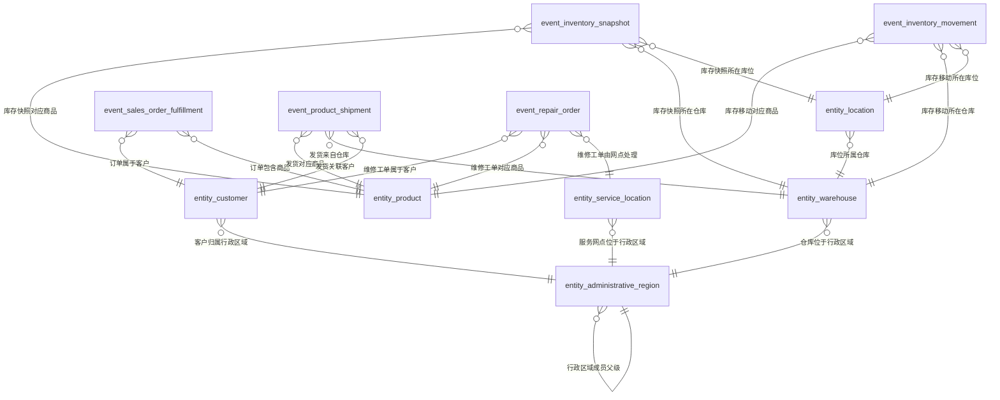

# 数码产品销售仓储维修语义模型审核报告

## 模型摘要

- 模型类型：`snowflake`
- 模型说明：覆盖共享主数据、库存快照与移动、订单履约、商品发货和维修SLA的语义雪花模型；行政区域及库位归属构成有证据支持的实体层级。
- 建模结果：6 张实体表、5 张业务事件表、105 个字段、19 条关系、14 个指标。
- 校验状态：通过，0 个错误、0 个警告。

## 实体表

### 商品 (`entity_product`)

由商品编码标识并被库存、出入库、订单、发货和维修过程共享的商品主数据。

| 字段 | 名称 | 角色 | 逻辑类型 | 语义类型 | 单位 | 格式 | 比例原值 | 来源 | 审核 | 查询能力 | 证据 | 推断或设计理由 | 待解决项 |
|---|---|---|---|---|---|---|---|---|---|---|---|---|---|
| `field_product_sk` | 商品代理键 | surrogate_key | id | ID |  |  |  | technical_generated | ACTIVE |  |  | 为商品实体生成稳定且与业务编码变化解耦的唯一连接键。 |  |
| `field_product_code` | 商品编码 | business_key | string | CODE |  |  |  | document_explicit | ACTIVE | 筛选 分组 展示 排序 | `E006` |  |  |
| `field_product_name` | 商品名称 | attribute | string | TEXT |  |  |  | document_explicit | ACTIVE | 筛选 展示 排序 | `E006` |  |  |
| `field_product_category` | 品类 | attribute | category | ENUM |  |  |  | document_explicit | ACTIVE | 筛选 分组 展示 排序 | `E006`, `E018` |  |  |
| `field_product_series` | 系列 | attribute | category | ENUM |  |  |  | document_explicit | ACTIVE | 筛选 分组 展示 排序 | `E006`, `E018` |  |  |
| `field_product_specification` | 规格 | attribute | string | TEXT |  |  |  | document_explicit | ACTIVE | 筛选 展示 | `E006` |  |  |
| `field_product_standard_cost` | 标准成本 | attribute | currency | AMOUNT | 元/件 |  |  | document_explicit | ACTIVE | 筛选 展示 排序 | `E006`, `E027` |  |  |

### 仓库 (`entity_warehouse`)

由仓库编码标识并承载仓库名称、区域、类型和行政区县归属的仓储主数据。

| 字段 | 名称 | 角色 | 逻辑类型 | 语义类型 | 单位 | 格式 | 比例原值 | 来源 | 审核 | 查询能力 | 证据 | 推断或设计理由 | 待解决项 |
|---|---|---|---|---|---|---|---|---|---|---|---|---|---|
| `field_warehouse_sk` | 仓库代理键 | surrogate_key | id | ID |  |  |  | technical_generated | ACTIVE |  |  | 为仓库实体生成稳定且与业务编码变化解耦的唯一连接键。 |  |
| `field_warehouse_code` | 仓库编码 | business_key | string | CODE |  |  |  | document_explicit | ACTIVE | 筛选 分组 展示 排序 | `E007` |  |  |
| `field_warehouse_name` | 仓库名称 | attribute | string | TEXT |  |  |  | document_explicit | ACTIVE | 筛选 分组 展示 排序 | `E007` |  |  |
| `field_warehouse_region` | 仓库区域 | attribute | category | ENUM |  |  |  | document_explicit | ACTIVE | 筛选 分组 展示 排序 | `E007`, `E018` |  |  |
| `field_warehouse_type` | 仓库类型 | attribute | category | ENUM |  |  |  | document_explicit | ACTIVE | 筛选 分组 展示 排序 | `E004` |  |  |
| `field_warehouse_district_code` | 区县编码 | foreign_key | string | FOREIGN_KEY |  |  |  | document_explicit | ACTIVE | 筛选 | `E007`, `E019` |  |  |

### 库位 (`entity_location`)

由WMS统一分配的全局唯一库位编码标识，并归属于一个仓库的库位主数据。

| 字段 | 名称 | 角色 | 逻辑类型 | 语义类型 | 单位 | 格式 | 比例原值 | 来源 | 审核 | 查询能力 | 证据 | 推断或设计理由 | 待解决项 |
|---|---|---|---|---|---|---|---|---|---|---|---|---|---|
| `field_location_sk` | 库位代理键 | surrogate_key | id | ID |  |  |  | technical_generated | ACTIVE |  |  | 为库位实体生成稳定且与业务编码变化解耦的唯一连接键。 |  |
| `field_location_code` | 库位编码 | business_key | string | CODE |  |  |  | document_explicit | ACTIVE | 筛选 分组 展示 排序 | `E004`, `E007` |  |  |
| `field_location_name` | 库位名称 | attribute | string | TEXT |  |  |  | document_explicit | ACTIVE | 筛选 分组 展示 排序 | `E007` |  |  |
| `field_location_type` | 库位类型 | attribute | category | ENUM |  |  |  | document_explicit | ACTIVE | 筛选 分组 展示 排序 | `E004` |  |  |
| `field_location_warehouse_code` | 所属仓库编码 | foreign_key | string | FOREIGN_KEY |  |  |  | document_explicit | ACTIVE | 筛选 | `E007`, `E019` |  |  |

### 客户 (`entity_customer`)

由客户编码标识、跨订单共享并参与订单履约、发货和维修过程的客户主数据。

| 字段 | 名称 | 角色 | 逻辑类型 | 语义类型 | 单位 | 格式 | 比例原值 | 来源 | 审核 | 查询能力 | 证据 | 推断或设计理由 | 待解决项 |
|---|---|---|---|---|---|---|---|---|---|---|---|---|---|
| `field_customer_sk` | 客户代理键 | surrogate_key | id | ID |  |  |  | technical_generated | ACTIVE |  |  | 为客户实体生成稳定且与业务编码变化解耦的唯一连接键。 |  |
| `field_customer_code` | 客户编码 | business_key | string | CODE |  |  |  | document_explicit | ACTIVE | 筛选 分组 展示 排序 | `E008` |  |  |
| `field_customer_name` | 客户名称 | attribute | string | TEXT |  |  |  | document_explicit | ACTIVE | 筛选 分组 展示 排序 | `E008` |  |  |
| `field_customer_level` | 客户等级 | attribute | category | ENUM |  |  |  | document_explicit | ACTIVE | 筛选 分组 展示 排序 | `E008`, `E018` |  |  |
| `field_customer_sales_region` | 销售区域 | attribute | category | ENUM |  |  |  | document_explicit | ACTIVE | 筛选 分组 展示 排序 | `E008` |  |  |
| `field_customer_sales_region_code` | 销售区域编码 | foreign_key | string | FOREIGN_KEY |  |  |  | document_explicit | ACTIVE | 筛选 | `E008`, `E014`, `E019` |  |  |

### 服务网点 (`entity_service_location`)

由服务网点编码标识、承担维修服务并跨维修工单复用的服务组织主数据。

| 字段 | 名称 | 角色 | 逻辑类型 | 语义类型 | 单位 | 格式 | 比例原值 | 来源 | 审核 | 查询能力 | 证据 | 推断或设计理由 | 待解决项 |
|---|---|---|---|---|---|---|---|---|---|---|---|---|---|
| `field_service_location_sk` | 服务网点代理键 | surrogate_key | id | ID |  |  |  | technical_generated | ACTIVE |  |  | 为服务网点实体生成稳定且与业务编码变化解耦的唯一连接键。 |  |
| `field_service_location_code` | 服务网点编码 | business_key | string | CODE |  |  |  | document_explicit | ACTIVE | 筛选 分组 展示 排序 | `E008` |  |  |
| `field_service_location_name` | 服务网点名称 | attribute | string | TEXT |  |  |  | document_explicit | ACTIVE | 筛选 分组 展示 排序 | `E008` |  |  |
| `field_service_area` | 服务区域 | attribute | category | ENUM |  |  |  | document_explicit | ACTIVE | 筛选 分组 展示 排序 | `E008` |  |  |
| `field_service_location_level` | 网点等级 | attribute | category | ENUM |  |  |  | document_explicit | ACTIVE | 筛选 分组 展示 排序 | `E004` |  |  |
| `field_service_location_city_code` | 城市编码 | foreign_key | string | FOREIGN_KEY |  |  |  | document_explicit | ACTIVE | 筛选 | `E008`, `E014`, `E019` |  |  |

### 行政区域 (`entity_administrative_region`)

跨仓库、客户和服务网点复用的标准行政区域主数据，内部承载大区、省、市、区县成员树。

| 字段 | 名称 | 角色 | 逻辑类型 | 语义类型 | 单位 | 格式 | 比例原值 | 来源 | 审核 | 查询能力 | 证据 | 推断或设计理由 | 待解决项 |
|---|---|---|---|---|---|---|---|---|---|---|---|---|---|
| `field_region_sk` | 行政区域代理键 | surrogate_key | id | ID |  |  |  | technical_generated | ACTIVE |  |  | 为行政区域实体生成稳定且与业务编码变化解耦的唯一连接键。 |  |
| `field_region_code` | 行政区域编码 | business_key | string | CODE |  |  |  | document_explicit | ACTIVE | 筛选 分组 展示 排序 | `E009` |  |  |
| `field_region_name` | 行政区域名称 | attribute | string | TEXT |  |  |  | document_explicit | ACTIVE | 筛选 分组 展示 排序 | `E009` |  |  |
| `field_region_level` | 区域级别 | attribute | category | ENUM |  |  |  | document_explicit | ACTIVE | 筛选 分组 展示 排序 | `E009`, `E014` |  |  |
| `field_parent_region_code` | 上级区域编码 | foreign_key | string | FOREIGN_KEY |  |  |  | document_explicit | ACTIVE | 筛选 | `E009`, `E014` |  |  |
| `field_region_member` | 行政区域成员 | attribute | string | HIERARCHY |  |  |  | document_explicit | ACTIVE | 筛选 分组 展示 | `E009`, `E014` |  |  |
| `field_region_member_code_path` | 成员编码路径 | attribute | string | HIERARCHY |  |  |  | document_explicit | ACTIVE | 筛选 展示 | `E014`, `E016` |  |  |

## 业务事件表

### 库存快照 (`event_inventory_snapshot`)

- 定义：在明确快照时间保存指定仓库、库位、商品和批次的库存状态。
- 粒度：每个快照时点、仓库、库位、商品、批次一行
- 无度量事件：否

| 字段 | 名称 | 角色 | 逻辑类型 | 语义类型 | 单位 | 格式 | 比例原值 | 来源 | 审核 | 查询能力 | 证据 | 推断或设计理由 | 待解决项 |
|---|---|---|---|---|---|---|---|---|---|---|---|---|---|
| `field_inventory_snapshot_sk` | 库存快照代理键 | surrogate_key | id | ID |  |  |  | technical_generated | ACTIVE |  |  | 快照粒度由多个字段共同确定，生成单一技术键以稳定标识事件行。 |  |
| `field_inventory_snapshot_time` | 快照时间 | event_time | timestamp | DATETIME |  |  |  | document_explicit | ACTIVE | 筛选 分组 展示 排序 | `E005`, `E017`, `E022` |  |  |
| `field_snapshot_product_code` | 商品编码外键 | foreign_key | string | FOREIGN_KEY |  |  |  | technical_generated | ACTIVE | 筛选 |  | 库存快照明确参与商品实体，生成必要外键以实现事件到商品的多对一连接。 |  |
| `field_snapshot_warehouse_code` | 仓库编码外键 | foreign_key | string | FOREIGN_KEY |  |  |  | technical_generated | ACTIVE | 筛选 |  | 库存快照明确参与仓库实体，生成必要外键以实现事件到仓库的多对一连接。 |  |
| `field_snapshot_location_code` | 库位编码外键 | foreign_key | string | FOREIGN_KEY |  |  |  | technical_generated | ACTIVE | 筛选 |  | 库存快照明确参与库位实体，生成必要外键以实现事件到库位的多对一连接。 |  |
| `field_inventory_batch_number` | 批次号 | attribute | string | CODE |  |  |  | document_explicit | ACTIVE | 筛选 展示 排序 | `E009` |  |  |
| `field_on_hand_quantity` | 在库数量 | measure | integer | NUMBER | 件 |  |  | document_explicit | ACTIVE | 筛选 展示 排序 | `E009`, `E022` |  |  |
| `field_locked_quantity` | 锁定数量 | measure | integer | NUMBER | 件 |  |  | document_explicit | ACTIVE | 筛选 展示 排序 | `E009`, `E022` |  |  |
| `field_safety_stock_quantity` | 安全库存数量 | attribute | integer | NUMBER | 件 |  |  | document_explicit | ACTIVE | 筛选 展示 排序 | `E009` |  |  |
| `field_inventory_receipt_date` | 入库日期 | attribute | date | DATE |  |  |  | document_explicit | ACTIVE | 筛选 分组 展示 排序 | `E009`, `E023` |  |  |
| `field_available_inventory_quantity` | 可用库存数量 | measure | integer | NUMBER | 件 |  |  | document_explicit | ACTIVE | 筛选 展示 排序 | `E017`, `E022` |  |  |
| `field_inventory_amount` | 库存金额 | measure | currency | AMOUNT | 元 |  |  | document_explicit | ACTIVE | 筛选 展示 排序 | `E009`, `E022`, `E027` |  |  |
| `field_inventory_age_days` | 库龄天数 | measure | integer | NUMBER | 天 |  |  | document_explicit | ACTIVE | 筛选 展示 排序 | `E017`, `E023` |  |  |

### 库存移动 (`event_inventory_movement`)

- 定义：以业务单据商品明细为粒度统一记录已完成的商品入库和出库流水，并以移动方向和移动类型区分动作。
- 粒度：每张入库单或出库单的商品明细一行，以移动方向区分入库与出库
- 无度量事件：否

| 字段 | 名称 | 角色 | 逻辑类型 | 语义类型 | 单位 | 格式 | 比例原值 | 来源 | 审核 | 查询能力 | 证据 | 推断或设计理由 | 待解决项 |
|---|---|---|---|---|---|---|---|---|---|---|---|---|---|
| `field_inventory_movement_sk` | 库存移动代理键 | surrogate_key | id | ID |  |  |  | technical_generated | ACTIVE |  |  | 入库和出库单号未被证明在合并后的事件族内全局唯一，生成技术键稳定标识事件行。 |  |
| `field_movement_document_number` | 业务单号 | attribute | string | CODE |  |  |  | document_explicit | ACTIVE | 筛选 展示 排序 | `E010`, `E017` |  |  |
| `field_movement_time` | 移动时间 | event_time | timestamp | DATETIME |  |  |  | document_explicit | ACTIVE | 筛选 分组 展示 排序 | `E005`, `E017` |  |  |
| `field_movement_direction` | 移动方向 | attribute | category | ENUM |  |  |  | document_explicit | ACTIVE | 筛选 分组 展示 排序 | `E005`, `E017` |  |  |
| `field_movement_type` | 移动类型 | attribute | category | ENUM |  |  |  | document_explicit | ACTIVE | 筛选 分组 展示 排序 | `E010`, `E017` |  |  |
| `field_movement_status` | 移动状态 | attribute | status | ENUM |  |  |  | document_explicit | ACTIVE | 筛选 分组 展示 排序 | `E005`, `E017`, `E023` |  |  |
| `field_movement_quantity` | 移动数量 | measure | integer | NUMBER | 件 |  |  | document_explicit | ACTIVE | 筛选 展示 排序 | `E010`, `E017`, `E023` |  |  |
| `field_movement_product_code` | 商品编码外键 | foreign_key | string | FOREIGN_KEY |  |  |  | technical_generated | ACTIVE | 筛选 |  | 商品入库和出库均明确参与商品实体，生成统一必要外键。 |  |
| `field_movement_warehouse_code` | 仓库编码外键 | foreign_key | string | FOREIGN_KEY |  |  |  | technical_generated | ACTIVE | 筛选 |  | 商品入库和出库均明确参与仓库实体，生成统一必要外键。 |  |
| `field_movement_location_code` | 库位编码外键 | foreign_key | string | FOREIGN_KEY |  |  |  | technical_generated | ACTIVE | 筛选 |  | 商品入库和出库活动均明确包含库位参与对象，生成统一必要外键。 |  |

### 销售订单履约 (`event_sales_order_fulfillment`)

- 定义：在订单创建时间记录销售订单商品明细的订购、取消、承诺发货和履约状态。
- 粒度：每张销售订单的商品明细一行，由销售订单号和订单行号共同标识
- 无度量事件：否

| 字段 | 名称 | 角色 | 逻辑类型 | 语义类型 | 单位 | 格式 | 比例原值 | 来源 | 审核 | 查询能力 | 证据 | 推断或设计理由 | 待解决项 |
|---|---|---|---|---|---|---|---|---|---|---|---|---|---|
| `field_order_fulfillment_sk` | 订单履约代理键 | surrogate_key | id | ID |  |  |  | technical_generated | ACTIVE |  |  | 为订单行履约事件生成单一技术连接键，同时保留订单号与行号组成的业务键。 |  |
| `field_sales_order_number` | 销售订单号 | business_key | string | CODE |  |  |  | document_explicit | ACTIVE | 筛选 展示 排序 | `E011` |  |  |
| `field_sales_order_line_number` | 订单行号 | business_key | integer | CODE |  |  |  | document_explicit | ACTIVE | 筛选 展示 排序 | `E011` |  |  |
| `field_order_created_at` | 订单创建时间 | event_time | timestamp | DATETIME |  |  |  | document_explicit | ACTIVE | 筛选 分组 展示 排序 | `E005`, `E017` |  |  |
| `field_order_customer_code` | 客户编码外键 | foreign_key | string | FOREIGN_KEY |  |  |  | technical_generated | ACTIVE | 筛选 |  | 销售订单履约明确属于客户，生成必要外键以连接客户实体。 |  |
| `field_order_product_code` | 商品编码外键 | foreign_key | string | FOREIGN_KEY |  |  |  | technical_generated | ACTIVE | 筛选 |  | 每个销售订单明细明确对应一个商品，生成必要外键以连接商品实体。 |  |
| `field_ordered_quantity` | 订购数量 | measure | integer | NUMBER | 件 |  |  | document_explicit | ACTIVE | 筛选 展示 排序 | `E011`, `E023` |  |  |
| `field_cancelled_quantity` | 取消数量 | measure | integer | NUMBER | 件 |  |  | document_explicit | ACTIVE | 筛选 展示 排序 | `E011`, `E023` |  |  |
| `field_effective_order_quantity` | 有效订购数量 | measure | integer | NUMBER | 件 |  |  | document_explicit | ACTIVE | 筛选 展示 排序 | `E017`, `E023` |  |  |
| `field_backorder_quantity` | 欠货数量 | measure | integer | NUMBER | 件 |  |  | document_explicit | ACTIVE | 筛选 展示 排序 | `E011`, `E023` |  |  |
| `field_promised_ship_date` | 承诺发货日期 | attribute | date | DATE |  |  |  | document_explicit | ACTIVE | 筛选 分组 展示 排序 | `E011` |  |  |
| `field_order_status` | 订单状态 | attribute | status | ENUM |  |  |  | document_explicit | ACTIVE | 筛选 分组 展示 排序 | `E011`, `E018` |  |  |

### 商品发货 (`event_product_shipment`)

- 定义：记录一张发货单对某个订单商品明细的一次实际发货，同一订单明细允许多次发货。
- 粒度：每张发货单的订单商品明细一行，同一订单明细可以对应多次发货
- 无度量事件：否

| 字段 | 名称 | 角色 | 逻辑类型 | 语义类型 | 单位 | 格式 | 比例原值 | 来源 | 审核 | 查询能力 | 证据 | 推断或设计理由 | 待解决项 |
|---|---|---|---|---|---|---|---|---|---|---|---|---|---|
| `field_product_shipment_sk` | 商品发货代理键 | surrogate_key | id | ID |  |  |  | technical_generated | ACTIVE |  |  | 发货单号未被证明能够单独唯一标识发货商品明细，生成技术键稳定标识事件行。 |  |
| `field_shipment_number` | 发货单号 | attribute | string | CODE |  |  |  | document_explicit | ACTIVE | 筛选 展示 排序 | `E012` |  |  |
| `field_shipment_sales_order_number` | 销售订单号 | attribute | string | CODE |  |  |  | document_explicit | ACTIVE | 筛选 展示 排序 | `E017`, `E021` |  |  |
| `field_shipment_order_line_number` | 订单行号 | attribute | integer | CODE |  |  |  | document_explicit | ACTIVE | 筛选 展示 排序 | `E017`, `E021` |  |  |
| `field_actual_shipment_time` | 实际发货时间 | event_time | timestamp | DATETIME |  |  |  | document_explicit | ACTIVE | 筛选 分组 展示 排序 | `E005`, `E012` |  |  |
| `field_shipment_product_code` | 商品编码外键 | foreign_key | string | FOREIGN_KEY |  |  |  | technical_generated | ACTIVE | 筛选 |  | 每次发货明确对应一个商品，生成必要外键以连接商品实体。 |  |
| `field_shipment_warehouse_code` | 仓库编码外键 | foreign_key | string | FOREIGN_KEY |  |  |  | technical_generated | ACTIVE | 筛选 |  | 每次发货明确来自一个仓库，生成必要外键以连接仓库实体。 |  |
| `field_shipment_customer_code` | 客户编码外键 | foreign_key | string | FOREIGN_KEY |  |  |  | technical_generated | ACTIVE | 筛选 |  | 商品发货活动明确包含客户参与对象，生成必要外键以连接客户实体。 |  |
| `field_shipped_quantity` | 发货数量 | measure | integer | NUMBER | 件 |  |  | document_explicit | ACTIVE | 筛选 展示 排序 | `E012`, `E023` |  |  |
| `field_carrier` | 承运商 | attribute | category | ENUM |  |  |  | document_explicit | ACTIVE | 筛选 分组 展示 排序 | `E012`, `E018` |  |  |
| `field_tracking_number` | 运单号 | attribute | string | CODE |  |  |  | document_explicit | ACTIVE | 筛选 展示 排序 | `E012` |  |  |
| `field_shipment_status` | 发货状态 | attribute | status | ENUM |  |  |  | document_explicit | ACTIVE | 筛选 分组 展示 排序 | `E017`, `E023` |  |  |
| `field_on_time_shipment_flag` | 按时发货标记 | measure | integer | NUMBER | 次 |  |  | document_explicit | ACTIVE | 筛选 展示 排序 | `E012`, `E023` |  |  |
| `field_valid_shipment_line_flag` | 有效发货订单行标记 | measure | integer | NUMBER | 次 |  |  | document_explicit | ACTIVE | 筛选 展示 排序 | `E012`, `E023` |  |  |

### 维修工单处理 (`event_repair_order`)

- 定义：从工单创建开始记录一张维修工单的首次响应、维修完成、状态、故障分类和SLA判断信息。
- 粒度：每张维修工单一行，所有按日、月统计固定按工单创建日期归属
- 无度量事件：否

| 字段 | 名称 | 角色 | 逻辑类型 | 语义类型 | 单位 | 格式 | 比例原值 | 来源 | 审核 | 查询能力 | 证据 | 推断或设计理由 | 待解决项 |
|---|---|---|---|---|---|---|---|---|---|---|---|---|---|
| `field_repair_order_sk` | 维修工单代理键 | surrogate_key | id | ID |  |  |  | technical_generated | ACTIVE |  |  | 为维修工单事件生成稳定技术连接键，同时保留维修单号业务键。 |  |
| `field_repair_order_number` | 维修单号 | business_key | string | CODE |  |  |  | document_explicit | ACTIVE | 筛选 展示 排序 | `E013` |  |  |
| `field_repair_created_at` | 工单创建时间 | event_time | timestamp | DATETIME |  |  |  | document_explicit | ACTIVE | 筛选 分组 展示 排序 | `E005`, `E013`, `E024` |  |  |
| `field_first_response_at` | 首次响应时间 | attribute | timestamp | DATETIME |  |  |  | document_explicit | ACTIVE | 筛选 展示 排序 | `E013`, `E024` |  |  |
| `field_repair_completed_at` | 维修完成时间 | attribute | timestamp | DATETIME |  |  |  | document_explicit | ACTIVE | 筛选 展示 排序 | `E013`, `E024` |  |  |
| `field_repair_customer_code` | 客户编码外键 | foreign_key | string | FOREIGN_KEY |  |  |  | technical_generated | ACTIVE | 筛选 |  | 每张维修工单明确属于一个客户，生成必要外键以连接客户实体。 |  |
| `field_repair_product_code` | 商品编码外键 | foreign_key | string | FOREIGN_KEY |  |  |  | technical_generated | ACTIVE | 筛选 |  | 每张维修工单明确对应一个商品，生成必要外键以连接商品实体。 |  |
| `field_repair_service_location_code` | 服务网点编码外键 | foreign_key | string | FOREIGN_KEY |  |  |  | technical_generated | ACTIVE | 筛选 |  | 每张维修工单明确由一个服务网点负责，生成必要外键以连接服务网点实体。 |  |
| `field_repair_status` | 维修状态 | attribute | status | ENUM |  |  |  | document_explicit | ACTIVE | 筛选 分组 展示 排序 | `E013`, `E018` |  |  |
| `field_fault_type` | 故障类型 | attribute | category | ENUM |  |  |  | document_explicit | ACTIVE | 筛选 分组 展示 排序 | `E013`, `E018` |  |  |
| `field_repair_sla_valid_flag` | SLA有效工单标记 | measure | integer | NUMBER | 次 |  |  | document_explicit | ACTIVE | 筛选 展示 排序 | `E013` |  |  |
| `field_response_target_hours` | 响应目标小时数 | attribute | decimal | NUMBER | 小时 |  |  | document_explicit | ACTIVE | 筛选 展示 排序 | `E013`, `E024`, `E027` |  |  |
| `field_completion_target_hours` | 完成目标小时数 | attribute | decimal | NUMBER | 小时 |  |  | document_explicit | ACTIVE | 筛选 展示 排序 | `E013`, `E024`, `E027` |  |  |
| `field_repair_response_duration_hours` | 维修响应时长 | measure | decimal | NUMBER | 小时 |  |  | document_explicit | ACTIVE | 筛选 展示 排序 | `E018`, `E024`, `E027` |  |  |
| `field_repair_completion_duration_hours` | 维修完成时长 | measure | decimal | NUMBER | 小时 |  |  | document_explicit | ACTIVE | 筛选 展示 排序 | `E018`, `E024`, `E027` |  |  |
| `field_repair_response_sla_met_flag` | 响应SLA达标工单标记 | measure | integer | NUMBER | 次 |  |  | document_explicit | ACTIVE | 筛选 展示 排序 | `E018`, `E024` |  |  |
| `field_repair_valid_responded_flag` | 有效已响应工单标记 | measure | integer | NUMBER | 次 |  |  | document_explicit | ACTIVE | 筛选 展示 排序 | `E018`, `E024` |  |  |
| `field_repair_completion_sla_met_flag` | 完成SLA达标工单标记 | measure | integer | NUMBER | 次 |  |  | document_explicit | ACTIVE | 筛选 展示 排序 | `E018`, `E024` |  |  |
| `field_repair_valid_completed_flag` | 有效已完成工单标记 | measure | integer | NUMBER | 次 |  |  | document_explicit | ACTIVE | 筛选 展示 排序 | `E018`, `E024` |  |  |

## 关系

| 关系编号 | 类型 | 起点 | 终点 | 基数 | 依据 |
|---|---|---|---|---|---|
| `rel_location_to_warehouse` | entity_hierarchy | `entity_location.field_location_warehouse_code` | `entity_warehouse.field_warehouse_code` | many_to_one |  |
| `rel_warehouse_to_region` | entity_hierarchy | `entity_warehouse.field_warehouse_district_code` | `entity_administrative_region.field_region_code` | many_to_one |  |
| `rel_customer_to_region` | entity_hierarchy | `entity_customer.field_customer_sales_region_code` | `entity_administrative_region.field_region_code` | many_to_one |  |
| `rel_service_location_to_region` | entity_hierarchy | `entity_service_location.field_service_location_city_code` | `entity_administrative_region.field_region_code` | many_to_one |  |
| `rel_region_to_parent_region` | entity_hierarchy | `entity_administrative_region.field_parent_region_code` | `entity_administrative_region.field_region_code` | many_to_one |  |
| `rel_snapshot_to_product` | event_to_entity | `event_inventory_snapshot.field_snapshot_product_code` | `entity_product.field_product_code` | many_to_one |  |
| `rel_snapshot_to_warehouse` | event_to_entity | `event_inventory_snapshot.field_snapshot_warehouse_code` | `entity_warehouse.field_warehouse_code` | many_to_one |  |
| `rel_snapshot_to_location` | event_to_entity | `event_inventory_snapshot.field_snapshot_location_code` | `entity_location.field_location_code` | many_to_one |  |
| `rel_movement_to_product` | event_to_entity | `event_inventory_movement.field_movement_product_code` | `entity_product.field_product_code` | many_to_one | 入库与出库候选合并后沿用二者均明确的商品参与关系。 |
| `rel_movement_to_warehouse` | event_to_entity | `event_inventory_movement.field_movement_warehouse_code` | `entity_warehouse.field_warehouse_code` | many_to_one | 入库与出库候选合并后沿用二者均明确的仓库参与关系。 |
| `rel_movement_to_location` | event_to_entity | `event_inventory_movement.field_movement_location_code` | `entity_location.field_location_code` | many_to_one | 入库与出库活动均列明库位为参与对象，因此合并事件保留统一库位关系。 |
| `rel_order_to_customer` | event_to_entity | `event_sales_order_fulfillment.field_order_customer_code` | `entity_customer.field_customer_code` | many_to_one |  |
| `rel_order_to_product` | event_to_entity | `event_sales_order_fulfillment.field_order_product_code` | `entity_product.field_product_code` | many_to_one |  |
| `rel_shipment_to_product` | event_to_entity | `event_product_shipment.field_shipment_product_code` | `entity_product.field_product_code` | many_to_one |  |
| `rel_shipment_to_warehouse` | event_to_entity | `event_product_shipment.field_shipment_warehouse_code` | `entity_warehouse.field_warehouse_code` | many_to_one |  |
| `rel_shipment_to_customer` | event_to_entity | `event_product_shipment.field_shipment_customer_code` | `entity_customer.field_customer_code` | many_to_one | 商品发货活动明确将客户列为参与对象，因此生成发货到客户的多对一关系。 |
| `rel_repair_to_customer` | event_to_entity | `event_repair_order.field_repair_customer_code` | `entity_customer.field_customer_code` | many_to_one |  |
| `rel_repair_to_product` | event_to_entity | `event_repair_order.field_repair_product_code` | `entity_product.field_product_code` | many_to_one |  |
| `rel_repair_to_service_location` | event_to_entity | `event_repair_order.field_repair_service_location_code` | `entity_service_location.field_service_location_code` | many_to_one |  |

## 指标

| 指标 | 定义 | 事件 | 聚合 | 度量字段 | 分子 | 分母 | 公式 | 半可加时间 | 证据 |
|---|---|---|---|---|---|---|---|---|---|
| 在库数量 (`metric_on_hand_quantity`) | 所选时间内最新库存快照的在库数量总和；该快照度量不能跨快照时间直接求和。 | `event_inventory_snapshot` | semi_additive | `field_on_hand_quantity` |  |  | SUM(在库数量) | `field_inventory_snapshot_time` | `E022` |
| 可用库存数量 (`metric_available_inventory_quantity`) | 先逐库存快照行计算在库数量减锁定数量，再对最新快照求和，并排除冻结库位；冻结库位识别资料仍待补充。 | `event_inventory_snapshot` | semi_additive | `field_on_hand_quantity`, `field_locked_quantity`, `field_available_inventory_quantity` |  |  | SUM(在库数量 - 锁定数量) | `field_inventory_snapshot_time` | `E022`, `E027` |
| 库存金额 (`metric_inventory_amount`) | 最新库存快照的库存金额总和；逐行库存金额等于在库数量乘商品当前有效标准成本，不能跨快照时间直接求和。 | `event_inventory_snapshot` | semi_additive | `field_inventory_amount` |  |  | SUM(库存金额)，其中库存金额 = 在库数量 × 商品标准成本 | `field_inventory_snapshot_time` | `E009`, `E022`, `E027` |
| 入库数量 (`metric_inbound_quantity`) | 移动方向为入库且单据已完成的库存移动数量总和。 | `event_inventory_movement` | sum | `field_movement_quantity` |  |  | SUM(入库数量) |  | `E023` |
| 出库数量 (`metric_outbound_quantity`) | 移动方向为出库且单据已完成的库存移动数量总和。 | `event_inventory_movement` | sum | `field_movement_quantity` |  |  | SUM(出库数量) |  | `E023` |
| 库龄天数 (`metric_inventory_age_days`) | 统计日期与库存批次入库日期之差，按批次计算且不跨批次相加；无入库日期的记录不参与。 | `event_inventory_snapshot` | none | `field_inventory_age_days` |  |  | 统计日期 - 入库日期 |  | `E023` |
| 有效订购数量 (`metric_effective_order_quantity`) | 逐销售订单行以订购数量减取消数量后求和，并排除已整单取消的订单。 | `event_sales_order_fulfillment` | sum | `field_ordered_quantity`, `field_cancelled_quantity`, `field_effective_order_quantity` |  |  | SUM(订购数量 - 取消数量) |  | `E023` |
| 已发货数量 (`metric_shipped_quantity`) | 排除已作废发货单后的发货数量总和。 | `event_product_shipment` | sum | `field_shipped_quantity` |  |  | SUM(发货数量) |  | `E023` |
| 欠货数量 (`metric_backorder_quantity`) | 订单行预计算欠货数量之和；欠货数量为有效订购数量减累计已发货数量且最小为零。 | `event_sales_order_fulfillment` | sum | `field_backorder_quantity` |  |  | SUM(MAX(有效订购数量 - 累计已发货数量, 0)) |  | `E011`, `E023` |
| 发货及时率 (`metric_on_time_shipment_rate`) | 按时发货标记之和除以有效发货订单行标记之和并乘100%；承诺日期为空或发货单作废时不进入分母，分母为零返回空值。 | `event_product_shipment` | weighted_avg | `field_on_time_shipment_flag`, `field_valid_shipment_line_flag` | `field_on_time_shipment_flag` | `field_valid_shipment_line_flag` | SUM(按时发货标记) / SUM(有效发货订单行标记) × 100% |  | `E012`, `E023` |
| 维修响应时长 (`metric_repair_response_duration`) | SLA有效且已经首次响应的维修工单从创建到首次响应所用自然小时数，默认取平均值且不允许求和。 | `event_repair_order` | avg | `field_repair_response_duration_hours` |  |  | (首次响应时间 - 工单创建时间) / 3600 |  | `E024`, `E027` |
| 维修完成时长 (`metric_repair_completion_duration`) | SLA有效且已经完成的维修工单从创建到维修完成所用自然小时数，默认取平均值且不允许求和。 | `event_repair_order` | avg | `field_repair_completion_duration_hours` |  |  | (维修完成时间 - 工单创建时间) / 3600 |  | `E024`, `E027` |
| 维修响应达标率 (`metric_repair_response_sla_rate`) | 响应时长不超过响应目标小时数的SLA有效工单数，占SLA有效且已响应工单数的比例；按工单创建日期归属，分母为零返回空值。 | `event_repair_order` | weighted_avg | `field_repair_response_sla_met_flag`, `field_repair_valid_responded_flag` | `field_repair_response_sla_met_flag` | `field_repair_valid_responded_flag` | SUM(响应SLA达标工单标记) / SUM(有效已响应工单标记) × 100% |  | `E013`, `E024` |
| 维修完成达标率 (`metric_repair_completion_sla_rate`) | 完成时长不超过完成目标小时数的SLA有效工单数，占SLA有效且已完成工单数的比例；按工单创建日期归属，分母为零返回空值。 | `event_repair_order` | weighted_avg | `field_repair_completion_sla_met_flag`, `field_repair_valid_completed_flag` | `field_repair_completion_sla_met_flag` | `field_repair_valid_completed_flag` | SUM(完成SLA达标工单标记) / SUM(有效已完成工单标记) × 100% |  | `E013`, `E024` |

## 候选去向

| 候选 | 处理 | 目标表 | 目标字段 | 原因 |
|---|---|---|---|---|
| `ENT001` | independent_table | `entity_product` |  | 商品具有稳定业务键、完整业务属性和跨多个业务过程复用依据，作为核心实体独立建表。 |
| `ENT002` | independent_table | `entity_warehouse` |  | 仓库具有稳定业务键、名称、区域和类型，并被库存、出入库和发货共享，作为核心实体独立建表。 |
| `ENT003` | independent_table | `entity_location` |  | 库位编码全局唯一，具有名称、类型和独立仓库归属，并被多个库存过程复用，作为核心实体独立建表。 |
| `ENT004` | independent_table | `entity_customer` |  | 客户具有稳定业务键和跨订单共享的主数据属性，并参与订单、发货和维修过程，作为核心实体独立建表。 |
| `ENT005` | independent_table | `entity_service_location` |  | 服务网点具有稳定业务键、组织属性和跨维修工单复用依据，作为核心实体独立建表。 |
| `ENT006` | independent_table | `entity_administrative_region` |  | 行政区域具有独立业务键、跨仓库客户和服务网点复用的生命周期，以及区域级别、父级引用和成员树等实质属性，满足层级实体独立建表条件。 |
| `EVT001` | independent_table | `event_inventory_snapshot` |  | 库存快照具有独立的时点状态语义和明确的快照粒度，不能与流水事件合并，独立建表。 |
| `EVT002` | independent_table | `event_inventory_movement` |  | 商品入库与商品出库共享业务单据明细粒度、商品仓库库位参与关系、数量语义及统一完成时间，可由移动方向和移动类型区分，归并为库存移动事件族并以商品入库候选作为来源表候选。 |
| `EVT003` | merged_into_table | `event_inventory_movement` | `field_movement_document_number`, `field_movement_time`, `field_movement_direction`, `field_movement_type`, `field_movement_status`, `field_movement_quantity`, `field_movement_product_code`, `field_movement_warehouse_code`, `field_movement_location_code` | 商品出库与商品入库的主体、关联实体、数量含义和流水粒度兼容，仅业务方向和类型不同，必须合并到库存移动事件表。 |
| `EVT004` | independent_table | `event_sales_order_fulfillment` |  | 销售订单履约是订单商品明细的生命周期状态事件，粒度和时间语义不同于可一对多拆分的发货流水，独立建表。 |
| `EVT005` | independent_table | `event_product_shipment` |  | 商品发货以一次发货单对订单商品明细的发货为粒度，同一订单行可多次发货，不能并入订单行状态事件，独立建表。 |
| `EVT006` | independent_table | `event_repair_order` |  | 维修工单处理具有独立工单粒度、维修生命周期时间点和SLA度量语义，独立建表。 |

## 待确认事项

- `unresolved_inventory_change_definition` **库存变化指标口径**：文档未定义库存变化的起止快照选择、计算公式、聚合方式和排除规则。；影响：无法一致计算或比较按日、周、月的库存变化。。
- `unresolved_safety_stock_comparison_basis` **低于安全库存的判断基数**：文档未明确安全库存数量应与在库数量、可用库存数量或其他数量比较。；影响：低库存识别结果可能因采用在库数量、可用库存数量或其他数量作为比较基数而不同。。
- `unresolved_frozen_location_identification` **冻结库位识别资料**：文档仅说明冻结库位清单由仓库主数据提供，未给出具体清单或冻结库位识别规则。；影响：可用库存数量公式可以建模，但缺少资料时无法执行冻结库位排除规则。。

## 模型关系图

## 证据目录

| 证据 | 章节 | 行号 | 原文 |
|---|---|---|---|
| `E001` | 文档标题 | 1-1 | # 数码产品销售仓储语义设计 |
| `E002` | 1. 文档说明 | 5-9 | - 资料版本：v4 - 建模范围：共享主数据、库存与出入库、订单履约、发货时效、维修服务 - 数据更新：库存每小时快照，出入库、订单、发货和维修工单准实时更新 - 使用部门：仓储、销售、客服、售后、供应链管理 - 版本变化：在 v3 完整内容上补齐维修 SLA 单位、聚合公式和排除规则 |
| `E003` | 2. 业务目标 | 13-18 | 1. 查询任意商品在各仓库的可用库存、在库数量和库存金额。 2. 按日、周、月分析商品入库量、出库量及库存变化。 3. 识别低于安全库存和库龄超过 90 天的商品。 4. 查询客户订单的订购、已发货、欠货数量和履约状态。 5. 评估订单是否按承诺日期发货，并分析各仓库发货及时率。 6. 查询维修工单进度，按服务网点分析维修响应和完成 SLA。 |
| `E004` | 3. 业务对象 | 22-29 | \| 对象 \| 业务键 \| 主要属性 \| 说明 \| \| --- \| --- \| --- \| --- \| \| 商品 \| 商品编码 \| 商品名称、品类、系列、规格、标准成本 \| 品类和系列作为商品属性，不单独建表 \| \| 仓库 \| 仓库编码 \| 仓库名称、仓库区域、仓库类型 \| 一个仓库属于一个区域 \| \| 库位 \| 库位编码 \| 库位名称、库位类型、所属仓库编码 \| 库位编码由 WMS 统一分配并在全部仓库中唯一 \| \| 客户 \| 客户编码 \| 客户名称、客户等级、销售区域 \| 跨订单共享的客户主数据 \| \| 服务网点 \| 服务网点编码 \| 服务网点名称、服务区域、网点等级 \| 承担维修服务的组织 \| \| 行政区域 \| 行政区域编码 \| 行政区域名称、区域级别、上级区域编码、行政区域成员 \| 跨仓库、客户和服务网点复用的标准地域主数据 \| |
| `E005` | 4. 业务活动 | 33-40 | \| 业务活动 \| 业务粒度 \| 发生时间 \| 参与对象 \| 说明 \| \| --- \| --- \| --- \| --- \| --- \| \| 库存快照 \| 每个快照时点、仓库、库位、商品、批次一行 \| 快照时间 \| 商品、仓库、库位 \| 保存实时库存状态 \| \| 商品入库 \| 每张入库单的商品明细一行 \| 入库完成时间 \| 商品、仓库、库位 \| 只统计已完成入库明细 \| \| 商品出库 \| 每张出库单的商品明细一行 \| 出库完成时间 \| 商品、仓库、库位 \| 只统计已完成出库明细 \| \| 销售订单履约 \| 每张销售订单的商品明细一行 \| 订单创建时间 \| 客户、商品 \| 保存订购数量、承诺发货日期和取消数量 \| \| 商品发货 \| 每张发货单的订单商品明细一行 \| 实际发货时间 \| 客户、商品、仓库 \| 一张订单明细可拆分多次发货 \| \| 维修工单处理 \| 每张维修工单一行 \| 工单创建时间 \| 客户、商品、服务网点 \| 记录首次响应和完成时间；所有按日、月统计均按工单创建日期归属 \| |
| `E006` | 5. 字段与维度—商品 | 44-51 | \| 所属对象或活动 \| 字段 \| 类型 \| 单位 \| 角色与分析方式 \| \| --- \| --- \| --- \| --- \| --- \| \| 商品 \| 商品编码 \| 字符串 \| 无 \| 业务键，可按商品筛选 \| \| 商品 \| 商品名称 \| 字符串 \| 无 \| 名称属性，可搜索 \| \| 商品 \| 品类 \| 字符串 \| 无 \| 分析维度，可分组 \| \| 商品 \| 系列 \| 字符串 \| 无 \| 分析维度，可分组 \| \| 商品 \| 规格 \| 字符串 \| 无 \| 描述属性 \| \| 商品 \| 标准成本 \| 小数 \| 元/件 \| 金额计算字段 \| |
| `E007` | 5. 字段与维度—仓库与库位 | 52-58 | \| 仓库 \| 仓库编码 \| 字符串 \| 无 \| 业务键 \| \| 仓库 \| 仓库名称 \| 字符串 \| 无 \| 分析维度 \| \| 仓库 \| 仓库区域 \| 字符串 \| 无 \| 分析维度，华北、华东、华南 \| \| 仓库 \| 区县编码 \| 字符串 \| 无 \| 外键，关联行政区域.行政区域编码 \| \| 库位 \| 库位编码 \| 字符串 \| 无 \| 业务键，在全部仓库中唯一 \| \| 库位 \| 所属仓库编码 \| 字符串 \| 无 \| 外键，关联仓库.仓库编码 \| \| 库位 \| 库位名称 \| 字符串 \| 无 \| 分析维度 \| |
| `E008` | 5. 字段与维度—客户与服务网点 | 59-67 | \| 客户 \| 客户编码 \| 字符串 \| 无 \| 业务键 \| \| 客户 \| 客户名称 \| 字符串 \| 无 \| 分析维度 \| \| 客户 \| 客户等级 \| 字符串 \| 无 \| 分析维度 \| \| 客户 \| 销售区域 \| 字符串 \| 无 \| 分析维度 \| \| 客户 \| 销售区域编码 \| 字符串 \| 无 \| 外键，关联行政区域.行政区域编码 \| \| 服务网点 \| 服务网点编码 \| 字符串 \| 无 \| 业务键 \| \| 服务网点 \| 服务网点名称 \| 字符串 \| 无 \| 分析维度 \| \| 服务网点 \| 服务区域 \| 字符串 \| 无 \| 分析维度 \| \| 服务网点 \| 城市编码 \| 字符串 \| 无 \| 外键，关联行政区域中的市级成员 \| |
| `E009` | 5. 字段与维度—行政区域与库存快照 | 68-78 | \| 行政区域 \| 行政区域编码 \| 字符串 \| 无 \| 业务键 \| \| 行政区域 \| 行政区域名称 \| 字符串 \| 无 \| 名称属性，可搜索和分组 \| \| 行政区域 \| 区域级别 \| 字符串 \| 无 \| 分析维度，取值为大区、省、市、区县 \| \| 行政区域 \| 上级区域编码 \| 字符串 \| 无 \| 同一行政区域维度内的成员父级引用 \| \| 行政区域 \| 行政区域成员 \| 字符串 \| 无 \| 成员层级字段，按大区→省→市→区县下钻 \| \| 库存快照 \| 批次号 \| 字符串 \| 无 \| 退化维度 \| \| 库存快照 \| 在库数量 \| 整数 \| 件 \| 可加度量 \| \| 库存快照 \| 锁定数量 \| 整数 \| 件 \| 可加度量 \| \| 库存快照 \| 安全库存数量 \| 整数 \| 件 \| 阈值字段 \| \| 库存快照 \| 入库日期 \| 日期 \| 无 \| 计算库龄 \| \| 库存快照 \| 库存金额 \| 小数 \| 元 \| 派生度量，逐行等于在库数量 × 商品标准成本 \| |
| `E010` | 5. 字段与维度—商品出入库 | 79-84 | \| 商品入库 \| 入库单号 \| 字符串 \| 无 \| 退化维度 \| \| 商品入库 \| 入库数量 \| 整数 \| 件 \| 可加度量 \| \| 商品入库 \| 入库类型 \| 字符串 \| 无 \| 分析维度 \| \| 商品出库 \| 出库单号 \| 字符串 \| 无 \| 退化维度 \| \| 商品出库 \| 出库数量 \| 整数 \| 件 \| 可加度量 \| \| 商品出库 \| 出库类型 \| 字符串 \| 无 \| 分析维度 \| |
| `E011` | 5. 字段与维度—销售订单履约 | 85-91 | \| 销售订单履约 \| 销售订单号 \| 字符串 \| 无 \| 退化维度 \| \| 销售订单履约 \| 订单行号 \| 整数 \| 无 \| 与订单号组成业务键 \| \| 销售订单履约 \| 订购数量 \| 整数 \| 件 \| 可加度量 \| \| 销售订单履约 \| 取消数量 \| 整数 \| 件 \| 可加度量 \| \| 销售订单履约 \| 承诺发货日期 \| 日期 \| 无 \| 履约基准时间 \| \| 销售订单履约 \| 订单状态 \| 字符串 \| 无 \| 分析维度 \| \| 销售订单履约 \| 欠货数量 \| 整数 \| 件 \| 派生度量，逐订单行等于有效订购数量减累计已发货数量，最小为 0 \| |
| `E012` | 5. 字段与维度—商品发货 | 92-98 | \| 商品发货 \| 发货单号 \| 字符串 \| 无 \| 退化维度 \| \| 商品发货 \| 发货数量 \| 整数 \| 件 \| 可加度量 \| \| 商品发货 \| 实际发货时间 \| 日期时间 \| 无 \| 事件时间 \| \| 商品发货 \| 承运商 \| 字符串 \| 无 \| 分析维度 \| \| 商品发货 \| 运单号 \| 字符串 \| 无 \| 退化维度 \| \| 商品发货 \| 按时发货标记 \| 整数 \| 次 \| 派生度量，实际发货日期不晚于承诺日期记 1，否则记 0 \| \| 商品发货 \| 有效发货订单行标记 \| 整数 \| 次 \| 派生度量，承诺日期非空且发货单未作废记 1，否则记 0 \| |
| `E013` | 5. 字段与维度—维修工单处理 | 99-107 | \| 维修工单处理 \| 维修单号 \| 字符串 \| 无 \| 业务键和退化维度 \| \| 维修工单处理 \| 工单创建时间 \| 日期时间 \| 无 \| SLA 起点 \| \| 维修工单处理 \| 首次响应时间 \| 日期时间 \| 无 \| 响应 SLA 终点 \| \| 维修工单处理 \| 维修完成时间 \| 日期时间 \| 无 \| 完成 SLA 终点 \| \| 维修工单处理 \| 维修状态 \| 字符串 \| 无 \| 分析维度 \| \| 维修工单处理 \| 故障类型 \| 字符串 \| 无 \| 分析维度 \| \| 维修工单处理 \| SLA有效工单标记 \| 整数 \| 次 \| 派生度量；正常工单记 1，维修状态为已取消、工单类型为测试或重复时记 0 \| \| 维修工单处理 \| 响应目标小时数 \| 小数 \| 小时 \| 响应 SLA 阈值，默认 4 小时 \| \| 维修工单处理 \| 完成目标小时数 \| 小数 \| 小时 \| 完成 SLA 阈值，默认 48 小时 \| |
| `E014` | 5.1 行政区域成员层级 | 109-117 | ### 5.1 行政区域成员层级  该层级是同一“行政区域”维度内部的成员树，不是跨实体关系。层级顺序固定为“大区 → 省 → 市 → 区县”；仓库关联区县，客户销售区域可关联任一级成员，服务网点关联城市。  \| 大区 \| 省 \| 市 \| 区县 \| 成员编码路径 \| \| --- \| --- \| --- \| --- \| --- \| \| 华东 \| 江苏 \| 南京 \| 玄武区 \| EAST / JS / NJ / XW \| \| 华东 \| 浙江 \| 杭州 \| 无 \| EAST / ZJ / HZ \| \| 华南 \| 广东 \| 深圳 \| 南山区 \| SOUTH / GD / SZ / NS \| |
| `E015` | 5.2 业务同义词—实体与事件 | 119-126 | ### 5.2 业务同义词  同义词只采用下表明确词面；标准名称、技术编码、代理键和外键不作为同义词。  \| 目标类型 \| 标准目标 \| 明确同义词 \| \| --- \| --- \| --- \| \| 实体 \| 商品；仓库；库位；客户；服务网点；行政区域 \| 产品；库房；货位；买方；维修网点；地区 \| \| 事件 \| 库存快照；库存移动；销售订单履约；商品发货；维修工单处理 \| 库存时点；出入库流水；订单行履约；发运；售后工单 \| |
| `E016` | 5.2 业务同义词—主对象字段 | 127-132 | \| 字段 \| 商品.商品编码；商品.商品名称；商品.品类；商品.系列；商品.规格；商品.标准成本 \| 商品号；产品名称；类目；产品线；规格型号；单位成本 \| \| 字段 \| 仓库.仓库编码；仓库.仓库名称；仓库.仓库区域；仓库.仓库类型 \| 仓库号；库房名称；仓库大区；仓储类型 \| \| 字段 \| 库位.库位编码；库位.库位名称；库位.库位类型 \| 货位编码；储位名称；货位类型 \| \| 字段 \| 客户.客户编码；客户.客户名称；客户.客户等级；客户.销售区域 \| 客户号；买方名称；客户分层；销售大区 \| \| 字段 \| 服务网点.服务网点编码；服务网点.服务网点名称；服务网点.服务区域；服务网点.网点等级 \| 网点编号；服务站名称；网点覆盖区域；服务级别 \| \| 字段 \| 行政区域.行政区域编码；行政区域.行政区域名称；行政区域.区域级别；行政区域.行政区域成员；行政区域.成员编码路径 \| 地区编码；地区名称；行政级别；地域节点；行政区划路径 \| |
| `E017` | 5.2 业务同义词—活动字段 | 133-138 | \| 字段 \| 库存快照.批次号；库存快照.在库数量；库存快照.锁定数量；库存快照.安全库存数量；库存快照.入库日期；库存快照.快照时间；库存快照.可用库存数量；库存快照.库存金额；库存快照.库龄天数 \| 库存批号；现存量；占用量；安全库存；到库日期；库存时点；可售库存量；库存价值；批次库龄 \| \| 字段 \| 库存移动.业务单号；库存移动.移动数量；库存移动.移动类型；库存移动.移动时间；库存移动.移动状态；库存移动.移动方向 \| 出入库单号；变动数量；库存动作；出入库时间；流水状态；库存方向 \| \| 字段 \| 销售订单履约.销售订单号；销售订单履约.订单行号；销售订单履约.订购数量；销售订单履约.取消数量；销售订单履约.承诺发货日期；销售订单履约.订单状态；销售订单履约.欠货数量；销售订单履约.订单创建时间 \| 订单号；行项目号；下单数量；退订数量；应发日期；履约状态；未发数量；下单时间 \| \| 字段 \| 销售订单履约.有效订购数量 \| 净订购数量、有效下单量 \| \| 字段 \| 商品发货.发货单号；商品发货.销售订单号；商品发货.订单行号；商品发货.发货数量；商品发货.实际发货时间；商品发货.承运商；商品发货.运单号；商品发货.按时发货标记；商品发货.发货状态；商品发货.有效发货订单行标记 \| 发运单号；发货关联订单号；发货关联行号；出货数量；出货时间；物流商；物流单号；准时发货标记；发运状态；有效发货标记 \| \| 字段 \| 维修工单处理.维修单号；维修工单处理.工单创建时间；维修工单处理.首次响应时间；维修工单处理.维修完成时间；维修工单处理.维修状态；维修工单处理.故障类型；维修工单处理.SLA有效工单标记；维修工单处理.响应目标小时数；维修工单处理.完成目标小时数 \| 售后单号；报修时间；首响时间；完修时间；工单状态；问题类型；有效维修单标记；首响目标小时；完修目标小时 \| |
| `E018` | 5.2 业务同义词—指标、维度与规则 | 139-144 | \| 字段 \| 维修工单处理.维修响应时长；维修工单处理.维修完成时长 \| 首响时长；完修时长 \| \| 字段 \| 维修工单处理.响应SLA达标工单标记；维修工单处理.有效已响应工单标记 \| 首响达标标记；响应分母标记 \| \| 字段 \| 维修工单处理.完成SLA达标工单标记；维修工单处理.有效已完成工单标记 \| 完修达标标记；完成分母标记 \| \| 指标 \| 在库数量；可用库存数量；库存金额；入库数量；出库数量；库龄天数；有效订购数量；已发货数量；欠货数量；发货及时率；维修响应时长；维修完成时长；维修响应达标率；维修完成达标率 \| 现存库存；可售库存；库存价值；收货量；发出量；库存天龄；净订购量；已出货量；未履约数量；准时发货率；首响时长；完修时长；首响达标率；完修达标率 \| \| 维度 \| 商品品类；商品系列；仓库区域；行政区域；客户等级；订单状态；承运商；维修状态；故障类型 \| 产品类目；产品线；仓库地区；地域维度；客户分层；履约状态维度；物流商维度；工单状态维度；问题分类 \| \| 规则候选 \| 最新库存快照规则；有效订单过滤规则；按时发货判断规则；维修SLA统计规则 \| 最新时点库存；有效订单口径；准时出货规则；售后SLA口径 \| |
| `E019` | 6. 对象关系—实体关系 | 146-153 | ## 6. 对象关系  \| 中文名称 \| 起点 \| 终点 \| 基数 \| 关联字段 \| 依据 \| \| --- \| --- \| --- \| --- \| --- \| --- \| \| 库位所属仓库 \| 库位 \| 仓库 \| 多对一 \| 所属仓库编码 \| 库位必须归属一个仓库 \| \| 仓库位于区县 \| 仓库 \| 行政区域 \| 多对一 \| 区县编码 \| 每个仓库按标准区县归属行政区域成员树 \| \| 客户归属销售区域 \| 客户 \| 行政区域 \| 多对一 \| 销售区域编码 \| 客户销售区域引用行政区域任一级成员 \| \| 服务网点位于城市 \| 服务网点 \| 行政区域 \| 多对一 \| 城市编码 \| 服务网点关联行政区域中的市级成员 \| |
| `E020` | 6. 对象关系—库存与出入库 | 154-160 | \| 库存对应商品 \| 库存快照 \| 商品 \| 多对一 \| 商品编码 \| 每条库存记录只对应一个商品 \| \| 库存所在仓库 \| 库存快照 \| 仓库 \| 多对一 \| 仓库编码 \| 每条库存记录只对应一个仓库 \| \| 库存所在库位 \| 库存快照 \| 库位 \| 多对一 \| 库位编码 \| WMS 库位编码全局唯一 \| \| 入库对应商品 \| 商品入库 \| 商品 \| 多对一 \| 商品编码 \| 入库明细对应一个商品 \| \| 入库进入仓库 \| 商品入库 \| 仓库 \| 多对一 \| 仓库编码 \| 入库明细进入一个仓库 \| \| 出库对应商品 \| 商品出库 \| 商品 \| 多对一 \| 商品编码 \| 出库明细对应一个商品 \| \| 出库离开仓库 \| 商品出库 \| 仓库 \| 多对一 \| 仓库编码 \| 出库明细离开一个仓库 \| |
| `E021` | 6. 对象关系—订单、发货与维修 | 161-168 | \| 订单属于客户 \| 销售订单履约 \| 客户 \| 多对一 \| 客户编码 \| 每张订单属于一个客户 \| \| 订单包含商品 \| 销售订单履约 \| 商品 \| 多对一 \| 商品编码 \| 每行订单对应一个商品 \| \| 发货履行订单 \| 商品发货 \| 销售订单履约 \| 多对一 \| 销售订单号、订单行号 \| 一行订单允许多次发货 \| \| 发货来自仓库 \| 商品发货 \| 仓库 \| 多对一 \| 仓库编码 \| 每次发货来自一个仓库 \| \| 发货对应商品 \| 商品发货 \| 商品 \| 多对一 \| 商品编码 \| 每次发货对应一个商品 \| \| 维修工单属于客户 \| 维修工单处理 \| 客户 \| 多对一 \| 客户编码 \| 一张维修工单属于一个客户 \| \| 维修工单对应商品 \| 维修工单处理 \| 商品 \| 多对一 \| 商品编码 \| 一张维修工单对应一个商品 \| \| 维修工单由网点处理 \| 维修工单处理 \| 服务网点 \| 多对一 \| 服务网点编码 \| 一张维修工单由一个网点负责 \| |
| `E022` | 7. 指标口径—库存数量与金额 | 170-176 | ## 7. 指标口径  \| 指标 \| 定义与公式 \| 聚合方式 \| 单位 \| 所属活动 \| 排除规则 \| \| --- \| --- \| --- \| --- \| --- \| --- \| \| 在库数量 \| `SUM(在库数量)` \| 求和 \| 件 \| 库存快照 \| 只取所选时间内最新快照 \| \| 可用库存数量 \| `SUM(在库数量 - 锁定数量)` \| 先逐行计算再求和 \| 件 \| 库存快照 \| 不包含冻结库位 \| \| 库存金额 \| `SUM(库存金额)`，其中库存金额逐行等于在库数量 × 商品标准成本 \| 求和 \| 元 \| 库存快照 \| 只取最新快照 \| |
| `E023` | 7. 指标口径—出入库、订单与发货 | 177-183 | \| 入库数量 \| `SUM(入库数量)` \| 求和 \| 件 \| 商品入库 \| 仅已完成单据 \| \| 出库数量 \| `SUM(出库数量)` \| 求和 \| 件 \| 商品出库 \| 仅已完成单据 \| \| 库龄天数 \| `统计日期 - 入库日期` \| 按库存批次计算，不跨批次相加 \| 天 \| 库存快照 \| 无入库日期的记录不参与 \| \| 有效订购数量 \| `SUM(订购数量 - 取消数量)` \| 先逐行计算再求和 \| 件 \| 销售订单履约 \| 排除已整单取消的订单 \| \| 已发货数量 \| `SUM(发货数量)` \| 求和 \| 件 \| 商品发货 \| 排除已作废发货单 \| \| 欠货数量 \| `SUM(欠货数量)`，欠货数量在订单行上预先按有效订购数量减累计已发货数量计算且最小为 0 \| 求和 \| 件 \| 销售订单履约 \| 已取消数量不计入欠货 \| \| 发货及时率 \| `SUM(按时发货标记) / SUM(有效发货订单行标记) × 100%` \| 比率，两个事件内标记字段分别求和后相除 \| % \| 商品发货 \| 承诺日期为空或发货单作废时有效发货订单行标记为 0；分母为 0 时返回空值 \| |
| `E024` | 7. 指标口径—维修 SLA | 184-187 | \| 维修响应时长 \| `(首次响应时间 - 工单创建时间) / 3600` \| 默认取平均值，不允许求和 \| 小时 \| 维修工单处理 \| 仅 SLA有效工单标记 = 1 且首次响应时间非空；固定按自然小时计算 \| \| 维修完成时长 \| `(维修完成时间 - 工单创建时间) / 3600` \| 默认取平均值，不允许求和 \| 小时 \| 维修工单处理 \| 仅 SLA有效工单标记 = 1 且维修完成时间非空；固定按自然小时计算 \| \| 维修响应达标率 \| `响应时长 ≤ 响应目标小时数且 SLA有效工单标记 = 1 的工单数 / SLA有效工单标记 = 1 且已响应的工单数 × 100%` \| 先逐单判断再计数相除；日期分组固定使用工单创建日期 \| % \| 维修工单处理 \| 首次响应为空不进入分母；分母为 0 时返回空值 \| \| 维修完成达标率 \| `完成时长 ≤ 完成目标小时数且 SLA有效工单标记 = 1 的工单数 / SLA有效工单标记 = 1 且已完成的工单数 × 100%` \| 先逐单判断再计数相除；日期分组固定使用工单创建日期 \| % \| 维修工单处理 \| 维修完成时间为空不进入分母；分母为 0 时返回空值 \| |
| `E025` | 8. 示例问题—库存与出入库 | 189-194 | ## 8. 示例问题  1. 华南仓的 BT-X100 当前可用库存是多少？ 2. 最近 30 天各品类的入库量和出库量是多少？ 3. 哪些商品低于安全库存数量？ 4. 各仓库库龄超过 90 天的库存金额是多少？ |
| `E026` | 8. 示例问题—订单、发货与维修 | 195-200 | 5. 订单 SO-20260801-001 已发货多少、还欠多少？ 6. 本月各仓库发货及时率是多少？ 7. 哪些客户的欠货数量最高？ 8. 本月各服务网点的维修响应达标率和完成达标率是多少？ 9. RM20260803001 从创建到完成用了多少小时？ 10. 哪些品类的维修完成时长中位数超过 48 小时？ |
| `E027` | 9. 待确认事项 | 202-208 | ## 9. 待确认事项  1. 冻结库位清单由仓库主数据提供。 2. 标准成本以商品主数据当前有效值计算，不回溯历史成本。 3. 跨仓拆分发货按实际发货仓库分别统计及时率。 4. 维修 SLA 固定按自然小时计算，不使用工作日历。 5. 当前版本没有影响发布的待确认事项；后续口径变更通过新资料版本提出。 |

## 语义增强

增强产物校验通过。

- 维度：9 个
- 待结构化规则候选：4 个
- 成员层级：1 个
- 同义词组：113 个

### 成员层级

- **行政区域成员层级**：大区 → 省 → 市 → 区县；成员 10 个
